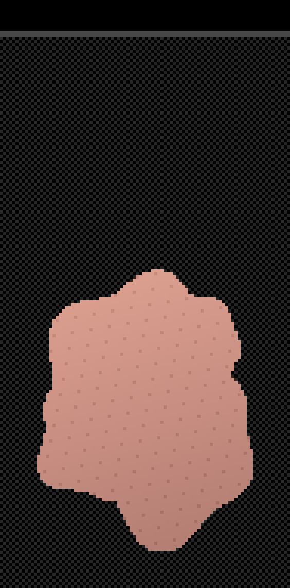
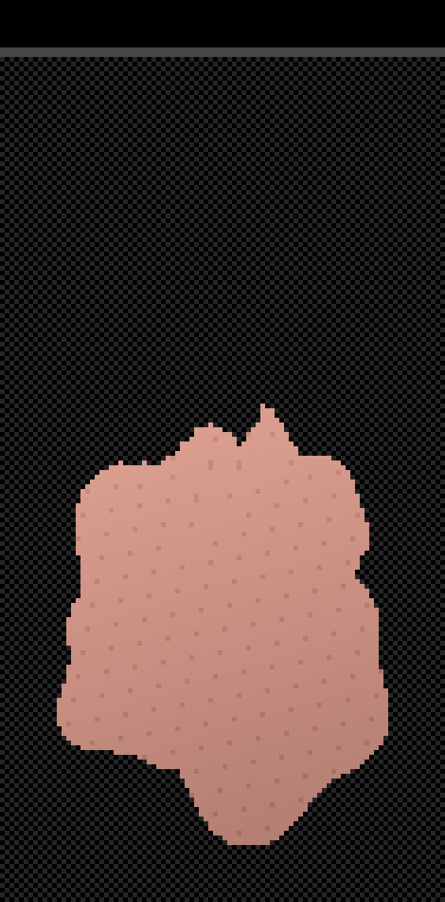
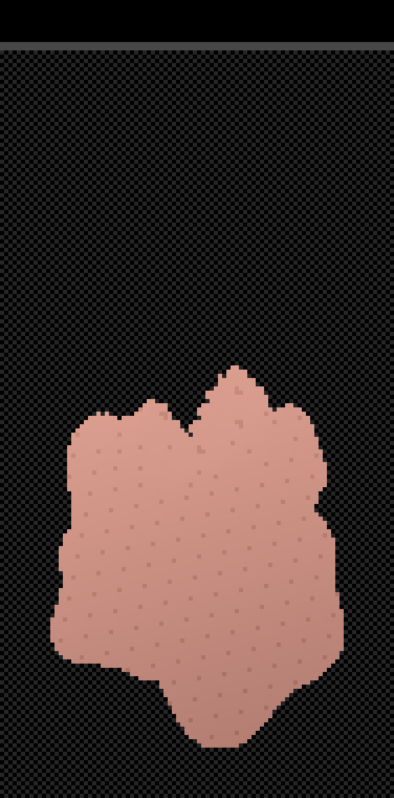
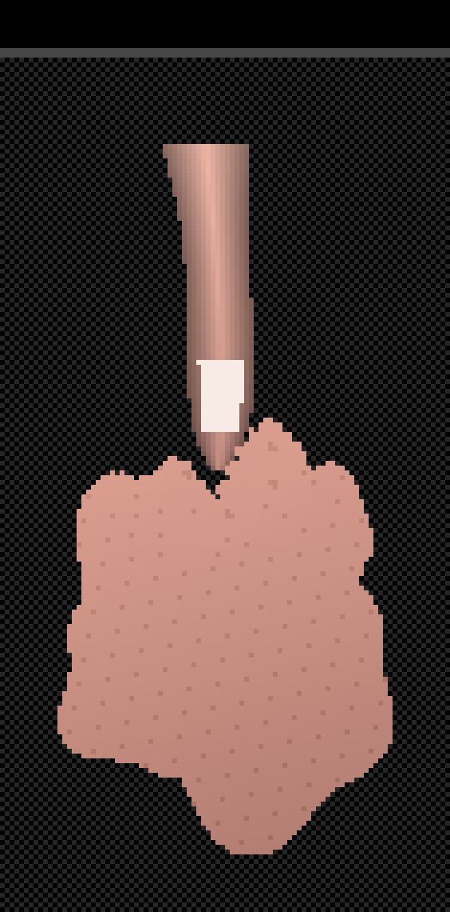

# Omni 2D

An HTML/JS/Canvas app wrapped by [Capacitor](https://capacitorjs.com/) into
a real, installable Android APK.

- **Part 0** proved the build pipeline end to end: a blank canvas, wrapped
  by Capacitor, built into an installable APK.
- **Part 1** added the app shell's screens, navigation, and visual theme —
  Home, Animate mode, and Recording, plus the export modal — with
  placeholder behavior. See "App states & how to navigate" below.
- **Part 2** added real PNG import and character assembly: pick several
  pixel-art PNGs at once, then drag, pinch, rotate, and reorder each piece
  on the canvas. See "Importing and assembling a character" below.
- **Part 3** added **Rig mode**: place bones over the assembled character
  and build a parent/child skeleton. Rotating a bone carries its whole
  chain of children with it. See "Building a skeleton (Rig mode)" below.
- **Part 4** added **Bind mode**: generate a deformable mesh over each
  Part, bind its vertices to nearby bones with weights, and paint those
  weights by hand. **Rotating a bone now actually warps the pixel art.**
  See "Binding artwork to bones (Bind mode)" below.
- **Part 5** added **optional spring physics per bone**, so hair, chest
  or loose clothing lags behind its parent, overshoots, and settles
  instead of snapping rigidly into place. See "Spring physics on a bone"
  below.
- **Grid revision** (current) turns the canvas into an explicit **pixel
  grid**: you choose a canvas size in pixels, every grid cell is exactly
  one pixel, and everything — imported art, drags, scales, bone endpoints,
  and the deformed artwork itself — sits on whole pixels. Pinch to zoom in
  on the grid, and layers exported from another app at the full project
  size **re-assemble themselves** on a canvas of that size (see
  "Re-assembling layers exported from another app").
  See "The pixel grid" below, which also lists what was
  re-verified from Parts 2–5 and the one gesture that changed.
- **Part 6** (current) adds **Free Move**: drag anywhere, or use the pad
  below the buttons, to move the whole character live — rigid bones in
  lockstep, spring bones trailing and settling. See "Free Move: moving the
  character" below.
- **Editor batch** makes it a tool you can actually work in:
  delete, reorder, duplicate, hide and lock layers; assign bones to layers
  and hide bone branches; **undo and redo everything**; and **save projects
  to the device**, with an auto-save that survives a crash. See "Managing
  layers and bones", "Undo and redo" and "Saving and loading projects"
  below. **GIF export is real**: recording captures frames, Stop opens a
  looping preview with an adjustable frame rate, and Save writes an actual
  `.gif` file to the device. Drag-driven animation and MP4 export are
  still to come.

## What's in this repo

```
www/index.html          App shell markup (screens, buttons, panels, export modal)
www/css/style.css       The dark plum/pink pixel-art theme: fonts, palette, pixel-stepped
                         borders, layout and button states
www/fonts/               The two vendored pixel fonts (OFL-licensed, no CDN dependency)
www/icons/               Custom pixel-art icons standing in for the app's former emoji
www/js/state.js         The app's state machine (home/rig/animating/recording) — no DOM
www/js/scene.js         The canvas itself: its size in pixels (8–3072 per side) and presets
www/js/view.js          The camera: zoom and pan between the pixel grid and the screen
www/js/raster.js        Software rasterizer that draws (deformed) triangles straight onto
                         the pixel grid one whole pixel at a time — no gaps, no blur,
                         optionally masked to a subset of the source texels
www/js/parts.js         The scene model: the Part object (whole-pixel position and scale,
                         plus its decoded pixels) and the store holding them
www/js/bones.js         The skeleton: Bone objects, the parent/child tree, and the
                         forward-kinematics math. Kept separate from parts.js
www/js/mesh.js          Mesh generation, auto-weighting, weight painting maths, the
                         linear blend skinning that deforms the artwork, and the
                         per-vertex pin influence that holds pinned pixels still
www/js/importer.js      Picked files -> Parts (PNG validation, size limits, decode,
                         whole-pixel placement, and position-preserving import of
                         canvas-sized layers)
www/js/gestures.js      Home-screen touch handling: drag / pinch-scale / twist a Part, or
                         pan / zoom the grid when the first finger lands on empty cells
www/js/viewGestures.js  Two-finger pinch-zoom of the grid in Rig and Bind mode
www/js/rigTool.js       Touch handling for Bones: two-tap placement, handle dragging
www/js/bindTool.js      Touch handling for weights: the paint brush
www/js/physics.js       The frame loop that keeps spring bones settling after
                         the input that disturbed them has stopped
www/js/poseTool.js      Free Move: the drag that moves the whole character, from
                         the canvas or from the pad below the buttons
www/js/pxpin.js         Px Pin: the pixel-pinning window — its own camera, the
                         paint strokes, and the brush-size menu
www/js/pierce.js        Pierce: the contact measurement and the spring that pushes
                         flesh aside — never a hole, only displaced vertices.
                         Also publishes which tips are currently inside which
                         flesh, so the renderer can draw them underneath it
www/js/pierceState.js   The pierce springs' per-vertex state, in a module of its
                         own so pierce.js and mesh.js can both reach it
www/js/pierceTool.js    The Pierce region painter, on the Px Pin pattern: the
                         piercer's tip, and the pierced layer's pierceable
                         area, the part of it that gives way, and its walls
www/js/history.js       Undo/redo: the command stack of reversible scene snapshots
www/js/project.js       The whole scene as plain data and back — used by both
                         undo/redo and save/load, so there is one serializer
www/js/storage.js       Saved projects and the recovery slot, in IndexedDB
www/js/psaver.js        PSaver: the same project written out as a file the user
                         can copy off the device, and read back in
www/js/autosave.js      Periodic + post-change auto-saves into the recovery slot
www/js/canvas.js        Renderer — rasterizes every Part into a pixel-grid bitmap, blits
                         it at the current zoom, and draws the checkerboard, bones, mesh
                         heatmap, snap highlight and selection outline on top
www/js/ui.js            DOM wiring: buttons, Scene Parts panel, the export modal
www/js/app.js           Thin entry point that boots ui.js once the page loads
capacitor.config.json   Tells Capacitor the app's name, ID, and where the web files live
android/                The native Android project Capacitor generated (this is what Gradle builds)
package.json            Node project file listing Capacitor and the Filesystem
                         plugin (PSaver writes exports through it) as dependencies
```

You will **not** need to hand-edit anything inside `android/` — Capacitor
manages it for you.

---

## Easiest option: download a pre-built APK, no local setup at all

This repo has a GitHub Actions workflow
(`.github/workflows/build-apk.yml`) that automatically builds the debug
APK in the cloud every time code is pushed to `main` or a `claude/**`
branch. You don't need Node, Android Studio, or anything else installed to
get an installable APK this way — just a browser and your phone.

There are two ways to grab it from GitHub:

1. **Releases page (recommended — stable link).** Go to the repo's
   **Releases** page (right-hand sidebar on GitHub, or
   `https://github.com/<owner>/<repo>/releases`) and open **"Latest Debug
   APK."** Download `Omni_2D.apk` from the Assets list. This release is
   overwritten on every push, so the link never changes — bookmark it and
   it'll always have the newest build.
2. **Actions artifacts (tied to one specific build).** Go to the
   **Actions** tab, click the most recent **Build Android APK** run, and
   download the `omni2d-debug-apk` artifact from the "Artifacts" section
   at the bottom of the run page. Artifacts expire after 30 days and
   require being logged into GitHub to download; the Release above doesn't.

Either way, once the `.apk` file is on your phone, open it with a file
manager and tap **Install** (Android will ask permission to "install
unknown apps" the first time — allow it for that app/source). No cable,
no `adb`, no Android Studio required.

If you want to trigger a fresh build without pushing a new commit, go to
**Actions → Build Android APK → Run workflow**.

> **One-time repo setting, if the release step fails with a permissions
> error:** GitHub sometimes defaults a repo's Actions token to read-only.
> If the workflow fails specifically on the "Publish/update latest debug
> build release" step, go to **Settings → Actions → General → Workflow
> permissions**, select **"Read and write permissions,"** save, then
> re-run the workflow.

The rest of this README covers building the APK yourself locally — useful
once you're actively editing code and want faster iteration than waiting
on a cloud build each time.

---

## Prerequisites (one-time setup on your machine)

Do these once, before you touch the terminal steps below.

1. **Node.js version 22 or newer.**
   Capacitor's CLI requires Node ≥ 22. Check what you have with:
   ```
   node -v
   ```
   If it's older than 22, download the current LTS installer from
   [nodejs.org](https://nodejs.org/) and install it.

2. **Android Studio** (this gives you the Android SDK, an emulator, and a
   JDK all in one installer — you generally do *not* need to install Java
   separately).
   Download it from
   [developer.android.com/studio](https://developer.android.com/studio) and
   run the installer. On first launch it opens a "Setup Wizard" — accept the
   defaults; this downloads the Android SDK (the tools/libraries needed to
   compile an Android app) and a bundled JDK (the Java compiler Gradle uses
   under the hood, currently JDK 17+, which Android Studio installs for
   you).

3. **A phone with USB debugging enabled** (only needed if you want to
   install over USB rather than copying the APK file manually):
   - On your phone, go to **Settings → About phone** and tap **Build
     number** 7 times. This unlocks a hidden **Developer options** menu.
   - Go to **Settings → System → Developer options** and turn on **USB
     debugging**.
   - Plug the phone into your computer with a USB cable. When prompted on
     the phone, tap **Allow** to trust the computer.

That's it for one-time setup. Everything below is repeatable.

---

## Steps to build and install the APK

Run these from the root of this repository (the folder containing
`package.json`).

### (a) Install dependencies

```
npm install
```

**What this does:** downloads Capacitor's command-line tool and libraries
into a `node_modules/` folder. This only touches the JavaScript side of
things — it does not build anything Android-related yet.

### (b) Build the web assets

There is nothing to build yet. `www/index.html` is plain HTML/JS with no
bundler (no Webpack/Vite/etc.) — it *is* the finished web output already.
Once real app code is added in a later step, this is where a `npm run
build` command would compile it into `www/`. For now, skip straight to
step (c).

### (c) Sync the web assets into the Android project

```
npx cap sync android
```

**What this does:** copies everything in `www/` into the native Android
project under `android/app/src/main/assets/public`, and makes sure the
Android project's configuration matches `capacitor.config.json` (app name,
app ID, plugins, etc.). Run this command any time you change a file inside
`www/` and want that change reflected in the Android build. It does **not**
produce an APK by itself — it just prepares the native project.

### (d) Produce a debug APK

You have two options: using Android Studio's UI (easier for a first time),
or the command line (faster once you're comfortable).

#### Option 1 — Android Studio (recommended for your first build)

1. Open **Android Studio**.
2. Choose **Open** and select the `android/` folder inside this repo (not
   the repo root — the `android` subfolder specifically).
3. Wait for the bottom status bar to finish "Gradle sync" (this is Android
   Studio downloading the specific tool versions this project needs and
   indexing the project — it can take several minutes the first time and
   needs an internet connection).
4. Once sync finishes with no red errors, go to the menu **Build → Build
   Bundle(s) / APK(s) → Build APK(s)**.
5. When it finishes, a small popup appears in the bottom-right corner
   saying "APK(s) generated successfully" with a **locate** link — click it
   to open the folder containing the file. It will be at:
   ```
   android/app/build/outputs/apk/debug/app-debug.apk
   ```

#### Option 2 — Command line (`gradlew`)

From the `android/` folder:

```
cd android
./gradlew assembleDebug
```

(On Windows, use `gradlew.bat assembleDebug` instead.)

**What this does:** `gradlew` is the "Gradle wrapper" — a script bundled
with the project that downloads the exact version of Gradle (Android's
build tool) this project needs, then runs it. `assembleDebug` tells Gradle
to compile the Android project into an unsigned, debug-mode APK — debug
APKs are automatically signed with a throwaway debug key so they can be
installed for testing without you needing to create your own signing key
yet.

When it finishes, the APK is at the same path as above:
```
android/app/build/outputs/apk/debug/app-debug.apk
```

### (e) Install the APK on your phone

Pick whichever is easier for you:

**Via USB (using `adb`, which ships with the Android SDK):**

```
adb install android/app/build/outputs/apk/debug/app-debug.apk
```

If `adb` isn't recognized in your terminal, it lives inside the Android SDK
folder Android Studio installed, typically under
`platform-tools/adb` (e.g. `~/Library/Android/sdk/platform-tools/adb` on
macOS, `%LOCALAPPDATA%\Android\Sdk\platform-tools\adb.exe` on Windows). You
can also run it directly from Android Studio: **Run → Run 'app'** with your
phone selected as the target device does the build-and-install in one step.

**Via file transfer (no cable/adb needed):**

1. Copy `app-debug.apk` to your phone (email it to yourself, use a cloud
   drive, USB file transfer, etc.).
2. On your phone, open the file using a file manager app.
3. Android will ask for permission to "install unknown apps" the first
   time — allow it for that one app/source.
4. Tap **Install**.

Once installed, you should see an app named **Omni 2D** in your app
drawer. Opening it should show the black-and-pink app shell described
below — that confirms the entire pipeline works end to end.

---

## The pixel grid: canvas size, zoom, and snapping

Omni 2D is for pixel art, so the canvas is an explicit grid of whole
pixels rather than a free-floating drawing area. **One grid cell is one
pixel of the final artwork.** Nothing in the app can sit between two
cells: imported art is placed on cells, drags move by whole cells,
scaling is by whole multiples, bone endpoints sit on pixel centres, and
even the deformed artwork is snapped back onto cells before it is drawn.

### Choosing the canvas size

On the Home screen, below the Scene Parts panel, a button reads
**Canvas 512 × 512 px** (the default). Tap it to open the size dialog:

- **Presets** — 256 × 256, 512 × 512, 1024 × 1024, 1024 × 3072 (a tall
  sheet), and 3072 × 3072.
- **Custom** — type any width and height. Each side is clamped to the
  allowed range: **at least 8, at most 3072** pixels. (8 × 8 is also the
  smallest image the app accepts, so a canvas can never be too small to
  hold one.)

Tap **Apply** and the grid resizes and re-fits itself on screen. Parts and
bones keep their pixel coordinates when the canvas changes size, so a
character sitting at pixel (200, 200) stays there. Shrink the canvas
below the character and the portion outside the grid is simply not drawn
until you move it back in or enlarge the canvas again — nothing is lost.

**⇄ Mirror** sits below the Width/Height fields, **off by default**. Turn
it on and typing into *either* field copies that exact value — whatever
you actually typed, not a fixed number — into the other, live as you type.
A square canvas then needs entering once instead of twice. Turning it back
off leaves the two fields independent again, unaffected by whatever they
happened to match a moment ago. It has no effect on the preset buttons,
which already set both sides at once.

### What you see

The grid is a **checkerboard of black and dark-grey cells**, one cell per
pixel, drawn *behind* the artwork — transparent pixels show the
checkerboard through them, the way a paint program shows transparency.
**It renders at every zoom level, all the way from the most zoomed-out fit
to the most zoomed-in**, never a flat panel — there is no distance at
which it switches off.

Pixel cells are usually far smaller than a fingertip, so the grid is
zoomable:

- **Two fingers on empty grid, pinch** — zoom in or out around your
  fingers, from the whole canvas down to a handful of cells. Pinch works
  in every mode (Home, Rig, Bind).
- **One finger on empty grid, drag** — pan.
- **⤢ (Fit)** in the top bar — zoom out (or in) to show the whole canvas
  and **re-centre it**, however far you had panned or zoomed beforehand.

When you let go after a pinch, the zoom snaps to a whole number of screen
pixels per cell, so every cell is exactly the same size and the
checkerboard stays even — and one cell is always exactly **one real pixel
of the canvas**, at whatever size that pixel happens to be on screen right
now. Zooming in has a natural ceiling: past a certain point a cell is
already as large as it is useful to make one pixel, and since there is
nothing smaller than a pixel in this grid to zoom into, the camera simply
stops there. Zooming out the other way, a cell can end up smaller than a
single screen pixel — the screen has no way to draw anything finer than
that — so past that point every cell is held at one screen pixel wide
instead of continuing to shrink. The checkerboard stays dense and busy
rather than blank, which is exactly the point: **even zoomed out over a
large canvas, you are still looking at a pixel grid, not a flat colour.**

#### Two bugs this used to have

**Fit used to leave the canvas parked in the top-left corner.** `fit()`
worked out the pan needed to centre the content, then rounded the zoom to
a whole number of screen pixels per cell for crispness — *after* the pan
had already been measured for the un-rounded zoom. Content sized for one
zoom, positioned to centre a different one: the two came apart by however
far the rounding moved, which on a typical phone is a large fraction of
the zoom step, not a stray pixel. Now the zoom is rounded first and the
centring pan is measured from that same final number, so the two can
never disagree.

**The checkerboard used to vanish below a fairly ordinary zoom level.**
It was written to fall back to a flat dark tone once a cell dropped under
3 screen pixels, to dodge a resampling glitch at very small sizes. Taking
that fallback out to make the pattern always render exposed the glitch it
was hiding: below one screen pixel per cell, the checker tile was being
asked to draw itself at a size smaller than a screen pixel, which the
browser then had to resample — and a repeating pattern resampled below
its own resolution beats against the screen's pixel grid instead of
shrinking cleanly, so a checker that should have been a fraction of a
pixel wide came out as a false, unrelated 3-pixel-wide pattern. Past that
point there is nothing smaller than one screen pixel to draw, so the tile
is now simply held at one screen pixel per cell instead of chasing a size
the screen cannot show — dense, but a real, correctly scaled checker
pattern rather than an aliased one.

### What's snapped, and what isn't

| Thing | Stored as | Snapped? |
|---|---|---|
| Part position | top-left corner, whole pixels | yes — drags move by whole cells |
| Part scale | whole-number factor, 1×–16× | yes — a 16 px sprite is 16, 32, 48… px wide, never 20 |
| Part rotation | any angle | no — the angle is continuous; the *drawing* of it is snapped (below) |
| Bone head / tail | pixel centres, e.g. (10.5, 10.5) | yes — a tap lands on the centre of the cell it is in |
| Bone rotation | any angle | no — forward kinematics and spring physics stay continuous |
| Mesh vertices after skinning | whole pixels | yes — snapped at the very last step, before drawing |

Bone endpoints snap to pixel *centres* rather than corners so that "a
bone in a pixel" means exactly that: the readout shows the cell's integer
coordinates (x 11 · y 11 for a head at 10.5, 10.5), and the cell itself
**lights up in pink** while you place or drag a handle, so you can see
where the snap landed before you lift your finger.

### How the artwork is drawn onto the grid

Parts are no longer drawn by the browser as scaled, rotated images (that
puts fractional edges between cells and, on rotation, blends colours).
Instead every Part is **rasterized into a pixel-grid bitmap** by the app's
own small renderer (`www/js/raster.js`):

1. Each Part is a mesh of triangles — the same mesh Bind mode uses; an
   unbound Part is just two triangles covering its rectangle.
2. The triangle corners — after scaling, rotation, and skinning — are
   **snapped to whole pixels**.
3. For every grid cell whose *centre* falls inside a triangle, the
   renderer looks up the one source pixel that maps there (nearest
   neighbour, no blending) and writes it to that cell.
4. Parts are rasterized back-to-front, so a later Part overwrites an
   earlier one — the same z-order behaviour as before.

Step 3 is what rules out the classic failure modes of snapping. Snap each
triangle independently and draw it as a block, and two neighbouring
triangles can leave a one-pixel **gap** between them or **overlap** and
paint a pixel twice. Testing cell centres against the *shared* edges
instead means every cell belongs to exactly one triangle (or none): no
gaps, no overlaps, no cell painted twice — by construction rather than by
tuning. The rasterizer's unit test checks exactly this on adjacent
triangles.

**The tradeoff, stated plainly.** The skinning maths is unchanged and
still continuous; snapping is applied only to its *output*. So:

- A rotated or bent Part is drawn as a **staircase** of whole pixels —
  hard edges, no anti-aliasing, no smeared in-between colours. That is the
  intended pixel-art look.
- Where a bone **stretches** the mesh, some source pixels are **drawn
  twice** side by side; where it **compresses** the mesh, some source
  pixels are **dropped**. That is unavoidable when the output must be
  whole pixels, and it is exactly what happens when you scale pixel art by
  a non-integer factor in any editor.
- Motions smaller than half a pixel produce **no visible change**,
  because nothing crosses a cell boundary. A spring bone's final tiny
  wobbles are therefore invisible; its swing is not.

### Why two-finger gestures changed on the Home screen

This revision makes one deliberate behaviour change to Part 2, because
two features now compete for the same gesture. Part 2 used two fingers
*anywhere* on the canvas to scale and rotate the selected Part; the grid
needs two fingers for zoom. The rule is now decided by **where your first
finger lands**:

- **First finger on a Part** → that Part is selected and dragged; a second
  finger then **scales and rotates the Part**, exactly as in Part 2.
- **First finger on empty grid** → one finger pans; a second finger
  **zooms the grid**.

Lift one finger mid-gesture and it degrades gracefully: a Part transform
goes back to dragging that Part, a zoom goes back to panning. This is the
one place the grid could not be added without touching an existing
interaction; the Part 2 gesture itself is unchanged once it starts. Tip:
on a big canvas a small sprite is tiny at the fitted zoom, so pinch in on
empty grid first, then put your first finger on the sprite.

### Re-verified after the grid revision

The revision touches the model behind Parts 2, 3 and 4, so each earlier
feature was re-tested on the snapped model. The checks are automated
browser tests that drive the real app with touch events on a 64 × 64
canvas (cells large enough to assert on individual screen pixels), plus
unit tests on the maths modules.

**(a) Part 2 — import, drag, scale, rotate: intact.**
- A 16 × 16 PNG imports at 1× on whole-pixel coordinates, centred on the
  grid, and its source pixel (4, 4) lands on exactly the expected cell —
  pixel-for-pixel alignment, no resampling.
- A drag of 2.6 cells right and 1.2 down moves the Part by exactly
  (3, 1) cells, and the artwork moves with it cell-for-cell.
- Pinching the Part to three times the finger spread gives scale exactly
  3, every source pixel becomes an exact 3 × 3 block, and the top-left is
  still on whole pixels.
- Twisting rotates it by about 45°, and the rotated sprite is drawn using
  only the checkerboard's two colours and the sprite's own colours — not a
  single interpolated shade.
- Panning does not move the Part; zooming does not change its scale; Fit
  restores the fitted view. Files that are too small or larger than the
  canvas are rejected and named in the message.

**(b) Part 3 — bone hierarchy and editing: intact.**
- Head and tail taps snap to pixel centres, the tapped cell is highlighted
  in pink, and the readout shows the integer pixel.
- A child added with the root selected attaches to the root's tail, and
  the Skeleton list indents it under its parent.
- Dragging a handle snaps to the cell under the finger; a nudge moves
  exactly one cell.
- Forward kinematics is untouched — the unit test rotating a parent by
  90° still moves the child by exactly 90° — as are rename and delete
  with re-parenting; those code paths did not change.

**(c) Part 4 — auto-weight and painting: intact.**
- A freshly bound Part at rest renders **byte-identical** to the unbound
  sprite (the whole canvas is hashed and compared).
- With a bone rotated, the deformed art is drawn and again contains only
  the sprite's own colours: snapped, never smeared.
- Painting the root bone over the sprite raises the root's total weight
  across the mesh and makes *less* of the art follow the child afterwards
  — painting still decides which bone owns which pixels, and weights still
  sum to 1 (unit-tested).

**(d) Part 5 — physics, now grid-snapped: intact.**
- Kicking the parent with the debug rotation still makes the spring child
  lag tens of degrees behind its target and settle to within 2° — the
  continuous spring maths is untouched.
- In every one of the ~70 frames sampled during the jiggle, the artwork's
  edges lie exactly on cell boundaries, and the art visibly passes through
  many distinct whole-pixel positions on the way to rest.

Two behaviours changed *on purpose* and are worth knowing about:

- **Rig and Bind mode: dragging on empty grid pans.** Parts still cannot
  be moved in these modes (their pixel coordinates do not change), but the
  view does, so the character moves *on screen*. Tap ⤢ to re-fit.
- **Imports are no longer auto-upscaled.** Part 2 scaled small sprites up
  2×–3× so they were easy to grab. On the grid an imported image is placed
  at exactly 1× so that its pixels *are* canvas pixels; zoom in to work on
  it, and pinch the Part if you actually want it larger.

### Known limits

- **Bones may be placed outside the canvas.** The grid extends
  conceptually past its edge, so a root head just off the artwork is
  allowed, and the snap highlight is drawn there too. Artwork outside the
  canvas is not drawn.
- **Big canvases cost memory.** The grid bitmap is width × height × 4
  bytes, held twice (working buffer plus the drawable copy): roughly
  75 MB at 3072 × 3072, 2 MB at 512 × 512. Each redraw re-rasterizes every
  Part, so drawing cost scales with the total sprite area, not the canvas
  size; a big canvas with small sprites is cheap, a canvas-sized sprite
  bound to spring bones is not.
- **A moved Part still needs re-binding**, exactly as in Part 4.

---

## Importing and assembling a character

### Importing PNGs (multi-select)

1. On the Home screen, tap **Import**. This opens your phone's normal
   file picker.
2. **Select as many PNGs as you want in one go** — you don't have to
   import them one at a time. In most Android pickers you long-press the
   first file to enter selection mode, then tap each additional file
   (some pickers instead show checkboxes straight away). Pick
   `head.png`, `hair.png`, `torso.png`, `hand_l.png` and so on together,
   then confirm.
3. Every PNG becomes its own independent **Part**, listed by filename
   (without the `.png`). They are never flattened into one image — each
   piece stays separately movable, which is what lets bones attach to
   individual pieces in the next step.

**PNG only.** JPG and other formats have no transparency, so they can't
carry pixel-art cutouts. If you select any, they're skipped and a message
appears at the top naming which files were ignored — the PNGs in the same
selection still import normally.

Newly imported parts land centred on the canvas, each nudged 8 pixels
down-right from the last so a batch doesn't arrive as one unseparable
stack. Every image is placed at exactly **1×** on whole-pixel coordinates,
so each of its pixels is one canvas cell — nothing is resampled. Two size
rules apply, and any file breaking them is skipped and named in the
message at the top: an image must be **at least 8 × 8**, and it must
**fit within the current canvas** (enlarge the canvas first if it
doesn't).

### Re-assembling layers exported from another app

If you drew your character in another app (ibis Paint, Procreate,
Aseprite…) you can bring it in **layer by layer with every piece already
in place** — no manual repositioning.

The trick is that a layer exported at the *full project size* carries its
own position: the artwork sits where it sat in the original composition
and everything around it is transparent. **That transparent padding is
the position information.** Omni 2D reads it.

**How to use it**

1. In the other app, note your project's pixel size and set Omni 2D's
   canvas to **exactly** that (Home → the `Canvas W × H px` button).
2. Export each layer on its own — hand, head, hair, torso — **at the full
   project size**, not cropped or "trimmed to content". What matters is
   that each PNG is the whole frame with just one layer visible.
3. Import them all at once. Each lands exactly where it belongs, and the
   character is assembled.

A toast confirms it: *"Positioned 3 layers from the transparent
padding."*

**It only triggers on an exact size match — with whatever size your canvas
happens to be.** No size is special or built in here: the app reads the
canvas's current width and height at the moment you import and compares
them with the file's real dimensions. A 64 × 64 canvas auto-positions
64 × 64 files; a 1024 × 3072 canvas auto-positions 1024 × 3072 files. Any
size the app supports (8 × 8 up to 3072 × 3072) behaves the same way.

**If the sizes don't match**, the file is still imported — it just uses
the ordinary placement (centred, then cascaded), and the message tells
you why, naming both real sizes:

> Placed by hand — auto-position needs an exact canvas match:
> hand.png is 64×64, canvas is 512×512

That is deliberate rather than a best guess. Padding only encodes a
position relative to the frame it was exported from; on a differently
sized grid the same padding points somewhere else, so guessing would put
layers in subtly wrong places. Set the canvas to the source project's size
and re-import to get automatic placement.

A canvas-sized PNG that turns out to be **fully transparent** is skipped
with a note, rather than becoming an invisible empty layer.

**What gets stored: trimmed art plus an offset (and why)**

Once the content's bounding box is found, the layer is **trimmed down to
that box**, and the box's position becomes the Part's ordinary x/y
coordinate. The alternative — keeping each layer as a full canvas-sized
image with the artwork somewhere inside it — was rejected because a Part's
`x`/`y` *already is* an offset, so trimming needs no new concept, and
because a full-frame Part would degrade everything built on top of it:

- **Selection and dragging** — a Part's touch area is its image, so a
  full-frame layer would be "hit" anywhere on the canvas. Every layer
  would overlap every other one, and tapping a piece would become
  guesswork.
- **The mesh (Part 4)** — mesh density is spread across the image, so a
  6–10 cell grid stretched over the whole canvas would leave only a couple
  of cells covering the actual hand. Bones would have almost no resolution
  where it matters.
- **Auto-weighting (Part 4)** — vertices out in the empty padding would
  still be weighted to bones and dragged around, deforming nothing while
  costing work every frame.
- **Memory** — every layer would hold a full canvas of pixels: about 37 MB
  each at 3072 × 3072, versus a few KB for the artwork itself.

Trimming keeps all of Parts 2–5 working exactly as they already do: an
auto-positioned layer is an ordinary Part that happens to know where it
belongs. Verified end to end — a trimmed, auto-placed layer selects on its
own artwork, binds, renders byte-identically at rest, and deforms with
clean pixel edges.

### Assembling: drag, scale, rotate

On the canvas (pinch in on empty grid first if the sprite is small):

- **One finger on a part, drag** — moves it in **whole cells**. Touching a
  part also selects it. **The selected part always wins a touch that
  lands on it**, even when newer layers are stacked on top: pick a buried
  layer in the Scene Parts list, then drag on the stack and *that* layer
  moves out from under the others. Touch a spot the selected part doesn't
  cover and the topmost part there is selected and dragged instead.
- **Second finger down while holding a part, pinch** — scales it. Scale
  is always a whole multiple (1×–16×), so the part steps 1× → 2× → 3× as
  you spread your fingers; each source pixel stays an exact n × n block.
- **Second finger down while holding a part, twist** — rotates it. The
  angle itself is free; the drawing is snapped to the grid, so a rotated
  sprite shows a staircase edge rather than a blurred one.
- Two-finger gestures also slide the part around, so you can scale,
  rotate, and reposition in one continuous motion (e.g. sizing hair to
  sit correctly on a head).
- **One finger on empty grid** — pans; **two fingers on empty grid** —
  zooms. **Tap empty space** — deselects.

The selected part is outlined in pink so you always know which piece
you're about to move. See "The pixel grid" above for why the *first*
finger decides between moving the part and moving the view.

### Reordering (which piece draws on top)

Tap a part to select it, and a bar appears above the Scene Parts panel
with the part's name and two buttons:

- **To Front** — draws it above everything else (a hat over hair).
- **To Back** — draws it behind everything else (a body behind clothes).

### The Scene Parts list

Below that is a collapsible **Scene Parts (n)** panel listing every
imported part, topmost first — the same order they stack on the canvas.
**Tap any entry to select that part**, which is much easier than trying
to touch a small piece that's completely hidden behind another one. Tap
the panel header to collapse or expand the list, which gives the canvas
more room while you work.

The selected entry is highlighted in pink to match the outline on the
canvas.

### What persists

The assembled arrangement is kept in memory for the whole session, so
switching to Animate mode and back to Home leaves your character exactly
as you posed it. It is **not** saved to disk yet — closing the app loses
the arrangement. Saving/loading is a later step.

### Suggested test on your phone

1. Tap **Import** and select several pixel-art PNGs at once (throw a JPG
   into the selection too, to confirm it's rejected while the PNGs still
   import).
2. Drag each piece apart so you can see them all.
3. With one finger already on a piece, pinch it bigger: it should jump
   1× → 2× → 3× with blocky edges, never in-between sizes or blur.
4. Twist a piece to rotate it — the edge becomes a pixel staircase.
5. Assemble the character — then use **To Front** / **To Back** to fix
   any piece stacking wrongly.
6. Tap a name in **Scene Parts** and confirm the pink outline jumps to
   that piece on the canvas.
7. Tap **Animate**, then **✕** to come back — your character should still
   be exactly where you left it.
8. To test layer re-assembly: set the canvas to your source project's
   exact size, export two or three layers from that project at full size,
   and import them together — they should snap into their original
   arrangement with no dragging at all.

---

## Building a skeleton (Rig mode)

Rig mode is where you define the character's bones. It's separate from
Animate mode — Animate will *use* the finished skeleton later; Rig mode is
purely for building it.

**Bones don't move the artwork yet.** In this step they're just the
structure being defined. Attaching the pixel art to the bones (mesh
binding / weights) is the next part.

### Entering Rig mode

On the Home screen, tap **Rig** (next to Animate). The canvas border turns
pink, the top bar reads "RIG MODE", and your assembled character is dimmed
slightly so the bright pink bones stay readable on top of it.

**Parts are locked in Rig mode** — the canvas belongs to the bone tool,
so your character's pixel position cannot change here. Dragging on empty
grid **pans the view** and pinching zooms it (tap ⤢ to re-fit). Tap **✕**
to return Home if you need to re-position artwork.

### Placing the root bone

1. Tap **Add Bone**.
2. **Tap once** on the canvas to place the bone's **head** (its origin — a
   small ring marks it).
3. **Tap again** to place the **tail** (the pointed end).

Placement is two taps rather than a drag, because tapping two points is
much more forgiving with a fingertip than dragging a precise line.

Each tap **snaps to the centre of the pixel cell you touched**, and that
cell lights up in pink so you can see where the snap landed; the readout
then reports the bone in whole pixels. Zoom in for precision — at a high
zoom each cell is a comfortable fingertip target. Handle drags snap the
same way, live, with the cell under your finger highlighted as you go.

The first bone you place automatically becomes the **root**.

### Placing child bones

Every bone after the root must be given a parent explicitly:

1. **Select the parent** — tap it on the canvas, or tap its name in the
   Skeleton list.
2. Tap **Add Bone**. (It stays greyed out until a parent is selected, and
   the hint line tells you what it's waiting for.)
3. **Tap where on the parent this bone should start.** Anywhere: partway
   along it, at either end, or a little off it. That point becomes the new
   bone's head.
4. **Tap again** to set the tail.

**A child can start anywhere on its parent, not just at the parent's far
end.** A chest bone belongs on the middle of the torso, not hanging off
the bottom of it, and an arm starts at a shoulder partway down the spine.
Where the child attaches is simply where you tapped, stored as an offset
from the parent, so forward kinematics carries it correctly however the
parent later moves or rotates.

This is independent of how the parent happens to be drawn. "Head" and
"tail" are only labels for a bone's two ends; whether the torso was drawn
top-down or bottom-up makes no difference to where a child may attach.

Each newly placed bone becomes the selected one, so building a chain is
just Add Bone → tap → Add Bone → tap: **root → spine → head → hair**
without reselecting anything in between.

To attach a child somewhere other than the parent's tail, select it and
**drag its head handle** — it stays parented to the same bone, and the
tail stays put while the bone re-aims.

### Reading the skeleton

- **Root bones** draw in the solid accent pink; **child bones** draw in a
  lighter pink, so you can tell hierarchy levels apart at a glance.
- A **dashed line** connects a parent's tail to a child's head whenever
  the child has been dragged away from it.
- The **selected** bone gets a thicker outline plus round **handles** at
  its head and tail — those handles are what you drag.

### The Skeleton list

The collapsible **Skeleton (n)** panel shows the whole tree as an indented
list, root at the top with children nested under their parent. **Tap any
name to select that bone**, which is much easier than trying to touch a
short bone buried under overlapping ones. Tap the panel header to collapse
the list and give the canvas more room.

### Editing a selected bone

Selecting a bone opens an editor above the list:

- **Rename** — type in the name field. Defaults are `Bone_1`, `Bone_2`…,
  but naming them `head_bone`, `hair_bone` and so on pays off quickly once
  you're managing 15+ bones.
- **Readout** — shows the bone's head as a whole-pixel grid coordinate,
  plus its angle and length in pixels.
- **Nudge controls** — `←` `↑` `↓` `→` move the bone by **exactly one
  grid cell** per tap and `↺` `↻` rotate it by 2° per tap, for precision
  that fingertip dragging can't give you.
- **Delete** — see below.

**Rotating a bone rotates all of its descendants with it**, pivoting
around its own head — a real forward-kinematics chain. Rotate the root and
the entire skeleton swings; rotate a forearm and only the hand follows.
This works because each bone stores its position and angle *relative to
its parent* rather than in absolute screen coordinates.

### Deleting a bone (and what happens to its children)

Deleting a bone with no children happens immediately. Deleting one that
**has** children shows a confirmation naming how many children there are
and where they'll end up.

**Children are re-parented onto the deleted bone's own parent — they are
not deleted.** Deleting a shoulder shouldn't silently destroy the whole
arm below it; losing one bone is easy to redo by hand, whereas a
cascade-delete could wipe out a long chain in a single tap. The children
also **keep their exact positions on screen**: their stored coordinates
are recalculated against their new parent so nothing jumps. If you delete
a root, its children simply become roots themselves.

### Suggested test on your phone

1. Import and assemble a character (see the previous section), then tap
   **Rig**.
2. Confirm dragging on empty grid pans the view but leaves the
   character's pixel position alone (⤢ re-fits).
3. **Add Bone**, tap twice to lay a root bone down the character's spine;
   watch each tap light up the cell it snapped to.
4. **Add Bone**, tap once — a child chains off the root's tail. Repeat to
   build root → spine → head → hair.
5. Rename them as you go so the list is readable.
6. Select the **root** and tap `↻` a few times — the entire chain should
   swing around the root's head together.
7. Select a middle bone and **Delete** it; confirm the warning, and check
   its child survives, re-attached and un-moved.
8. Tap **✕** to leave, then **Rig** again — your skeleton should still be
   there.

Like the assembled character, the skeleton lives in memory for the
session only; it isn't saved to disk yet.

---

## Binding artwork to bones (Bind mode)

Rig mode defines *where the bones are*. Bind mode decides *which pixels
each bone moves* — and it's the step that makes bone rotation actually
warp the pixel art.

### Entering Bind mode

Tap **Bind** on the Home screen. You need artwork (Part 2) and a skeleton
(Part 3) first; if there are no bones, the hint line says so.

The panel at the bottom has a **Parts** / **Bones** tab pair. Use the
Parts tab to choose which piece you're working on, and the Bones tab to
choose which bone you're inspecting or painting.

**Show: All layers / Show: Rigged only.** Below the tabs, on the Parts
tab only, a toggle narrows that list to layers at least one bone has
claimed via **Controls layer** (Rig mode) — handy once a character has
enough layers that scrolling past ones you have not rigged yet gets
tedious. It defaults to **off**, deliberately: a layer with *no* bone
attached is still a perfectly legitimate one to bind — auto-weighting
falls back to whichever bones are nearest for it — and that has to stay
reachable, not just possible in principle. The toggle hides itself on the
Bones tab, where there is nothing for it to filter.

### Binding a Part (auto-weighting)

1. On the **Parts** tab, tap the piece you want to bind.
2. Tap **Auto-weight Part**.

That builds a grid mesh over the Part's image, splits it into triangles,
and gives every vertex weights by inverse squared distance to each bone's
line segment, capped at the 3 closest bones and normalized to sum to 1.
Capping matters: letting every bone tug on every vertex produces mush.

**Which bones are candidates is your choice, not the geometry's.** If any
bones name this layer in their **Controls layer** dropdown (Rig mode), then
those are the *only* bones that can weight it, and distance decides nothing
but how the weight is shared between them. Assign one bone and that layer
becomes wholly its own — every vertex at weight 1, immune to anything else
in the rig. Only when no bone claims the layer does auto-weighting fall
back to considering every bone by distance.

That fallback is why the old behaviour looked like a hit-test bug. Layers
overlap constantly — a hand resting on a chest, hair over a face — and pure
proximity would hand a slice of the hand to the chest bone, so rotating the
chest dragged the hand with it. Naming the bone fixes it outright. The Bind
screen's hint line tells you which way you are about to go: it names the
assigned bones, or says it will use whichever are nearest.

The Parts list marks bound pieces as **"— bound"**, and the status line
shows the vertex count.

**Auto-weight never moves the layer.** It used to look as though it did:
drag the character across the canvas in Free Move, come back and re-bind a
layer, and the layer would jump back to roughly where it was imported. The
button was not repositioning anything — the opposite. A bound layer is
drawn at

```
its own stored origin  +  (where its bones are now − where they were at bind time)
```

and Free Move moves the *bones*, deliberately leaving bound layers' own
coordinates alone because the bones already carry them. So after a drag the
layer sits some distance from its own origin, held there entirely by that
second term. Re-binding recaptures the bind pose at wherever the bones are
*now*, which zeroes that term — and the layer fell back onto an origin that
had gone stale hours ago.

Binding now folds that offset into the origin instead of discarding it: the
layer keeps its place on screen to the pixel, and its stored position
finally means what it says again. The fold is measured against the **rest**
pose rather than the simulated one, so re-binding a jiggling spring bone's
layer takes in the settled displacement and lets the spring carry on from
there, rather than freezing a wobble into the layer's coordinates. A first
bind moves nothing at all, since there is no previous bind pose to be
carried away from.

**Nothing should look different yet.** That is the correctness check: a
freshly bound Part renders pixel-for-pixel identically to the flat sprite
until a bone actually moves. (Verified — the bound render is currently
byte-identical to the unbound one at rest.)

**Mesh density** controls how many cells the grid gets along the Part's
longest side. Pixel art wants a coarse mesh, so the default is 6–10 cells
depending on the image's pixel size — a small hand PNG needs far fewer
vertices than a big torso. Moving the slider on an already-bound Part
rebuilds its mesh, **which discards hand-painted weights** and
auto-assigns fresh ones.

### Seeing what a bone controls

Switch to the **Bones** tab and tap a bone. Its influence appears as a
heatmap over the mesh:

- **Bright, large pink dots** — vertices this bone strongly controls.
- **Faint, small dots** — weak influence.
- **No dot at all** — this bone doesn't move that vertex.

### Painting weights by hand

With a Part bound and a bone selected, **drag your finger across the
mesh**. That changes the selected bone's weight on the vertices under the
brush, and every other bone's weight on those same vertices is scaled to
compensate, so each vertex's weights always still sum to 1.

- **Weight tool** — **Paint** raises the selected bone's influence;
  **Erase** lowers it back toward zero. The same brush either way: size,
  falloff and strength mean exactly the same thing for both, and Erase is
  literally the paint delta negated rather than a second code path to keep
  in step.
- **Brush** — the radius of the brush in *screen* pixels, so it feels the
  same at any zoom; zoom in to paint finer detail in grid cells. Influence
  falls off linearly from the centre to the rim.
- **Strength** — how fast each pass pushes weight toward or away from this
  bone.

**Erase used to not exist.** Weight painting only ever added, and the only
way to lower a bone's share was to select a *different* bone and paint
over the same area, letting renormalization take the difference — a
workaround rather than a tool, and no help at all on a layer with a single
bone. Measured before the fix: no control matching "erase" existed
anywhere in Bind mode, the Strength slider was floored at 0.05 so no
negative delta was even expressible, and the one function that writes
weight was only ever called with a positive one.

**The one case worth spelling out.** Redistribution needs somewhere to
redistribute *to*. On a vertex that only one bone influences there is no
other bone to hand the weight to, so the sum-to-1 rule used to put it
straight back at 1 — erasing such a vertex changed nothing at all, however
long you scrubbed. Measured: a stroke that moved shared vertices by 0.1
moved these by exactly 0. Those vertices now let their lone weight decay
and drop the influence at the floor, leaving the vertex unweighted, which
skinning already reads as "stay at rest". The partial values in between
are invisible either way, because skinning renormalizes by whatever total
it finds — verified directly, with the same vertex at weight 1.0 and at
0.6 landing in **exactly** the same place, to a delta of 0.

**Auto-weight Part** doubles as a reset: it throws away all hand-painted
weights for that Part and recomputes the automatic defaults.

### Testing the deformation (temporary debug slider)

Select any bone and use the **Debug: rotate** slider. It drives that
bone's rotation directly so you can watch the skinning work. This control
is scaffolding for this step — real drag-driven animation replaces it
later.

Rotate a bone and the artwork weighted to it warps and follows, with the
pixel art staying hard-edged rather than blurring. Because the skeleton is
a forward-kinematics chain, rotating a parent also swings every child
bone, and the artwork bound to those children comes along too.

### Px Pin: pinning single pixels

Weight painting works at the mesh's resolution; **Px Pin** works at the
pixel's. From Bind mode, **Px Pin — pin single pixels…** opens a dedicated
full-screen window (not the main canvas) for marking individual pixels
that must never deform.

**Entering.** Pick two layers: **Above** is the one you'll pin; **Below**
is drawn underneath purely as reference, so you can line pixels up against
what they sit on. Both appear at their current arrangement.

**Looking.** The window has its own camera: **two fingers** pinch to zoom
(far enough to fill the screen with a handful of pixels) and drag to pan,
and each layer has an opacity slider so you can see through the top one. A
texel grid fades in once cells are big enough to aim at. **This camera is
the window's alone** — zooming to 800%, panning around and leaving again
cannot move, scale or rotate anything; the layers' real transforms are
never touched, only read. (Verified: every part and bone transform, and
the main camera, are byte-identical after a zoom-pin-zoom-exit round
trip.)

**Pinning.** One finger paints. With the **📌 Pin** tool active, press
down and drag: every pixel the finger crosses is pinned as it goes, and a
fast flick still fills in the texels between samples rather than leaving a
dotted trail. Pinning a collar or a scalp band is one stroke, and the
whole stroke is a single undo step. Pinned pixels show a pink marker in
this window (and only here — the main canvas stays clean).

**⌫ Eraser Pin** is a separate, explicitly selected tool, never a hidden
toggle of Pin: with it active, the same drag frees pixels again.

**Brush size.** The third button opens a dropdown of every size from
**1×1 to 10×10** pixels, in the same "⌄" menu style used elsewhere in the
app. The chosen size shows on the button, applies to Pin and Eraser Pin
alike, and stamps a square centred on the touch.

Because one finger paints, the camera belongs to two fingers — and if a
second finger lands mid-stroke, that stroke is *undone* rather than left
behind as a stray pin, since a pinch that started slightly out of sync
should not paint.

**What a pin does.** Pins are stored per layer, in that layer's own pixel
grid — not screen or canvas coordinates — so they stay glued to their
artwork wherever the layer goes. At runtime a pinned pixel is held at its
rest position: bone rotation and spring physics move the artwork around it
and leave it where it was. It is NOT nailed to the canvas — legitimate
whole-layer movement (a Free-Move drag, a rigid or pivot chain carrying
the layer) carries pins along exactly, measured the same way the
auto-weight fix measures carriage: against the rest pose, which physics
never touches. Unpinned pixels on the same layer keep deforming normally.
At rest, a pinned layer renders byte-identically to an unpinned one — a
pin only shows its effect when deformation would have moved that pixel.

Erasing a pin returns the pixel to normal deformable behaviour
immediately. Pins are part of the scene state: they save with the project,
survive Reverse and recovery, and pinning/erasing are ordinary undoable
steps.

### Why pinned pixels used to tear away, and what fixed it

The first version of Px Pin tore: pin a hair layer's scalp band, give the
hair a physics bone, drag the character in Free Move, and the pinned band
came apart from the hair hanging off it — a seam opened straight across
the layer at exactly the pin boundary.

The natural guess is that pinned *vertices* were being overridden without
their neighbours being constrained to stay attached. **That is not what
was happening, and it is worth correcting precisely: there were no pinned
vertices at all.** Pins were a rendering trick, not geometry. The
rasterizer skipped pinned texels, and a *second pass* painted them at
their undeformed position afterwards. The mesh never knew a pin existed.
So the deformation carried the surrounding artwork wherever physics wanted
while those texels were stamped back at rest, and the two simply came
apart. Measured on a hair layer at full swing, the seam reached **80 cells
wide across 49 columns**, and the layer rendered as **three separate
pieces**.

That design also broke the renderer's founding promise — that every scene
pixel is decided exactly once, by one mesh — which is what makes this
rasterizer produce no gaps and no doubled pixels in the first place. A
second pass is by definition a second decision.

**A pin is now a constraint on the mesh.** Every vertex carries a pin
influence between 0 and 1: **1** on pinned artwork, easing to **0** about
one mesh cell away, along a smoothstep so the surface has no crease at
either end. A vertex's final position is that fraction of the way from
where the bones would put it back to where it rests. Pinned regions
therefore hold still, their neighbours are drawn along a *continuous*
surface, and there is one mesh and one raster pass again — so a seam would
have to be a hole inside a triangle, which the rasterizer cannot produce.
Tearing is not fixed here so much as made geometrically impossible.

A pin holds the whole mesh **cell** its pixel sits in. Cell corners are
the only places a mesh can hold anything, so holding the cell is what
makes the pinned pixel itself land exactly on its rest position rather
than somewhere within a fraction of a cell of it. The cost is that the
pixel's immediate neighbours inside that cell come along; raise **Mesh
density** in Bind mode to shrink that neighbourhood.

Measured on the reported scenario — hair layer, physics bone, pins across
the attachment band, dragged in Free Move at up to **92° of spring lag**:

| | Before | After |
|---|---|---|
| Rendered pieces at worst frame | **3** | **1** |
| Pinned band displacement | **27.7 cells** | **0 cells** |
| Free ends still swinging | yes | yes — **47.6 cells** |

One continuous, visually connected piece at every frame of the drag and
after it settles, with the unpinned length still swinging freely.

### How the deformation works

Standard **linear blend skinning**. For each vertex, every influencing
bone proposes a position — take the vertex's rest position, rotate it
about that bone's head by however much the bone has rotated since binding,
then translate to where the bone's head is now. The vertex's final
position is the weighted average of those proposals:

```
deformed = Σ  w_bone × ( R(θ_now − θ_bind) × (rest − head_bind) + head_now )
```

With no bone moved, every term collapses back to the rest position, which
is exactly why a bound Part looks untouched until you rotate something.

That formula is unchanged by the grid revision and still produces
fractional positions. The grid comes in **after** it: each deformed
vertex is rounded to the nearest whole pixel and the triangles are
rasterized cell by cell (see "The pixel grid" above), so the warped
artwork is always a clean arrangement of whole pixels — a staircase, not
a blur — with some source pixels doubled where the mesh stretches and
some dropped where it compresses.

### A caveat worth knowing

Bone bind poses are recorded in world space at the moment you bind. If you
go back to Home and **move a Part after binding it**, its deformation
pivots stay where the bones were at bind time. The Part still drags and
renders normally — but re-tap **Auto-weight Part** to re-establish the
relationship. This is normal rigging-tool behavior: change the model,
re-bind the model.

### Suggested test on your phone

1. Import a Part and build a 2–3 bone chain over it in Rig mode.
2. **Bind** → Parts tab → tap the Part → **Auto-weight Part**. Confirm it
   looks *exactly* as it did before.
3. Bones tab → tap a bone → check the heatmap highlights the region you'd
   expect that bone to own.
4. Drag the **Debug: rotate** slider — the artwork should bend, and the
   pixels should stay crisp and blocky, never blurry.
5. Return the slider to 0, paint that bone over a different area, then
   rotate again — more of the artwork should now follow it.
6. Tap **Auto-weight Part** to reset if the painting goes wrong.

### Performance note

Every redraw rasterizes each Part's triangles into the grid bitmap in
JavaScript, so cost scales with the on-canvas area of the artwork (at 3×
scale a sprite covers nine times the cells). Mesh density barely matters
now — it changes how many triangles cover the same cells, not how many
cells get written. If live animation later feels sluggish, the lever is
smaller or fewer Parts, not a coarser mesh.

---

## How a bone follows its parent

Select a bone in **Rig mode** and the editor asks one question under
**Follows parent**: is this bone **Rigid**, **Physics** or **Pivot**? Three
mutually exclusive answers, so three buttons rather than a switch — an
on/off toggle cannot say *which* of the two "not physics" behaviours a bone
has.

| | What the parent's motion does to it |
|---|---|
| **Rigid** *(default)* | Carried by the parent, and turned by it, instantly. A head on a neck. |
| **Physics** | Same as rigid, but late: a spring lets it trail behind and settle. Hair, cloth, a chest. |
| **Pivot** | Carried by the parent, **never turned by it**. It keeps whatever angle it was given. |

**Position works identically for all three.** A bone is always placed off
its parent by the same stored rest offset, so all three are carried around
by the parent with no drift whatsoever. The entire difference between them
is what happens to their *rotation*.

**Switching type never moves the bone.** A pivot bone stores a world angle
while the other two store an angle relative to the parent, so crossing that
boundary rewrites the stored number to keep the same world rotation it
already had. Without that, a bone hanging under a parent turned 90° would
snap 90° the instant you named it a pivot. Switching to Physics likewise
seeds the spring where the bone already is.

### Pivot

A pivot bone goes where its parent goes and points where *you* point it.
Rotate the parent by any amount and the pivot child's own rotation value
does not change by a thousandth of a degree — but drag the character across
the canvas and it travels exactly as far as everything else.

Its own angle is yours to set, with the same rotate buttons and slider as
any other bone, and it stays where you put it until you move it again.

**Pivot means that and nothing else.** There is no spin rate, no speed, no
rotation derived from how far or how fast the parent moved. It is a general
joint type for anything that should be carried without being turned, not a
wheel, and it carries no content-specific behaviour of any kind — exactly
as generic as Rigid and Physics.

A pivot bone's **own children follow their own rules** relative to it. A
rigid child of a pivot turns with the pivot (and only with the pivot); a
physics child of a pivot springs off the pivot's angle. The chain works
normally — the pivot simply doesn't pass its parent's rotation down into
it. Setting a *root* bone to Pivot is allowed but changes nothing: a root
has no parent whose rotation could reach it.

## Spring physics on a bone

Choosing **Physics** makes a bone *lag* behind its parent's motion,
overshoot slightly, and wobble to a stop — the difference between a head
(which should be rigid) and a ponytail (which shouldn't).

### Turning it on

In **Rig mode**, select a bone and tap **Physics** under *Follows parent*.
Every bone starts **Rigid**, which is the right default — most of a
character should not jiggle.

Switching it on never makes the bone jump: the simulation starts exactly
where the bone already is.

### The three parameters

**Stiffness — how hard it is pulled back toward where it should be.**
Higher snaps back faster and feels tighter; lower feels loose and floaty
and takes longer to catch up.

**Damping — how quickly the wobble dies out.** Higher settles sooner with
less bouncing; lower keeps oscillating and feels jellier. Push it high
enough and the bone glides to its target without overshooting at all.

**Gravity Influence — how strongly the bone is pulled toward hanging
straight down.** At 0 the bone rests exactly where the skeleton says it
should. Above 0 it sags below that, coming to rest wherever the pull and
the spring balance out. Long hair that should hang wants some; a strand
that should stay put wants none.

### Suggested starting points

| Feel | Stiffness | Damping | Gravity |
|---|---|---|---|
| **Hair-like** — light, whippy, doesn't sag | 180–260 | 6–10 | 0 |
| **Cloth-like** — heavier, swings and hangs | 80–140 | 10–16 | 20–40 |
| **Stiff / barely any jiggle** | 400–600 | 25–40 | 0 |
| **Rigid** | *leave physics off* | | |

The defaults (stiffness 180, damping 8, gravity 0) are deliberately in the
hair-like range so the effect is obvious the first time you switch it on,
before you tune anything.

### Testing it by hand

Go to **Animate** and drag — on the canvas, or on the pad below the
buttons if you would rather watch the character than your thumb. The whole
character follows and the spring bones trail behind it (see "Free Move:
moving the character"). The **Debug: rotate** slider is still there in the
bone editor when you want a precise angle rather than a fingertip.

Build a rig where the contrast is visible side by side:

1. Place a **parent** bone.
2. Place a **child** off it, then re-select the parent and place a
   **second child** so the two are siblings, angled apart so you can tell
   them apart.
3. Select **one** child and tap **Physics** under *Follows parent*. Leave
   the other alone.
4. Select the **parent** and swing the **Debug: rotate** slider back and
   forth.

The rigid child snaps to its new position the instant the slider moves.
The physics child trails behind it, swings past, and wobbles to a stop
about a second later. That contrast is the whole feature.

Bind a Part to the skeleton first (Bind mode) and the artwork itself lags
too — the deformed pixel art follows the bone's *simulated* position, not
where the skeleton says it ought to be. On the pixel grid that jiggle is
drawn in whole pixels: the art hops from cell to cell as the bone swings,
and the last sub-pixel wobbles before rest are invisible (the bone still
simulates them; nothing crosses a cell boundary).

### How it works

A textbook damped spring, integrated every frame:

```
angular acceleration = stiffness × (target − current)     spring
                     − damping   × angular velocity       damping
                     + gravity   × cos(current)           gravity
```

Physics never changes *what* the target is — that's still ordinary forward
kinematics from the parent. It only changes how fast the bone is allowed
to get there. The gravity term is the standard pendulum torque: zero when
the bone already points straight down, strongest when it's horizontal.

Chains work too: a spring bone hanging off another spring bone lags
further behind still, which is what makes a long ponytail ripple rather
than swing as one rigid stick.

The simulation runs continuously in its own frame loop, so a bone keeps
settling after the input stops. Once everything has come to rest the loop
sleeps, and any change wakes it again — an idle character costs nothing.

### Where a spring bone settles

**Exactly where it would be with physics off.** The spring changes how a
bone *gets* somewhere, never where that somewhere is. Move the parent and
the bone lags, swings past and wobbles; when it stops, it is back on its
proper position relative to the parent — the same place a rigid bone would
occupy — to within about a twentieth of a pixel. Move the parent back and
it returns to exactly where it started.

The one exception is **Gravity Influence above 0**, which is meant to hold
the bone below its rigid position. That sag is stable: disturb the bone and
it comes back to the same sagged angle, it does not creep further each time.

Two bones hanging off the same parent keep their own separate offsets. Put
one to the left and one to the right and they stay a left one and a right
one through any amount of swinging — they never drift toward each other or
collapse onto the parent.

### The rest pose and the simulated pose

A spring bone has two poses at once, and the difference matters when you
edit a rig while it is moving:

- Its **rest pose** — the position and angle stored relative to its parent.
  This is what you author, and what the bone returns to.
- Its **simulated pose** — where it is drawn at this instant, trailing the
  rest pose while it catches up.

Drawing, tapping and the artwork's deformation all use the *simulated*
pose, so you see and touch the bone where it actually is. Everything that
*records* a pose uses the *rest* pose: creating a bone, dragging a handle,
nudging, deleting a bone (which re-parents its children), and binding a
mesh. That split is deliberate. A stored offset measured against a
swinging parent would have the swing baked into it permanently, and the
bone would then settle somewhere it was never put.

The practical consequence: if you drag a handle while the rig is still
jiggling, you are editing the rest pose, so the bone springs to where you
put it rather than landing there instantly. Wait for it to settle and the
two poses are the same thing.

### Suggested test on your phone

1. Build the two-sibling rig above and enable physics on one child.
2. Swing the parent's Debug slider quickly and let go — watch one child
   snap and the other trail and wobble.
3. Drop **Damping** to ~2 and repeat: it should wobble much longer.
4. Raise **Damping** to ~35: the wobble should almost disappear.
5. Raise **Gravity** to ~40 and watch the bone sag below where the
   skeleton puts it, then hold there.
6. Bind a Part (Bind mode) and repeat — the artwork should lag with the
   bone rather than with the skeleton.
7. With Gravity at 0, swing the parent right round and back to where it
   started: every spring bone should end up exactly where it began, with
   the pixels landing on the same cells as before.

---

## Free Move: moving the character

Tap **Animate**, then drag. Two places work, and they do exactly the same
thing:

- **Anywhere on the canvas.** There is nothing to aim at — no handle, no
  gizmo, no bone to hit. A drag anywhere moves the character.
- **The pad below the buttons.** Same drag, but your finger is nowhere
  near the artwork, so you can throw the character around and actually
  watch it bounce and settle instead of watching your own thumb.

Two fingers pinch to zoom and pan the view; **⤢** re-fits.

### What moves

**All of it.** A drag shifts three things by the same whole number of
grid cells:

- **Every root bone's own position** (a root has no parent, so its stored
  offset *is* its world position). Every root, not one — a rig can have
  several parentless bones, and the others used to stand still while the
  rest of the body walked off.
- **Everything hanging under those roots**, which follows for free.
- **Every layer that is not bound to the skeleton.** A bound layer follows
  its bones through skinning; an unbound one is drawn at its own
  coordinates, so it used to sit pinned in place while the rest of the
  character left without it. Plenty of pieces are meant to be carried
  along exactly as drawn rather than bent or bounced, and this carries
  them.

None of this needs physics switched on anywhere. Physics only decides
whether a piece *trails* as it travels.

### What follows what

Every bone under a root derives its own position from it, every frame:

- **Bones without physics** move in perfect lockstep. Not "very quickly":
  their positions are not simulated at all, they are recomputed from the
  chain every time anything asks where they are, so a rigid bone is never
  even one frame behind the root. Measured across every frame of a drag,
  the deviation is exactly zero.
- **Bones with physics** have their target recomputed from that same
  chain, live, but what gets *drawn* is the spring's own angle trailing
  the target. They lean, swing past, and keep settling for a moment after
  your finger lifts, then come to rest at exactly their own correct
  position relative to the root.

Two spring bones on the same parent stay independent — a left one and a
right one keep their own separate offsets and never drift together.

**A spring bone dragged along its own length barely swings, and that is
correct.** A pendulum shoved straight along the direction it points gets
almost no turning force; push it sideways and it swings properly. So a
bone can look inert for one direction of travel and lively for another.
If a piece never moves *at all*, in any direction, it isn't physics —
it's an unbound layer, which now travels with the character anyway.

### Nothing on screen but the character

Free Move draws no skeleton and no controls over the artwork: no bone
bodies, no handles, no parent links, not even a selection outline on a
layer. The canvas shows the character and the checkerboard, full stop.

### Saved state

Save, Reverse and Discard have moved out of this screen and into the
**≡ menu in the top bar**, where they are reachable from every mode — see
*The ≡ menu* below.

### Sway: how much a bone minds being moved

A spring bone resists having its pivot dragged out from under it, which
is what makes hair swing back when the head moves sideways. The **Sway
when moved** slider in the physics controls sets how strongly:

| Sway | Feel |
|---|---|
| 0 | The bone ignores being carried; only *rotation* of its parent makes it swing. |
| 1 (default) | Natural: a drag pulls it back, a stop lets it overshoot forward. |
| 2–3 | Exaggerated, whippy — good for long loose hair. |

This is the same physics as the Gravity slider, which is a bone's response
to a constant downward pull; Sway is its response to being moved.

### Rig mode is for building, not moving

Dragging in Rig mode does what it did in Part 3: the **handles** on a
selected bone's head and tail author that bone's rest pose, and dragging
empty grid pans. Moving the character lives in Free Move. The **Debug:
rotate** sliders remain in the bone editor for setting a precise angle.

### What it renders through

Every frame of a drag goes through the same pixel-grid pipeline as
everything else: the skinned mesh is snapped to whole pixels and drawn by
the rasterizer. The whole character — every layer — updates live, and the
artwork stays crisp and cell-aligned *during* the drag, not just once it
settles.

---

## Pierce: pushing flesh aside without cutting a hole

A needle pressed into a belly does not cut a hole in it. The belly dents.
**Pierce** is that dent: a piercing layer reshapes a pierced layer's
pixels out of its way, in proportion to how deep it has come, and they
spring back when it withdraws.

It never removes a pixel, never hides one, never makes one transparent and
never punches a hole. There is no second render pass and no stencil. Every
pixel the layer had before contact is still drawn afterwards, through the
same rasterizer, in the same single pass. The only thing that changes is
where some mesh vertices are — the very same lever bone skinning already
pulls — which is why backing the piercer out restores the artwork exactly,
with nothing to undo or restore.

### Piercer and Pierced

**Piercer** is the layer that does the poking. **Pierced** is the layer
that receives it. The second was called *Interactive* until this pass; the
name said nothing about what it did, so it was renamed throughout — every
label, hint, toast, painter caption and internal identifier. A search for
`interactive`, case-insensitive, across `www/js`, `www/index.html` and
`www/css` now returns exactly **two lines**, both in `project.js`: the
comparison that loads the old stored value, and the comment explaining it.

The stored value changed with it, so a project saved before the rename
would have lost its roles on load. It does not: deserialization maps the
old `interactive` onto `PIERCED` on the way in, because the name changed
and what it means did not.

### Roles are chosen, never guessed

Pierce does nothing until you say which layer is which. From a layer row's
**⋮** panel, **◆ Pierce** offers exactly three roles:

| Role | What the layer becomes |
| --- | --- |
| **None** | An ordinary layer. The default, and what every layer starts as. |
| **Piercer** | The thing that goes in — a needle, a horn, a finger. |
| **Pierced** | The thing that gives way. |

Nothing about this is inferred. The app never decides a layer "looks like"
a piercer because of what has been painted on it, how it is shaped, or
where it sits. Free Move, the solver and the painter all read the stored
role and nothing else, so a layer does what you told it to do and keeps
doing that until you change it.

**Choosing Piercer asks for its depths before it will take.** A popup asks
for two numbers, and **cancelling it leaves the role at None** rather than
saving a Piercer that was never finished:

- **Enter Point** — the gap at which contact begins. Further out than
  this, nothing moves at all.
- **End Point** — how much further past that first contact the push keeps
  growing. Reaching it is the maximum; going deeper changes nothing more.

Both are in scene pixels, 1–128, defaulting to 12 and 24. A depth bar in
the popup draws the two marks on one scale with the live contact reading
against them.

### Painting the regions

Which *part* of a piercer is its point, and which part of the pierced
layer can be pierced, are painted — in a dedicated full-screen window
built on exactly the Px Pin pattern, not on the main canvas.

**Looking.** Two fingers pinch to zoom and drag to pan, each layer has its
own opacity slider, and the texel grid fades in once cells are big enough
to aim at. **This camera is the window's alone**: zooming to 800%, panning
around and leaving again cannot move, scale or rotate either layer. Their
real transforms are read, never written.

**Painting.** One finger paints. A **target switch** picks which of the
two you are painting — **Tip** (pink) on the piercer, **Pierceable**
(cyan) on the pierced layer — and separate **Paint** and **Erase**
tools, explicitly selected rather than hidden toggles, add and remove.
Brush sizes run **1×1 to 10×10** in the same "⌄" menu the rest of the app
uses. A stroke fills in the texels between samples rather than leaving a
dotted trail, and the whole stroke is one undo step. If a second finger
lands mid-stroke the stroke is *undone*, since a pinch that started
slightly out of sync should not paint.

Regions are stored per layer in that layer's own pixel grid, so they stay
glued to the artwork wherever the layer goes, and they save with the
project.

### Editing, and getting out again

Everything set at assignment can be changed afterwards. With a role
already assigned, **◆ Pierce** offers **Edit depths** (the same popup,
pre-filled, applying on OK) and **Edit regions** (the same painter,
pre-loaded). Neither re-asks for the role.

**Remove Pierce Role** sets the layer back to None and clears its pierce
data — regions and depths — and nothing else. The artwork, the bones, the
weights, the pins and the layer's place in the stack are untouched.

**Deleting a layer that has a Pierce role warns first**, and says what
will be lost. Pierce works in pairs, so deleting one half leaves the other
half configured for a partner that no longer exists: confirming the delete
therefore also clears the orphaned partner's role, and the warning says so
before you commit.

### Moving the piercer: the Piercer tab in Free Move

Free Move gained a **Body / Piercer** switch, which appears only once some
layer actually holds the Piercer role.

- **Body** drags the whole character as it always did — every root bone,
  everything under them, and every unbound layer — *except* piercers.
- **Piercer** drags only the piercer layers, and nothing else.

They are mutually exclusive **by construction rather than by luck**: the
body drag skips piercers and the piercer drag touches nothing else. A
piercer moved by both would travel twice as far as the finger, and could
never be brought toward the body at all — the body would run away from it
at exactly the same speed.

Meanwhile the pierced layer's own physics keeps running. Its spring
bones swing and settle underneath the contact, and the pierce's shape
change composes with that rather than freezing it.

### How deep is deep

```
gap   = how far the tip still has to travel to reach the pierceable
        pixels, measured ALONG THE PIERCER'S OWN AXIS, and signed:
        negative once the tip is already that far in
depth = clamp(Enter - gap, 0, End)          t = depth / End
```

`t` runs 0 at first touch to 1 at the limit, and scales how hard the contact
presses back on the pierced layer's bones.

The **notch** has a third depth of its own and does not read `t` — see
[the Dent Trigger Distance](#the-dent-trigger-distance-touching-and-denting-are-two-events).
Enter governs contact, z-order and force; the trigger governs the dent.

The axis is read from the artwork: it points from the middle of the whole
piercer layer toward the middle of its painted tip — a needle has its
point at one end of its sprite — so it rotates with the layer and costs
nothing to specify. Only flesh within the tip's own width of that axis
counts as being in the path; flesh off to one side is not something a
needle travelling past it should drive into sideways.

**The sign is the whole reason it is measured along an axis** rather than
as a plain nearest-pixel distance. A nearest-pixel distance cannot go
below zero — two overlapping regions are zero apart and stay zero however
much further the needle is driven in — so depth could never exceed Enter,
and any End beyond it (including the 24 the app offers by default against
an Enter of 12) was simply unreachable.

One consequence is the effect rather than a side effect of it: at the
instant the tip actually touches, the gap is 0 and the depth is already
Enter, so the flesh has retreated *ahead* of the tip. Flesh dents away
from a needle instead of being skewered by it, and Enter is how far ahead
of itself the needle pushes.

**End is a hard limit, and it binds the piercer as well as the shape.**
Capping the depth was only half of it. The contact's *geometry* also stops
advancing past End, so the dent holds at its deepest instead of melting
away — but the piercer's own artwork was still drawn wherever the drag had
got to, and the drag does not stop. A needle driven past End therefore
carried on straight through the layer and came out the other side while
every number sat pinned at End. Measured against a 32 px block: depth held
at 16 the whole way while the tip travelled from 435 px to 720 px down the
screen and crossed the flesh's bottom edge at 590.

So past End the piercer is **drawn short** of where the drag put it, by
exactly the distance the depth refused. Its tip stops where the depth
stopped. Nothing blocks the finger — the layer's real coordinates still
follow it one-for-one, and the contact is still measured from those real
coordinates rather than from where the sprite ended up, so the hold can
never feed back into the measurement that produced it. Only the component
of the motion *along the piercer's axis* stops having a visible effect:
sideways motion still tracks the finger, and pulling back shrinks the hold
to nothing so the piercer catches up with it again.

Verified by driving a needle 100 px past End: `needle.y` travelled 65 →
155 while the rendered tip stayed on the same screen row (435 px) at every
one of those depths, and never reached the flesh's far edge.

Everything that points *at* the piercer follows it there. The selection
outline is drawn around the held position rather than the raw one, and so
is the touch target — otherwise a finger aiming at the needle it can see
would grab the empty grid its coordinates still point at, and the layer
would be stuck where no tap could reach it.

### Which pierceable pixels may actually move

Pierceable answers *can a piercer make contact here*. That is a different
question from *and may this pixel then move*, and the two used to share one
mask — so anything a piercer could touch was also something that gave way.

They are now two independently painted masks on the pierced layer:

| Mask | Decides |
| --- | --- |
| **Pierceable** | where contact is detected at all — the Enter state, the z-order swap, the depth reading, and the only place the notch may cut |
| **Deformable** | which pixels **bunch up** around that notch, pushing outward as it opens |

A pierceable pixel that is *not* deformable registers the contact
completely — the tip still sinks beneath the surface, the depth still
reads, the solver still reports it engaged, and the notch still cuts — and
simply does not move. That is what a firm edge inside soft tissue looks
like: bone under flesh, a buckle under a belt, a fingernail at the end of a
finger.

**The mask's meaning was inverted by the dent rework, and so was its
default.** It used to mean *which pixels may give way*, with an unpainted
mask meaning all of them. It now means *which pixels gather around the
dent*, with an unpainted mask meaning **none** of them. That is the right
way round for what it now does: bunching is an effect you ask for on the
pixels you want it on, not one every pierceable pixel gets until told
otherwise. Anyone who learned the old meaning would read the same button
and get the opposite answer, so the painter's hint line, the ⓘ popover and
the Pierce window's own summary all state both halves outright rather than
leaving it to be discovered.

A project saved under the old meaning is **not** migrated into a Depth and a
Width: those numbers cannot be recovered from a freehand outline without
inventing them, and inventing them would silently give an old project a
dent nobody configured. It opens with the defaults, and the two sliders are
then the whole setup.

It is painted in the same window as the others, as one of four paint targets
— Tip, Pierceable, Deformable, Barrier — with the same brush and the same
stroke undo, alongside a fifth target, Dent, which places rather than paints.

### Deformable bulges. It never cuts.

The two halves of a dent are produced by two completely separate calculations,
and only one of them removes anything:

| | reads | does |
| --- | --- | --- |
| **the cut** | the triangle ∩ **Pierceable** | zeroes texels in the draw mask |
| **the bunching** | the triangle + **Deformable** | moves mesh vertices |

`dentCutMask` does not consult the Deformable mask anywhere, and the suite
pins that down rather than trusting the reading: the published draw mask is
**byte-identical** with Deformable full, empty, and every other texel — and
with no dent configured at all, `dentTriangleAt` returns null, every vertex
offset is exactly 0, and nothing is cut.

**One real bug, and it is why this is worth stating.** The push direction was
computed as `vertex − nearestPointOnWedge` for *every* vertex. Outside the
wedge that points away from it, which is right. **Inside** the wedge it points
from the face into the interior — so material the artist had marked "pile up
here" was driven *into the hole*, and with a Deformable mask painted over the
notch the mask read as though it were doing the carving. Measured on a wedge 8
texels wide and 10 deep with a rise of 1: a vertex sitting **0.186 texels
inside** the left face came out **1.184 texels inside** it, further in than it
started and travelling toward the middle of the hole. With a larger rise it
was worse in a different way — the same direction carried vertices straight
*across* the notch and out the far side.

The direction is now chosen by side. Outside, away from the nearest boundary
point; inside, toward it — out through the face it sits on. The magnitude for
an inside vertex carries it clear of the face first and then gives it the same
rim rise everything else gets, so the two cases agree exactly at the boundary:
at distance 0 both are a plain `rise`.

The invariant is checked directly rather than by eye. A signed clearance —
positive outside the wedge, negative inside — is measured for every vertex
before and after the push, at twenty dent fractions, with **every** pixel on
the layer painted Deformable (the worst case, since the mask then covers the
notch itself). It never decreases for any vertex at any fraction, and every
vertex that starts inside the wedge ends up clear of it.

So: one tool cuts, one tool bulges, and the bulging one can only ever move
material away from the notch.

**On a report that this mask was stored but not respected:** not
reproducible. Traced through the actual deformation path and measured
every way it could be set — the real brush in the painter as well as the
store directly, patches from 6×6 px up to the full region, on a 32 px
layer and a 96 px one, and through a save/load round trip. The bunching
reads the mask in all of them: a sub-region painted where the tip arrives
gathers, and the same pixels left unpainted hold at 0.000 px while still
registering contact. There is one real limit behind it, and it
is resolution rather than wiring: the mask is expressed through mesh cells,
and a pierced layer that was never bound gets an auto-generated mesh
6–10 cells across whatever its size — 12 px cells on a 96 px layer. A mask
painted finer than a cell still works, but gives way at cell resolution. On the canvas debug overlay it is drawn in amber over the pierceable
cyan, so the split is visible at a glance: cyan is where a pierce
registers, amber is where it actually moves something.

Measured with the deformable mask painted away from where the tip arrives:
the arriving pixels displaced **0.000 px** and rendered at row 431 — their
exact rest position — while the same pixels with the mask painted over them
displaced 2.68 px and rendered at row 421. Contact stayed engaged at full
depth and the z-order swap still fired in both cases. With **nothing at all**
painted Deformable the notch still cut its 42 texels and nothing moved,
which is the two promises being separate.

### Walls: containing the tip sideways

Enter and End constrain how far **in** a piercer goes, along one axis.
They say nothing about sideways, so a tip driven at an angle slid out
through the edge of the pierceable shape and sat in open space beyond it —
a small artifact poking past the region's outline.

**Barrier** is a fourth painted mask on the pierced layer, and its
pixels are solid. While a tip is in contact its contained position is
stopped by them, in any direction, so it stays inside the cavity the
artwork draws.

Two things make that actually hold, and both were wrong in the obvious
first version:

- **The test is swept, not an overlap check.** "Am I inside a wall right
  now" has no memory of which side you came from, so pushing out of the
  *nearest* wall pixel sends a tip that has passed the wall's midline
  further out instead of back. Measured on a 24 px channel: a tip 2 px
  past the wall was pushed to 145.3 — through it and out the far side.
  The contained position now travels from where it was last frame toward
  where the drag has put it and stops at the first blocked sample, so it
  can never end up beyond a wall however fast the drag, and slides along
  one it is pressed against.
- **Engagement is read from the contained position, not the raw one.**
  Otherwise the two undo each other: the wall holds the tip inside while
  the finger carries on outside, the raw reading says nothing is in its
  path, the contact drops — and dropping the contact releases the
  containment. Measured before the fix, the tip sat correctly at 137 until
  the raw needle left the channel, then sprang out to 146, 154, 168.

Pulling back out along the axis is what ends it: the sweep follows a
retreat freely, the gap opens past Enter, and the contact drops for the
ordinary reason.

Measured with walls at a channel's edges and the needle dragged 40 px
sideways: the contained tip reached 137 and stayed at 137 at every step,
never past the wall at 140, while the raw position tracked the finger from
128 to 168 throughout.

### A wall is the pixels that were painted

The first version of Barrier treated a wall pixel as blocking everything
within the **tip's own half-extent** of it. That is a simplification, and
it quietly invented walls nobody painted: two barriers down the sides of a
cavity, each inflated by the tip's spread, meet in the middle of anything
narrower than twice that spread — and the inflation reaches up past the
topmost painted pixel too, roofing over an entrance left wide open.
Measured on a 20 px cavity with a tip of spread 12.3 and **nothing painted
across its front**, entry straight down the middle stalled at depth 9 of
16, stopped by a ceiling that existed only in the collision function. The
same inflation made the test O(radius²) per sample, building a fresh string
key for each — hundreds of thousands of them a frame near a wall.

It is now the honest test. The contained position is a point; it is blocked
exactly when the scene cell it lands in was painted, as one integer-keyed
set lookup. An unpainted direction has nothing in it, so it stays open.

Two details that matter:

- **The contained point is the tip's leading EDGE, not its middle.** On
  anything but a very shallow tip the middle sits well behind the part that
  actually goes in, and a wall running down the side of a cavity starts
  below it — so the middle glides over the wall's top and out the far side
  without ever entering a painted pixel. Measured against walls occupying
  rows 121–144, the middle sat at row 120 the whole way and sailed past.
- **A flat tip's leading edge is a tie.** Every texel across its front is
  the same distance along the axis, and picking any single winner picks a
  corner — a corner of a tip wider than the cavity starts out already
  inside the wall, which blocked entry down a completely open channel. The
  midpoint of the leading edge is the one point that means the same thing
  for a flat tip and a pointed one.

Verified: entering straight down an open front is unheld at every step and
reaches full depth 16; sliding sideways stops dead at the painted wall and
stays there through a 40 px drag; and a frame costs 0.17–0.2 ms with the
drag 800 px past the wall, flat with distance rather than growing.

### Containment holds back; it never pulls forward

Nothing in this feature moves a piercer's own coordinates — the only writes
are the drag itself. What *can* move its artwork is the hold, and a hold
pointing along the approach axis would draw the piercer deeper than the
finger asked: a needle appearing to be sucked in, or to stick when pulled
out. The sweep starts from where the tip was last frame, so a withdrawal
whose path clipped a wall could stop short and leave it deeper than the
drag now wants.

The along-axis component of the hold is therefore clamped to zero or
negative: whatever the walls say sideways, it can only ever lag the drag,
never lead it. Swept across 448 positions with and without walls, the
forward component measures **exactly 0** at every one.

### Physics Direction: which side's movement counts

The gap is a measurement between two painted regions, so it has no opinion
about which of them moved. Measured: flesh sliding onto a parked needle
gives depth 1/11/15 and a push of 0.29/9.58/13.06 px — **byte-identical**
to the needle driven into parked flesh. The reverse direction was never
missing; what was missing was any say in it, and the behaviour shipped as
"Piercer" was in fact "Both".

**Physics** here means the interaction: contact changing the pierced
region's shape and the skeleton's springs settling afterwards — not
parenting. The setting lives on the
piercer beside Enter and End, because like them it describes the
relationship rather than the artwork:

| | |
| --- | --- |
| **Piercer** | only the piercer closing the gap deepens the contact |
| **Pierced** | the reverse — only the pierced layer's own movement does |
| **Both** | either does, which is the symmetric behaviour above |

It works by accounting rather than gating: each frame the excluded side's
contribution to the change in gap is accumulated and added straight back,
so its movement nets out to nothing while the other side's passes through
untouched. **Deepens** is the precise word — whichever side is excluded
keeps the contact it is already in, its depth, its z-order and its springs.
It simply stops being able to push it further. The accumulator is
re-baselined whenever the pair drifts out of range, so it cannot wander
over a long session.

### Setting the three depths by hand, on the piercer

The depth window still has the numeric fields, and now also draws the
piercer's own artwork with its painted tip tinted and a ruler running out
along the direction that tip points. The depths sit on that ruler as
handles: **Enter** where contact begins, **Dent** where the notch starts to
appear, **End** where both stop growing.

Neither input owns the value — the Part does, and both are views onto it.
Dragging a handle writes the field; typing in the field moves the handle.
The ruler is planned when the window opens and when a number is typed, but
never mid-drag: a ruler that rescaled itself as the handle moved would
slide out from under the finger holding it.

**Each handle is a place, not a distance.** Enter sits at `enter` along the
ruler and End at `enter + end`, so writing only `enter` when the Enter
handle moved dragged the End handle along with it — End's position is
*derived* from Enter. From the outside that looks exactly like "only the
distance between the two markers is adjustable, never where either one
actually sits", which is what it was. A drag now holds the other handle's
place on the ruler and re-derives both stored numbers from the two
positions: dragging is the input, and Enter and End are what fall out of
it. Measured by finding the handles' own colours on the canvas and dragging
them: moving End 40 px moves End 38.5 px and Enter **0.00 px**; moving
Enter 30 px moves Enter 28.9 px, leaves End at **0.00 px** of drift, and
leaves `enter + end` — End's place on the ruler — unchanged at 48. Aiming a
handle at a spot on the artwork lands it **1.00 px** from the target, and
the field then reads the ruler distance of where it landed.

The Dent handle is the simple case of the same rule: it is a **gap**, exactly
like Enter, so it sits on the ruler at its own value and a drag writes it
directly. Neither of the other two moves — that independence is the whole
point of the setting.

The handle positions are projected onto the tip's axis rather than assumed
horizontal, so this works for a tip pointing in any direction — and the
whole drawing, sprite and ruler together, is fitted to the canvas. Fitting
only the sprite put the End handle 62 px below the bottom edge of a
480×300 canvas for a needle pointing down, where it could be neither seen
nor dragged.

### A wedge, not two drawn shapes

The shape of a pierce is a **notch, stated as two numbers**. On the pierced
layer the artist sets a **Depth** and a **Width**, in that layer's own
pixels — by dragging the wedge itself, or by typing — and the app builds a
triangle where the artist placed it, every frame:

```
        base, WIDTH across the surface
     b1 ------------------ b2        <- the region's outline
         \              /
          \            /             <- the notch, cut out of the artwork
           \          /
            \        /   DEPTH along the approach
             \      /
              \    /
               apex                  <- pointing inward, down the axis
```

The base sits at the placed point; the apex is driven inward along the placed
direction. Neither moves. Both dimensions are multiplied by the **dent
fraction**, which is the only thing the piercer contributes:

```
t = (dentStart - gap) / (dentStart - (enter - end))    clamped to 0..1
half-width = Width * t / 2           reach-in = Depth * t
```

So at the Dent Trigger Distance the wedge has zero size, and it grows
continuously to the configured Depth × Width at the End point. Measured over a full sweep
with a 10 × 16 dent and a 1 scene px drag step: the wedge's depth advances
**0.625 texels per step with no step larger than that**, and the cut area
advances on **13 of 15 growth steps** — the two that do not are texel
quantisation on a wedge one texel wide, not a stage. Past End it holds at
full size rather than growing on.

**The cut is a per-texel draw mask, not a mesh deformation.** `dentCutMask`
marks every texel whose centre falls inside the triangle — by the same
all-edges-one-sign test and the same sample point the rasterizer uses for
every other pixel in this renderer — and the pierced layer draws through
that mask. So the notch is pixel-exact whatever the mesh density is. That
matters: the failure mode that sank the system this replaced was a mesh too
coarse to carry the shape, and a mask cannot have that problem. The cut is
intersected with the **pierceable** mask, so a deep wedge cannot chew
through whatever else the layer happens to draw nearby.

**And the material has to go somewhere.** A wedge pushed into something
does not leave a clean hole with dead artwork around it — what it displaces
piles up at the rim. So the **Deformable** mask, in its new meaning, marks
which pixels are allowed to do that. Each marked vertex is pushed away from
its nearest point on the wedge's *boundary*, by

```
rise  = 0.45 * Depth * t                       how far the rim gathers
reach = max(2, max(Depth, Width) * 0.85)       how far out it reaches
push  = rise * smoothstep(1 - distance/reach) * influence
```

The reach is deliberately **not** scaled by `t`. The area that responds is a
property of the dent the artist configured; only the *amount* it moves grows
as the piercer goes in. Scaling the reach too makes the rim crawl outward as
it rises, which reads as the material spreading rather than gathering.

**One wedge, one push.** Both halves come off the same triangle object, built
once per contact per frame in `publishOcclusion`, so they cannot drift out of
step with each other or with the drag — the notch opening and the rim rising
are one effect driven by one number, not two effects that happen to overlap.

**Nothing integrates.** The wedge *is* the depth. A given depth always
produces exactly the same triangle and exactly the same rim, however it was
arrived at, so withdrawing runs the identical numbers backwards to exactly
zero. Measured across a 53-position sweep in and back out again: every depth
on the way out reproduced the way in to the last decimal, and fully
withdrawn the cut area, the wedge depth and the moving-vertex count were all
zero. Px Pin still wins over everything, exactly as before.

### Why the two drawn outlines had to go

The system this replaced asked the artist to draw the pierceable shape
twice — once at rest, once "entered" — traced both with Moore-neighbourhood
border following, resampled each to 64 points at equal arc length, and
blended between them point for point with mean value coordinates.

On a rectangle or a cone that works. On real character art it does not, and
the reason is not a bug that was left unfixed: **two freehand drawings of a
curvy silhouette have no reliable point-to-point correspondence to blend
along.** They have different perimeters (measured on one real pair: 173.7
texels against 178.5), different local detail, and no agreement about which
point means which place. Every fix tried against that — rigid rotation to
the best cyclic alignment, then pinning the stretches where the two
drawings coincide — narrowed the failure without removing it, because the
premise was wrong.

Three separate faults were traced to that one premise, and each is worth
recording because each looked like something else first:

- **The change appeared in the wrong place.** Reported as *"instead of the
  tip deforming into an opening, the top is changing pixels"*. Not a
  geometry error: the two resampled point lists simply did not line up, so
  the deformation landed wherever point 17 happened to be on each shape.
- **The change appeared to be inverted.** Reported as *"look where it
  deformed and look where I drew Deformable — it's the inverse"*. Mean value
  coordinates are a **global** interpolation, so movement refused at the tip
  did not vanish; it leaked out wherever the Deformable mask did allow
  motion. A cancelled change *relocated* rather than disappearing.
- **A patch is not a silhouette.** The Entered target sat fifth in a row of
  four masks and so got used like one — a band brushed in where the tip
  arrived. That stores perfectly well and then blends a 120-texel perimeter
  toward a 51-texel one whose centre sits 14 texels away, which does not
  read as an opening at all.

It also asked for a whole second silhouette to express what is usually one
small local change. The wedge asks for two numbers.

**The wedge cannot have any of those faults.** There is no correspondence to
get wrong, because there is no second drawing. The push is a pure function
of distance from the triangle, so a Deformable mask painted twenty rows away
from the notch does not relocate anything — it is simply out of reach, and
the answer is zero in *both* places. `test_pierce_barrier.mjs` runs exactly
the scene that produced the original report and measures **0.000 px at the
tip and 0.000 px over the mask's own rows**.

### Verified on organic artwork, not on a primitive

The system this replaced worked on a triangle and a rectangle and failed on
a character, so "it works" is only worth saying about artwork of the second
kind. The check runs on a lumpy 96 × 96 blob built from four overlapping
ellipses with a wobbling radius — no straight edge, no symmetry, no axis a
test could accidentally line up with — pressed by a curved, tapered finger
with a nail. The whole silhouette is pierceable (4,596 texels), a rim of 299
texels is painted Deformable around where the finger lands, and Depth 14 /
Width 22 are set by driving the real sliders in the real Pierce window.

The frames below are the scene bitmap itself, magnified nearest-neighbour,
with the region overlay **off** and the piercer hidden — so what is shown is
the pierced layer's own silhouette and nothing else.

| Apart | About half depth | At the End point |
| --- | --- | --- |
|  |  |  |

And the same moment with the finger drawn, its pad sunk beneath the surface
by the z-order swap:



Measured over the same sweep, one scene pixel at a time:

| | |
| --- | --- |
| Wedge at the End point | **14.00 texels**, exactly as configured |
| Biggest single step in the wedge | **0.699 texels** — 5% of the dent, no stages |
| Steps of the approach that grew the cut | **19 of 20** |
| Rendered notch depth | **14 canvas px** against a 3 px raised rim |
| Columns notched in / raised out | 24 / 8, adjacent rather than in one place |
| Positions on the way out reproducing the way in | **65 of 65, exactly** |
| Artwork after full withdrawal | **4,596 px, worst column drift 0 px** |

### Where the dent is, is placed; how big it is, is driven

The dent used to appear wherever the piercer's tip happened to be touching,
which made its position a live readout of the drag rather than a decision
anybody got to make. It is now the other way round. The artist **places** the
wedge — base point and the direction it points — once, and it stays exactly
there. The piercer's approach drives only *how much* of it there is.

The placement lives on the pierced layer in its **own texel grid**, like every
other mask on a Part:

| Field | Means |
| --- | --- |
| `pierceDentX`, `pierceDentY` | the base's centre, in this layer's texels |
| `pierceDentAngle` | the direction the apex is driven in |
| `pierceDentPlaced` | whether the artist has placed it yet |

A layer that has never had one placed still needs somewhere sensible for the
handles to start, so `dentPlacement` derives one from the pierceable paint:
the middle of the region's topmost run, pointing at the region's middle — a
point *on* the outline aimed *into* the material. It is a starting position
rather than a stored decision, and the first drag replaces it with a real one.

**Storing it in texel space is what removed a whole class of bug rather than
fixing one instance of it.** The previous version read the contact point out
of the solver — scene space, with the bone carriage already folded in — and
inverted the layer's rest transform to get back to texels. On a **bound**
layer `x`/`y` are *rest* coordinates: dragging the character moves what is
drawn without changing them by one pixel, so inverting only the rest transform
put the wedge wherever the layer used to be. Measured on a 32-texel-wide bound
layer after a 36 px whole-character drag: the notch's base came out at texel
**x = 52**, twenty texels off the right-hand edge of the artwork — nothing cut,
no vertex near enough to bunch, the whole effect silently doing nothing on
precisely the layers most likely to be rigged.

That was patched by carrying the carriage through the contact and subtracting
it again. The placement rework deletes the conversion instead: `worldToTexel`,
`directionToTexel` and the contact's `carriage` field are all gone, because a
number stored in the grid it is used in never has to be converted into it. The
wedge now rides the layer's transform for free — re-measured with the layer
dragged 37 px across and 11 px up, the base stays on the same texel to the
last bit.

### Placing it by hand, on the artwork

Two numbers in a slider are a poor way to answer *where should this notch
happen*, so the wedge itself is draggable. The Pierce painter gains a fifth
target, **Dent**, which paints nothing: it draws the triangle at full size
over the pierced layer's artwork with three handles on it.

| Handle | Sets |
| --- | --- |
| **base** | where on the artwork the notch opens — moves the whole wedge |
| **apex** | how deep it goes *and* which way it faces |
| **width** | how wide its mouth is, and nothing else |

Three, because a triangle pinned to a surface has exactly three degrees of
freedom worth exposing. The apex carries both depth and direction since
dragging it around the base swings the wedge and dragging it away deepens it;
too close to the base to read an angle from, it keeps the one it has rather
than letting the wedge spin under a fingertip. The width handle counts only
the component *across* the wedge, so dragging at any angle widens it without
knocking it off its own axis.

The Depth and Width sliders in the Pierce window show the same two numbers and
write the same fields. Neither is the source of truth — the Part is, and both
are views onto it. Verified in a real browser by dispatching the pointer
events a fingertip produces: dragging the base marks the dent placed and lands
it under the finger to within a pixel, dragging the apex 14 texels from the
base sets Depth to exactly **14**, dragging the width handle 9 texels out sets
Width to exactly **18**, and reopening the Pierce window shows `14` and `18` on
the sliders and `14 px` / `18 px` on their labels. Typing into the slider
writes back to the same field the handle does.

Because the wedge is a large opaque shape, it is drawn **only** while the Dent
target is selected; the rest of the time it would hide the paint underneath
it. The Paint/Erase pair and the brush menu are hidden on that target rather
than greyed — an active-looking Paint button on a target that cannot paint is
a worse lie than no button.

A placed dent can be dragged somewhere there is nothing to cut, which the
numbers alone cannot show: Depth and Width would both read as set while the
notch never appeared. `pierceDentIssue` asks the wedge at **full size** whether
it cuts anything — so a dent that only reaches the paint part-way through its
growth still counts as working — and names the problem in the painter's status
line and on the Pierce window's own button.

### What the wedge breaks off, it takes with it

One more artifact, found by that same organic sweep and invisible on any
primitive. The notch is cut out of artwork whose own boundary wobbles, and
where the wedge's mouth meets a bump in that boundary it can clip the bump's
base away and leave the top of it floating: **a single texel detached from
the silhouette at five of 71 positions**, a speck hanging in the air just
above the opening. Transient, one pixel, and on pixel art unmistakable.

Attributed rather than guessed at, by running each half of the effect alone:
with the Deformable mask cleared the speck appeared at exactly the same five
positions, and with the dent set to zero it never appeared at all. The cut
does it; the bunching does not.

So the wedge takes what it strands. After the cut, a flood fill seeded from
the one-texel ring around the wedge's bounding box marks everything still
joined to the rest of the artwork; anything left over is an island, and an
island is removed **only if one of its neighbours is a texel this wedge
actually cut** — so a speck the artist drew detached stays exactly as drawn.
The box remembered for the next frame's reset is widened to cover that ring,
or a texel cleaned up there would never be put back and the notch would
leave a permanent nick behind it.

Re-measured over the same 71 positions: **one connected piece at every
one**, with each half alone and with both together.

### The painter's canvas, and a hint line that broke it

The hint line added above — the one that says what each paint target is —
sits in the same flex column as the painter's canvas, and its text differs
per target. So selecting a target changes the controls' height and takes
the difference out of the canvas: **448 css px down to 385** on tapping the
target with the longest hint.

`sizeCanvas()` ran on open and on window resize, and nothing else. The
window had not resized, so the backing store kept its old size while the
box shrank — the browser then scaled it, **1.24× vertically**, and every
texel drew as a stretched rectangle. The pointer mapping reads a fresh
bounding rect against a stale camera, so paint landed somewhere other than
the finger. Reopening the window called `sizeCanvas()` again and it worked
until the next target change.

The fix is a `ResizeObserver` on the canvas element, so **any** cause of a
size change re-measures rather than the one cause that happened to be
known. `test_pierce_painter_touch.mjs` proves it both ways: with the
observer removed the backing store runs 1.069× then 1.244× out of step,
and with it the canvas stays exactly square-pixelled across four target
changes while each tap lands on the texel the painter's own camera says is
under it. (That last check used to compare the two taps to each other, which
only ever worked because the two targets happened to have hints of the same
height. It now asks the app where the finger is, which is the thing that
was always meant.)

### The Dent Trigger Distance: touching and denting are two events

Enter used to answer two questions at once — *are these two in contact* and
*has the surface started to give way* — so a piercer could not touch anything
without immediately denting it. They are now separate settings.

**Dent Trigger Distance** is a third depth on the piercer, in the same scene
pixels as the other two, measured the same way: from the painted tip to the
nearest pierceable pixel.

| Setting | Decides |
| --- | --- |
| **Enter** | when the pair is in **contact** — the tip draws beneath the surface, the depth starts counting, force transfers to the pierced layer's bones |
| **Dent Trigger** | when the **notch** starts to appear |
| **End** | where both stop growing — the one place they share |

The dent's fraction runs on its own scale: 0 at the trigger, 1 at the End
Point. Sharing the far end is deliberate; a drag should not have two different
"all the way in" positions, one for the numbers and one for the artwork.

```
dentT = clamp((dentStart - gap) / (dentStart - (enter - end)), 0, 1)
```

Set it closer than Enter and the tip touches, sinks in, and only then does the
notch open — a needle resting on skin before it breaks it. Set it equal to
Enter and the dent begins on contact, which is how every project behaved
before this setting existed, so that is the default and old saves load with
it.

**It is gated on the trigger alone, not on `contact.engaged`.** Two
independent settings have to be able to disagree: a trigger further out than
Enter has to be able to start the notch *before* contact, and one closer has
to hold it back *after* contact has begun. Reading engagement would quietly
overrule both.

Enter and End stay editable underneath it, and nothing stops a later edit
leaving the trigger behind the End Point — where the growth span would be zero
or negative. Rather than refuse the edit or divide by nothing, the trigger is
held one pixel clear of the End Point, so the dent starts as late as it still
can. Measured with Enter 20, End 24 and a trigger of 1 (an End Point at gap
−4): still a finite fraction, still exactly **1.000** at the End Point.

Measured on organic artwork with Enter 20, End 24, trigger 6:

| gap | engaged | depth | dent |
| --- | --- | --- | --- |
| 24 | no | 0.0 | 0% |
| 12 | **yes** | 8.0 | **0%** |
| 6 | yes | 14.0 | 0% |
| 4 | yes | 16.0 | 20% |
| 2 | yes | 18.0 | 40% |
| 0 | yes | 20.0 | 60% |
| −2 | yes | 22.0 | 80% |
| −4 | yes | 24.0 | 100% |
| −12 | yes | 24.0 | 100% |

The row that matters is **gap 12**: in contact, eight pixels deep, and the
artwork has not moved. That is the whole feature, and it was not expressible
before.

It is set the same two ways Enter and End are — typed into a third field, or
dragged as a third handle on the piercer's own ruler. All three handle labels
are drawn out to one side, alternating, because the default puts the trigger
exactly under the Enter handle and that is precisely where a user goes looking
for it.

### The dent's two sliders

The notch's size lives on the **pierced** layer, in the Pierce window, as
two sliders rather than a paint target — it describes the material's
reaction, which is a property of the material and not of whatever goes into
it. Both run 0–128 in the layer's own pixels, update the canvas live while
dragging, and take one undo step per drag rather than one per pixel of
slider travel. Setting either to 0 means no notch, which is a finished,
valid setup and not a missing step: contact, the depth reading and the
z-order swap all carry on normally, and nothing errors or warns.

They are the secondary way in. The primary one is dragging the wedge itself,
above.

**One bug found by painting to the edge**, from the system this replaced and
worth keeping because the shape of it recurs. A mask is a flat array of
texels, so column −1 is the previous row's last texel and column `width` is
the next row's first. A boundary walk with no bounds test wrapped round at
the row end and marched off down the image — on a 32-texel sprite that
produced an "outline" **1034 texels wide** and a move of **1020 px** where
17 px was the most anything should have moved. The wedge's cut does its own
bounds clamping on both axes for the same reason.

### No skeleton required

The bunching is applied *per vertex*, so a pierced layer needs a mesh to
carry it. (The notch itself does not — it is a texel mask — but the two
travel together.) Layers used to get a mesh only by being bound to a
skeleton in Bind mode — which meant that unless you had already rigged and bound the
flesh, the whole feature silently did nothing. Nothing in the Pierce UI
ever asked for a rig, and piercing has nothing to do with bones.

It was silent, not broken-looking, which is the worst way for it to fail.
Measured on a two-layer scene with both roles assigned and both regions
painted: the contact read perfectly the whole way in — gap `31 → 7 → -1 →
-7 → -13`, depth rising and capping at End, `engaged` true — while the
displacement sat at **0.000 px at every depth**, because the layer never
reached the solver at all.

(Both bugs in this section belong to the spring displacement that the dent
has since replaced, by way of a blend-shape morph that was itself replaced;
the mesh they needed is still exactly what the bunching writes into, so the
fixes still carry.)

The solver now builds the mesh itself, the first time it looks at a
pierceable layer. An unbound mesh has no bind pose and no weights, so
skinning it is the identity: the layer renders exactly as the flat sprite
did, and the pierce offsets are the only thing that ever moves it. Binding
the layer later replaces the mesh as usual. Gaining one is invisible —
every fixture colour renders at an identical pixel count before and after.

**A second bug surfaced once the first was fixed.** A vertex sitting
*exactly* on the tip has no outward direction of its own, so it borrows the
piercer's heading — but the substitute was already a unit vector and was
then normalized a second time by the epsilon standing in for the distance,
multiplying the target by a million. One such vertex drove the layer's
displacement to **1.3 × 10⁷ px** and took the spring with it. Direction and
distance are now kept apart, and the borrowed heading is the piercer's real
axis. The bound path never hit this because no vertex happened to land on
the tip; the unbound mesh puts one there.

### Going in, not lying on top

A 2D stack does not imply depth. A piercer drawn above the flesh it has
entered goes on looking like it is lying *on* the surface however far in
the numbers say it is, because draw order is the only depth cue the scene
bitmap has. So while a tip is actually in contact, it is drawn **beneath**
the layer it has entered and the surface closes over it — the same
information a 3D renderer would take from a depth buffer, taken from the
one place this app actually knows it.

Only the painted **tip** moves. The rest of the piercer — the shaft of a
needle, the finger behind a nail — has not entered anything and stays
exactly where it was in the stack, so the artwork reads as one object going
in rather than the whole sprite ducking under. The split is by *texel*, not
by geometry: both halves are drawn from the same vertices through the same
triangles, differing only in which texels each pass may touch, so they
cannot drift apart or open a seam between them.

The switch is driven by `contact.engaged` — the very same reading the
blend is taken from, published in the same pass. There is one contact test
and both effects read its answer, so the tip cannot sink a frame before the
flesh gives way or stay sunk a frame after it lets go. A
piercer already below its target is left alone; there is nothing to fix.

Making the renderer read that state meant it might need the measurement
before the frame loop has taken its step, which profiling turned into a
useful accident: the contact test was costing **3.1 ms** on a 160-texel tip
against a 1024-texel area, every frame the loop was awake, and all of it
was the fallback used when the piercer is *not* aimed at the flesh — a
plain every-pair nearest-pixel search. It now culls each tip point against
the flesh's bounding box first, which is exact (checked to the last bit
against a brute-force search across 675 placements and rotations) and
brings the same case to **0.48 ms**. A piercer actually aimed at flesh —
the case that matters — measures in **0.005 ms**, so the renderer's extra
look costs nothing worth counting.

Measured at full depth: **648 tip pixels on screen out of contact, 0 in**,
with the shaft unchanged at 2808 pixels either way, and the tip back to all
648 one pixel outside the Enter Point.

### Seeing the painted regions (a testing aid)

Which pixels the app thinks are painted is invisible once the painter is
closed, so *"nothing is happening"* and *"the regions are not where I think
they are"* look identical. **Show painted regions on the canvas**, in the
Pierce window, tints every painted tip pink and every pierceable area cyan
— the painter's own two colours — directly on the artwork, and puts a live
contact reading in the corner of the canvas:

```
P_needle -> P_flesh
  gap -4.0px  enter 12  end 16
  depth 16.0  AT END  tip sunk
```

The gap is reported whether or not it is close enough to do anything, which
is the point: *"the tip is 14 px out and nothing is moving"* has to be
distinguishable from a solver that is not running. The tint rides the
layer's own triangles with the same texel mask as the artwork, so it
follows every deformation exactly, and a sunk tip's tint is occluded
exactly as the tip is. It is off by default, remembered across a reload,
and switching it off restores the artwork to an identical pixel count.

### Force transfer: what a pierce gives back

A pierce used to be entirely one-way. The pierced layer took the shape
change and gave nothing back, so a piercer driven into a character stopped
dead at the End Point against something that never reacted — read as a
picture, a needle hitting a wall rather than entering flesh. This is the
other half of it.

Every engaged contact becomes a **torque** on the bones that drive the
layer being pierced. The contact already knows all three things a torque
needs: where the tip is, which way it is pushing, and how hard. The bone
integrator takes it in the same sum as gravity and the carry torque:

```
press  = t + min(1, overshoot / End)          0 at first touch, capped at 2
moment = (tip - boneHead) x axis  /  boneLength      clamped to ±1
angular acceleration = 45 * press * moment
```

Two things about that are worth stating.

**Past the End Point, the press keeps building.** The tip stops advancing
there — that is what End means, and it is deliberate — but the *drag* does
not, and that leftover travel is the only thing on screen still saying
"harder". So it goes on counting after the depth has stopped counting, up
to one more End Point's worth and no further. Leaning on something is not
the same as resting against it, and this is what makes the difference
visible now that the tip itself cannot move.

**The press is felt up the chain.** It is applied about the head of every
physics bone the layer is attached to *and every bone above them* — a force
on a link is felt at every joint it hangs from. The moment arm is clamped
to one bone length so a contact far off to one side cannot manufacture an
enormous torque out of a modest force.

Nothing models the settling separately, because the spring already is the
settling. The bone leans away under the press, overshoots, comes back, and
holds its pushed position while the press holds; when the piercer withdraws
the torque goes to zero and it springs back to rest. It is a genuine
feedback loop and meant to be — the flesh leaning away opens the gap, which
lowers the depth, which lowers the press — and it converges rather than
oscillating because the loop gain is well under one and the damping absorbs
what is left.

Measured, with a physics bone running across the needle's path:

```
  gap   depth  overshoot  press   bone leans
   20      0        0      0.00     0.00 deg
   11      1        0      0.06     0.46 deg
    4      8        0      0.50     3.51 deg
   -4     16        0      1.00     7.01 deg      <- the End Point
  -12     16        8      1.50    10.50 deg
  -20     16       16      2.00    13.99 deg
  -40     16       36      2.00    13.99 deg      <- capped
```

and the jiggle itself: a peak of 0.1472 rad, settling to 0.1225 rad after
four direction changes, then holding to within 0.000 rad over twenty
frames. Withdrawing releases the press entirely and the bone returns to
**3.0e-4 rad** of where it started.

A steady press does not keep a phone redrawing, which it easily could have:
the frame loop sleeps whenever the spring balances the press, and a press
that CHANGES is what wakes it. Counted: 0 physics steps in 1.2 s out of
contact, 30 in the half second the press lands, then **0 in 1.5 s while the
press is held** — asleep under load, still leaning 0.1216 rad against a
live 21.94 rad/s² — and awake again the moment the piercer withdraws.

**The one case that does nothing, and why.** A bone can only rotate, so a
press exactly along a bone's own axis produces no torque — which is correct
(a rod pushed straight down its length does not turn) but surprising if you
meet it without warning. A needle driven straight down into a bone pointing
straight back up at it leans that bone by 0.01 rad and no more. The remedy
is geometric, not a setting: the reaction comes from the component of the
press *across* the bone, so a bone that runs across the piercer's path — a
torso bone and a needle from the side, which is the ordinary way round —
gets the full effect. The contact readout prints `press NN%` whenever
something is pressing, precisely so that "pressing hard, nothing moving"
can be told apart from "not pressing", since the usual cause is the lever
rather than a missing force.

### Two reported regressions, and what the measurements said

Both were investigated before anything was changed, and the fix in each
case was not the one the symptom suggested.

**"The jagged, torn distortion is back, but only when the body is
dragged."** The proposed cause was that the Physics Direction feature had
been built on the old spring-target displacement and never moved over to
the new deformation, leaving two techniques in two contact-direction paths.
That is not what is there. There is exactly one deformation path:
`publishOcclusion` builds one wedge and writes both halves of it for every
pierced layer in the scene, from one contact test that has no opinion about
which side moved. Physics Direction touches only the *gap*, which is a
number, not a technique. No spring-target displacement survives anywhere —
`writeTargets`, the settle thresholds, the velocity arrays and the
stiffness/damping import all went with it.

Measured rather than argued. The body driven onto a parked needle, in
`pierced` and in `both`, against the piercer driven into parked flesh, at
the same three depths:

```
                    gap 11         gap 4          gap -4
  piercer-driven    0.19 px        1.50 px        2.99 px      0 folds
  body-driven       0.19 px        1.50 px        2.99 px      0 folds
```

Identical, to the last measured digit, with the same worst-neighbour gaps
(5.38 / 5.70 / 6.07 px) and no fold at any depth in either. Driven further,
with the character's own spring bone swung 0.11 rad mid-contact so the mesh
is being skinned by a *rotating* bone while the shape is written on top of
it, the silhouette still holds **0 enclosed hole pixels** on screen.

**"The piercer is blocked by the pierced object instead of pushing it."**
The proposed cause was Barrier clamping too broadly and stopping the
piercer's depth advancement. It is not Barrier. The hold on a piercer is
one number — where the drag put the tip against where it is allowed to be —
fed by two separate constraints, so it was split into its along-axis and
across-axis parts and measured with walls painted and with none at all:

```
  gap      no walls             walls down both sides
   11    axial 0  lateral 0     axial 0  lateral 0
    4    axial 0  lateral 0     axial 0  lateral 0
   -4    axial 0  lateral 0     axial 0  lateral 0
  -14    axial 10 lateral 0     axial 10 lateral 0
  -44    axial 40 lateral 0     axial 40 lateral 0
```

Painting walls changes the depth at no point and adds **exactly zero** to
the along-axis hold at every depth. Dragged sideways at full depth they
hold 8 px, then 18 px, without ever touching the depth — which is their
whole job, and all of it.

What halts the piercer is the End Point depth cap, on its own: zero hold
until End, then exactly the overshoot, one pixel per pixel. That is the
behaviour the cap was built to have. What made it *read* as hitting a wall
was that nothing happened on the other side — which is the force transfer
above, and was genuinely missing.

### A one-time tip

The first time a Pierce role is assigned, a dismissible note explains that
Pierce works best alongside Px Pin — pin the parts that should hold their
shape and let the rest give way. It appears once and is remembered.

### Verified end to end

Twelve browser suites cover this, all passing. The dent's own suite is
committed, in `tests/dent.mjs`, and runs anywhere Node does — `node
tests/dent.mjs`, no dependencies, no browser. The rest were run against the
build they describe; their figures are what was measured at the time.

- **Setup** (24 checks) — the three roles; the mandatory depth popup;
  cancel leaving the role at None; the painter's isolated camera; stroke
  painting; the brush menu; the one-time tip.
- **Editing** (22 checks) — editing depths and regions after the fact;
  Remove Pierce Role clearing pierce data and only pierce data; the
  delete-layer warning clearing the orphaned partner.
- **Runtime** (27 checks) — the Piercer tab moving the piercer and *only*
  the piercer (`needle +24`, `root 100.5 -> 100.5`) and Body moving the
  character and *only* the character (`root +36`, `needle 60,20 ->
  60,20`); nothing engaging at 1 px outside Enter and engaging at 1 px
  inside it; the bunching rising monotonically with depth; depth and `t`
  pinned at End from 0 to 40 px past it; a flood fill of the rendered frame
  finding **0 enclosed hole pixels** at maximum depth, while the notch does
  take **1.2%** of the layer's pixels out and gives every one of them back
  on withdrawal; a residual of 0.0000 px after retraction; a pinned band
  at **0.00 px** where an unpinned one moved 1.34 px, rendering at the
  identical row in contact and at rest; and the pierced layer's own spring
  bone still swinging 0.178 rad and settling while a contact is engaged.
- **Visual** (35 checks) — the whole suite run on a scene with **no
  skeleton in it at all**: the flesh taking the drawn shape
  `0.19 → 0.93 → 1.87 → 2.99` px as the tip goes in, capped within 0.5 px
  of End from 0 to 40 px past it, and never diverging; every fixture colour
  at an identical pixel count before and after the layer gains a mesh; the
  tip at 648 rendered pixels out of contact and **0** at full depth, with
  the shaft unchanged at 2808 either way; the z-order accounted for exactly
  against a control with the pierce switched off — the flesh at 24412 px
  with the whole needle on top and 25060 px with the tip sunk, **648 px
  handed back against 648 tip pixels**, so nothing else was lost and no
  hole was punched; the sink and the shape change flipping on the same
  reading one pixel either side of Enter; the overlay tinting the painted
  band to 0 remaining yellow pixels while leaving the unpainted body and
  shaft untouched to the pixel, the readout tracking
  `OUT → IN → AT END / tip sunk` with its dent percentage, and switching
  it off restoring the artwork exactly.
- **Walls as painted pixels** (10 checks) — a 20 px cavity with barriers
  on its left and right only and a tip whose own spread is 12.3 px, the
  geometry that used to seal itself shut: entry straight down the open
  front unheld at every step (0.00 px held) and reaching full depth 16;
  sideways motion stopped dead at the painted wall and staying there
  through a 40 px drag, never onto a painted cell, while the raw drag
  tracked the finger throughout; and a frame at 0.17–0.2 ms with the drag
  40, 200 and 800 px past the wall — flat with distance rather than
  growing.
- **Physics Direction** (12 checks) — in Piercer mode the piercer driven in
  reaches depth 16 while the pierced layer moved onto a parked piercer
  reaches 0; in Pierced mode exactly the reverse; in Both, either side
  reaches 16. Plus the control appearing on a piercer, the choice storing
  and surviving a save/load round trip, the role buttons reading
  None / Piercer / Pierced, and a project written with the pre-rename
  `interactive` value still loading its role.
- **Barrier, deformable and drawn depths** (23 checks) — a needle dragged
  40 px sideways out of a walled channel with its contained tip reaching
  137 and staying at 137 at every step, never past the wall at 140, while
  the raw position tracked the finger 128 → 168 and the artwork stopped
  with it; the same scene without walls following the drag straight out
  past the edge; the depth cap still pinned at End 60 px deeper; a
  pierceable-but-not-deformable area engaging at full depth with the
  z-order swapping while its pixels moved 0.000 px and rendered at their
  rest row, against 8.15 px once painted deformable; all four masks
  surviving a serialize/load round trip; and the drawn Enter/End handles
  writing 26 and 5 into the numeric fields, a typed number moving the
  handle back, and the stored values then driving the clamp — nothing
  engaging outside the drawn Enter, contact beginning 1 px inside it, and
  the depth capping at the drawn End 40 px deeper.
- **Depth cap and deformable mask** (24 checks) — a needle dragged 10, 30,
  60 and 100 px past End with the raw `needle.y` travelling 65 → 155 and
  the overshoot tracking it one px per px, while depth stayed at 16 and the
  rendered tip stayed on screen row 435 at every one of them, never
  reaching the flesh's far edge at 590; the hold releasing the moment the
  drag comes back inside End, and sideways motion past End still tracking
  the finger; contact engaging at full depth and the z-order still swapping
  on a pierceable-but-not-deformable area while those pixels moved
  **0.000 px** and rendered at their exact rest row; the shape change
  returning to 13.52 px once that area is painted deformable; a deformable
  mark on non-pierceable pixels moving nothing; the painter's third target;
  and the mask surviving a serialize/load round trip at 256 px.
- **The dent** (25 checks, `tests/dent.mjs` — pure Node, no dependencies,
  run it with `node tests/dent.mjs`) — the whole system on a lumpy 48 × 48
  blob, driven through the real solver rather than a re-implementation of it.
  *Deformable never cuts*: no vertex displaced toward the notch at any of 20
  dent fractions with **every** pixel painted Deformable, every vertex that
  starts inside the wedge evicted clear of it, the published draw mask
  **byte-identical** with the mask full, empty and half-painted, and with no
  dent configured every offset exactly 0 and nothing cut. *The trigger*:
  contact at gap 19 with the dent still at **0%**, the dent starting at the
  trigger and not before, reaching exactly 1.000 at the End Point and never
  more however far past it, growth monotonic over 100 positions, moving the
  trigger changing where the dent starts and leaving depth and engagement
  untouched, a trigger set beyond Enter starting the notch *before* contact,
  and a trigger stranded behind the End Point still finite and still full at
  End. *The placement*: an unplaced dent landing on the painted region and
  cutting; the wedge built at the placed spot; the base fixed across a
  41-position approach, across a sideways sweep of the piercer, and across a
  37 px drag of the pierced layer itself; both dimensions scaling about it;
  and withdrawal reproducing the approach's fractions exactly, back to zero.
  *All of it together*: the cut growing from the trigger and holding past
  End, every zeroed texel inside the pierceable region, one wedge feeding
  both halves, and everything back to nothing when the piercer leaves.
- **The dent's UI, in a real browser** (12 checks) — Chromium, the real page,
  the pointer events a fingertip produces. The Dent target selectable; the
  dent starting unplaced; dragging the base marking it placed and landing it
  under the finger to within a pixel; the apex dragged 14 texels from the base
  setting Depth to **14**; the width handle dragged 9 texels out setting Width
  to **18**; the Pierce window — opened through the layer's own ⋮ menu — then
  reading `14` / `18` on its sliders and `14 px` / `18 px` on its labels;
  typing into a slider writing back to the same field; and the dent's base
  staying on **one** position across the piercer's whole travel.
- **The effect on screen** (9 frames, overlay off) — Enter 20, End 24,
  trigger 6, dent 11 × 16 placed on the blob's surface. Rendered at gaps 24
  through −12: untouched and not engaged at 24; **engaged, 8 px deep, and
  visibly untouched at 12**; still nothing at the trigger itself; then 20%,
  40%, 60%, 80%, 100% as it closes, holding at 100% past End. The notch sits
  on the same texel in every frame, with the rim raised either side of it.
- **Enter/End markers** (23 checks) — both handles found by their own
  colours on the drawing, 77.2 px apart; dragging End 40 px moving End
  38.5 px and Enter **0.00 px**, with the Enter field untouched at 12;
  dragging Enter 30 px moving Enter 28.9 px, leaving End at **0.00 px** of
  drift and `enter + end` unchanged at 48 — against the old behaviour,
  which dragged End 29 px along with it; both handles pulled back the other
  way just as freely; a handle aimed at a spot landing **1.00 px** from it
  with the field reading that spot's ruler distance; typing still moving
  the handle; Confirm storing exactly what the drawing showed
  (`{enter: 9, end: 49}`); and the solver then honouring it — nothing
  engaged outside the placed Enter, depth capping at the placed End.
- **Force transfer and the two reported regressions** (32 checks) — the
  along-axis hold measured with walls painted and with none, identical at
  every depth (`0/0/0/0/0/10/40`) so Barrier adds exactly zero to
  advancement, while still holding 8 px then 18 px sideways without
  touching the depth; a rigged, bound, physics-driven pierced layer leaning
  `0.46 → 3.51 → 7.01 → 10.50 → 13.99 → 13.99` degrees as the press builds
  and then caps; the press reaching a bone the layer is not attached to,
  up the chain, and turning it 0.25 rad; a peak of 0.1472 rad settling to
  0.1225 over four direction changes and then holding to 0.000 rad;
  withdrawal releasing the press to exactly 0 and the bone returning to
  3.0e-4 rad of rest; the body driven onto a parked needle in `pierced`
  and in `both` producing the same shape the piercer produced at the same
  depth, to the last digit, with 0 folds; and the silhouette holding
  **0 enclosed hole pixels** with the spring bone swung 0.11 rad
  mid-contact; and the frame loop counted asleep out of contact (0 steps in
  1.2 s), woken by the press landing (30 steps in 0.5 s), asleep again
  once the press is steady (0 steps in 1.5 s) while still holding 0.1216 rad
  under a live 21.94 rad/s², and woken again by the withdrawal.

---

## Managing layers and bones

### Layer controls

Every row in **Scene Parts** is just a name and a single **⋮** button now.
Tapping **⋮** opens a small panel directly beneath that row — the row
growing downward, not a popup covering the screen — carrying the five
things that used to be four separate buttons crowded into the row itself:

| Control | Where | What it does |
|---|---|---|
| **✏️ Rename** | that row's **⋮** panel | Turns the name into a text field. See *Renaming a layer*, below. |
| **▲ Move up / ▼ Move down** | that row's **⋮** panel | Move the layer one step up or down the stack. Greyed out at the ends. |
| **👁 Hide / 🚫 Show** | that row's **⋮** panel | Hide or show the layer. |
| **🔓 Lock / 🔒 Unlock** | that row's **⋮** panel | Lock or unlock the layer. |
| **To Front / To Back** | selection bar | Jump straight to the top or bottom, as before. |
| **Duplicate** | selection bar | Independent copy of the artwork. |
| **Delete** | selection bar | Remove the layer. |

**Only one row's panel is open at a time.** Tapping **⋮** on a different
row closes whatever was open first — there is never a stack of them piled
up. Tapping the *same* row's button again (it reads **✕** while its panel
is open) closes it, so you are never forced to open a different row just
to dismiss the one you have. The panel deliberately stays open after
Move/Hide/Lock rather than closing itself, so nudging a layer down several
slots, or checking a toggle actually took, doesn't mean reopening the menu
each time — it is anchored to that layer, not that row's position, so it
survives the list reshuffling under it.

**Reordering to any position.** Part 2 could only send a layer all the way
to the front or all the way to the back. **▲ Move up / ▼ Move down** move
it one place at a time, so a layer can be placed anywhere in the stack —
tap twice to lift a hand above the sleeve but keep it under the glove. The
list runs top-of-stack first, so "up" in the list is "closer to the front"
on the canvas.

**Why the Skeleton list (Rig mode) does not have a "⋮" too.** A bone row
already carries exactly one button (show/hide), not several — its
rename/delete/nudge controls live in the single bone editor panel for
whichever bone is selected, a form-style editor rather than a row of
per-item buttons repeated down a list. Consolidating a single always-visible
control behind an extra tap would only add friction for nothing gained, so
that pattern was left as it is.

### Renaming a layer

Imported artwork starts out named after its source file — `9703`, `9704`
— which stops meaning anything the moment you have more than two layers.
Open a row's **⋮** panel and tap **✏️ Rename**: the name becomes an
editable text field, pre-filled and pre-selected so typing straight away
replaces it.

- **Enter**, or tapping away from the field, commits the new name.
- **Escape** cancels and puts the old name back, discarding what you typed.
- A blank name is rejected rather than saved — a layer with no name would
  be unfindable in every list that shows one.

The new name is real data, not a label: it is what the **Controls layer**
dropdown (Rig mode), the Bind Parts list, and every other place a layer
name appears will show from then on, and it is saved with the project.

**Duplicate** copies the artwork, the position, scale and rotation, and
drops the copy on top of the stack named `hand_l_copy` (then `_2`, `_3` if
that name is taken). It gets a **brand-new id** and, deliberately, **none
of the original's rig**: duplicating a layer duplicates artwork, not bone
weights. Bind the copy separately when you want it deformed.

**Hidden layers** stay in the project with all their data — bones, weights,
position — and are simply not drawn. They are also **not touchable**: a tap
where a hidden layer sits passes straight through to whatever is behind it,
because picking something you cannot see is never what you meant.

**Locked layers** can be selected, inspected and re-ordered, but **cannot
be moved, scaled or rotated** on the canvas. Touching a locked layer pans
the view instead, so the canvas still responds normally while the artwork
stays exactly where you put it. Lock a finished background and you can
never nudge it by accident again.

### Deleting a layer that bones are attached to

Deleting a layer with no bones attached happens immediately (and undo
brings it straight back). If bones **are** attached to it, deleting would
orphan them, so the app stops and asks, naming the bones. There are three
answers:

- **Delete layer, keep bones** *(the default, listed first)* — the layer
  goes, the bones stay in the skeleton and become unassigned, ready to
  point at another layer. Nothing about the rig is lost.
- **Delete layer and its bones** — removes both. Deleting a bone also
  re-parents its children (see Part 3), so a branch is not silently wiped.
- **Cancel**.

Keeping the bones is the default on purpose: **losing work should take an
explicit choice**, never a side effect of a different one.

### Which layer a bone controls

A bone is not tied to a layer by guesswork — a bone over a torso might well
be meant to drive the coat in front of it. So the bone editor in Rig mode
has a **Controls layer** dropdown listing every layer plus **Not assigned**,
which is what a new bone starts as.

The assignment is **editable at any time**: select the bone later and pick
a different layer, or clear it back to unassigned. The Skeleton list shows
each bone's assignment inline (`Bone_2  → torso`).

What the assignment does: it **restricts auto-weighting to the bones you
named**, and it is what tells a spring bone whose artwork to jiggle
(see *Spring bones only jiggle the layer they were given*, below). Bind a layer that one or more bones claim, and only those bones get
weight over it — distance then only decides how the weight is split among
them. It also drives the layer-delete warning above, and labels the skeleton
so a 30-bone rig stays readable (`Bone_2  → torso`).

A layer no bone claims is unchanged from Part 4: every bone competes for it
by distance. So existing rigs that never touched this dropdown deform
exactly as they did before. Nothing here alters the deformation maths — the
same linear blend skinning, the same rest-pose capture, the same whole-pixel
snapping. It only changes *which* bones are allowed into the sum.

### Spring bones only jiggle the layer they were given

Switching physics on for a bone says *this piece is loose*. It does not say
*and everything near it is loose too* — but that is what proximity
weighting quietly did. Auto-weighting handed a spring bone a minority share
of every layer around it, and linear blend skinning then dragged that share
along with the spring. Measured on a body/hair/hands/chest rig, one chest
bone owned **24% of the torso layer** and **8% of the hair**.

The result looked exactly like physics leaking onto rigid bones. It wasn't.
The bones were never wrong: through an entire Free-Move drag every rigid
bone stayed **0.00 px** from the root, precisely as a rigid bone should.
Only the *artwork* lagged — the torso trailing 1.7 px and the hair 6.5 px,
rising and falling in an unmistakable spring curve — because a quarter of
it was riding a spring nobody had pointed at it.

So for any layer other than the one it was assigned, skinning reads that
bone at its **rigid transform** — carried by the drag exactly like every
other bone, simply not swinging. The simulation is untouched: the bone
swings as it always did, over exactly the artwork it was assigned.

Reading it rigidly rather than *dropping* it is the whole point, and the
first version got this wrong. Dropping the bone worked until a vertex's
weight sat entirely on spring bones — which is exactly what a layer bound
100% to one bone looks like after that bone is re-pointed at something
else. Then nothing was left to blend, and the renormalizing fallback put
the vertex back at its untouched **import position**. All 42 vertices of a
layer went that way at once, and it sat pinned where it was first imported
while the rest of the character was dragged off: panties riding up to the
chest, a hand left behind in mid-air. Every bone now contributes something,
so that fallback is unreachable.

This is read live from the bone rather than baked into the mesh, which
matters more than it sounds. Weights are never rewritten, so hand-painted
work survives; switching physics off restores the previous look exactly;
and it makes no difference whether you bind first and enable physics after
or the other way round — a bind-order dependence that would otherwise be
impossible to explain to anyone.

**The trade-off, stated plainly:** a spring bone with no layer assigned now
moves no artwork at all. That is the honest consequence of refusing to
guess — proximity is the very signal that proved untrustworthy here. To
keep it from being a silent surprise, switching physics on for an
unassigned bone says so in a toast and points at the dropdown.

### Hiding bones

Each row in the **Skeleton** list has a 👁 toggle. Hiding a bone hides
**its whole branch**: hiding a shoulder takes the entire arm off the
screen rather than leaving its children floating loose. Hidden bones are
not drawn and cannot be tapped on the canvas, which makes a crowded rig
workable while you concentrate on one area.

Hidden bones **keep working**. They still drive the artwork bound to them,
still take part in forward kinematics, and still simulate physics — hiding
is a view setting, not an off switch.

### Bone deletion (unchanged, and re-verified)

Deleting a bone still behaves exactly as Part 3 described: a bone with no
children goes immediately, and a bone **with** children warns first, then
**re-parents them onto the deleted bone's own parent** while keeping their
exact positions on the canvas. This was re-tested against everything added
since — the child ends up under the right parent and does not move by so
much as a fraction of a pixel — and it is now undoable, which restores both
the bone and the original hierarchy.

---

## Recording and GIF export

**Stop opens a preview, not a filename box.** The frames captured during
recording play back on a loop inside the export dialog, at whatever frame
rate is currently selected — so the slider is not a number to guess at,
it is a speed you watch change before committing to it. Save encodes and
writes a real file; Discard throws the recording away.

### What gets captured

Frames come off the **scene bitmap**, not off the canvas the user is
looking at. That buffer holds the character at its own resolution on
transparency — no checkerboard, no grid, no bone handles, no selection
outline — which is exactly what belongs in an exported animation and
nothing that does not. Reading the display canvas instead would bake the
whole editor into the file.

Two limits keep a recording from eating the device, because a 512×512
frame is a megabyte and an uncapped recording at display rate would be
gigabytes within a minute: frames are sampled at **20 Hz** rather than
once per redraw, and there is a hard ceiling of **240 frames** (12
seconds). Hitting the ceiling is said out loud under the preview rather
than silently truncating.

The renderer only draws when something asks it to, so a recording also
drives a frame request every tick. Without that, a still moment would
capture nothing at all and the finished animation would skip over it — a
pause has to record as a pause.

### The encoder

`www/js/gif.js` writes GIF89a directly: palette, LZW, and the block
structure the spec lays out. There is no bundler here and no network at
runtime — the app is plain ES modules served into a WebView — so an npm
GIF library was never an option, and neither was a CDN.

The format suits pixel art especially well. GIF caps at 256 colours,
which is a real constraint for photographs and no constraint at all for
this kind of artwork, so the common case is an **exact palette** with
every colour landing in the file unchanged. Artwork that really does
exceed 255 colours falls back to median cut. One palette slot is spent on
transparency, and frames are written with disposal method 2 so
transparent areas do not keep whatever the previous frame left behind.

**The bug that cost the most to find.** GIF's LZW widens its codes as the
dictionary fills, and the decoder learns each dictionary entry one code
*later* than the encoder creates it — it cannot know an entry's last
symbol until the following code arrives. The two are therefore
permanently one entry out of step. Widening when the encoder's own next
code *reaches* `1 << codeSize` is one code too early, and every code after
that point is read at the wrong width. Chromium rejected the file outright
with "unexpected end of image"; decoding the stream by hand recovered 22
of 32 indices, with the first wrong one exactly where the width diverged.
The encoder widens when its next code *exceeds* `1 << codeSize`, which is
the moment the decoder's own next code reaches it.

### Frame rate

The slider runs 2–30 fps and defaults to 12. GIF measures frame delays in
hundredths of a second, so not every rate is expressible exactly — 12 fps
becomes an 8-centisecond delay, which really plays at 12.5. Where the
requested rate has to be rounded, the line under the preview says what it
will actually play at rather than quietly differing from the number on
the slider.

### Where the file goes

`www/js/filesave.js` writes binary, trying **Downloads** first because
that is where a person looks for something they just exported, then
Documents, then the app's own storage — reporting which one it actually
reached. In a browser (and in the test harness) an anchor download does
the same job. It deliberately does not reach into `psaver.js`, which
already knows how to do the text version of all this: sharing the code
would mean editing a module whose export path is working and verified, to
serve a feature with different needs. The duplicated part is the six lines
that sniff the Capacitor bridge.

### Verified

Two suites, both ending in a real file rather than a passing UI flow:

- **Encoder** (10 checks) — the bytes round-tripped through **Chromium's
  own GIF decoder**, which is the only arbiter that matters since that is
  the class of decoder the file will actually meet. Three frames decode,
  the file is marked as looping forever, every frame carries the delay
  asked for (12 fps → 80000 µs), and every pixel comes back **exactly** —
  worst channel difference 0, zero alpha mismatches — so the palette is
  exact rather than approximate.
- **Export flow** (20 checks) — record a moving scene, confirm 19 frames
  were captured at the scene's own resolution and that they are not all
  the same picture; confirm the preview draws and advances on its own;
  confirm the FPS readout follows the slider (`19 frames · 1.52s at 12
  fps` versus `0.76s at 24 fps`); then Save and catch the actual download:
  **`verify_walk.gif`, 3199 bytes on disk**, GIF89a signature, GIF
  trailer, and decoding back to 19 frames at 64×64, looping forever, at
  the delay 12 fps asks for. Saving also releases the captured frames
  rather than holding a megabyte a frame indefinitely.

## Info buttons: explanations on demand

A small pink **ⓘ** mark, drawn in `icons/icon-info.png` — the same
white-ring-on-pink two-tone as the other custom pixel icons, so it reads as
one more member of that set rather than a different visual language — sits
beside any control whose purpose is not obvious from its label alone.
Tapping it opens a short, plain-language explanation in a popover anchored
near the button: an on-demand footnote, not a permanent fixture competing
with the control for space, and never a full-screen interruption.

**One component, everywhere.** `www/js/info.js` wires the whole feature
once, centrally, with two listeners on `document` — the same pattern the
app menu's own outside-tap-to-close already used. Any button anywhere in
the app becomes an info button by wearing `class="info-btn"
data-info="some-key"`; opening, closing, positioning and dismissing are
identical for every instance, and adding coverage for a new control
anywhere is a one-line HTML addition plus one entry in `info.js`'s lookup
table. Nothing about a screen has to know the feature exists.

**Dismissal, three ways.** Tapping the same icon again closes it, tapping
its own **×** closes it, tapping anywhere else in the app closes it —
including a real action button underneath, which still receives its own
click normally; the popover never blocks or delays it, it only stops
floating on top of it. Escape closes it too. A screen change (leaving a
modal, changing mode) is not special-cased: it is simply one more "tap
elsewhere," so a popover never survives past the screen that opened it.

**Positioning is defensive, not just placed.** Anchored below the button
by default, left-edge aligned to it, and clamped on every side so it never
runs off a phone screen regardless of where the trigger sits; it flips
above when there is no room below. The box's own height is capped at
`min(60vh, 420px)` with internal scrolling past that point — added after a
first draft of the longest topic measured **1000px tall** on an 844px-tall
test viewport and swallowed everything below it, including the button that
opened it. The capped version keeps every popover reachable and every
trigger re-tappable, whatever the screen size.

### Coverage

Eight controls, matching the ones actually confused in testing. Six came
from the priority pass over Pierce and Bind mode; the last two arrived
with the Weight tool and GIF export work that followed, each added by the
one-line route the component was built for.

| Control | Where | Explains |
| --- | --- | --- |
| **Pierce role** | Pierce modal | Piercer vs Pierced, and that a layer is always exactly one, the other, or neither. |
| **Physics direction** | Pierce modal (piercer only) | Piercer / Pierced / Both, as *whose movement* deepens contact — not who is "allowed" to move, since both sides always can. |
| **Depths** | Pierce modal (piercer only) | Enter vs End, adapted from the Enter & End Points dialog's own wording so the two never drift apart. |
| **Paint target** | Pierce painter | All three masks on the pierced layer at once — Pierceable, Deformable, Barrier — giving Deformable its *inverted* new meaning (which pixels bunch outward, empty meaning none rather than all) and saying outright that the notch itself is not painted at all. |
| **Dent shape** | Pierce modal (pierced only) | Depth and Width as the notch measured at the End point, that it grows from nothing at Enter and shrinks back on the way out, and that 0 means no notch. |
| **Follows parent** | Rig mode's bone editor | Rigid / Physics / Pivot, side by side rather than one at a time. |
| **Paint tool** | Px Pin's own window | What a pin does (held exactly at rest, immune to bone rotation and spring physics) and the difference between Pin and Eraser Pin. |
| **Weight tool** | Bind panel | Paint vs Erase sharing one brush, that erasing hands the freed weight to the other bones influencing those vertices so the total stays at 1, and what erasing a vertex's last influence means. |
| **Frame rate** | Export modal | Frames per second as the trade between smoothness and file size, that the preview plays at the chosen rate, and why GIF's hundredths-of-a-second delays mean some rates get rounded. |

Two controls in this same area were deliberately left alone, because they
are already covered by an existing, always-visible explanation and a
second one next to it would be redundant rather than additive: the region
overlay toggle in the Pierce modal (a paragraph directly beneath it already
names every colour), and Bind mode's own weight-painting drag (`bindHint`
already narrates each step contextually — pick a layer, pick a bone,
drag to paint). Both were re-checked rather than assumed still accurate.

**What is not covered, and why:** a general sweep beyond Pierce and Bind
was judged out of scope for that first pass, per the brief's own priority
order. Concretely — Home/Animate mode's controls (Import, Undo/Redo, Fit,
Record, Save) are self-explanatory from their labels, which is the stated
bar for needing one of these at all; there is no user-facing grid-snap
toggle anywhere in the app to attach one to (snapping is automatic, not a
setting); and the canvas-size and Physics param sliders (Stiffness,
Damping, Gravity, Sway) are plausible candidates for a follow-up pass but
were not covered, to keep each pass focused.

### Verified

One suite (`test_info_buttons.mjs`) covers the mechanics and all six
priority instances: opening, toggling closed by re-tapping the same
button, dismissing by tapping outside, dismissing by Escape, switching
cleanly between two different topics, every priority topic's text
containing the specific facts it is meant to teach (Physics Direction
naming Piercer/Pierced/Both by name; Paint target distinguishing
Pierceable/Deformable/Barrier and stating that an empty Deformable mask
means "none" while the notch "still cuts"; Dent shape naming Depth, Width
and the End point; Px Pin naming Eraser Pin and "rest position"), and the popover
staying on screen rather than clipping off any edge. Full regression
otherwise unchanged. The two later topics are exercised by the suites for
the features they belong to (`test_weight_eraser.mjs` and
`test_gif_export.mjs`), which drive those panels with the info buttons
present.

---

## Undo and redo

The **↶** and **↷** buttons in the top bar undo and redo. They are greyed
out when there is nothing to undo or redo, and their tooltips name the
action (*"Undo Delete layer"*). A toast confirms what was undone.

**What is covered:** importing layers, deleting, moving, scaling and
rotating them, reordering, duplicating, hiding and locking; creating,
moving, rotating, renaming and deleting bones; changing a bone's layer
assignment; toggling and tuning physics; auto-weighting, mesh density
changes, and weight painting; and canvas size changes.

**One action is one step.** A drag across the canvas is a single undo, not
one per frame; so is a whole brush stroke, and a slider dragged from 0° to
40°. Each one snapshots when the gesture starts and commits when it ends.

**How it works.** A standard command-history stack: each action pushes a
record holding the scene state *before* it and *after* it. Undo applies the
before-state and moves the record onto the redo stack; redo applies the
after-state. Doing something new clears the redo branch, as every editor
does. The stack holds the last 60 actions.

The records are **whole-scene snapshots** rather than hand-written inverse
operations, and that is a deliberate choice. The actions needing undo
include auto-weighting a mesh, deleting a bone (which re-parents children
and rewrites their local coordinate frames), and painting weights across
dozens of vertices at once. Writing a correct inverse for each of those is
a large amount of subtle code whose bugs corrupt a project silently. The
usual objection to snapshots — copying the artwork every time — does not
apply here, because pixel buffers never change after import, so every
snapshot shares them. What each record actually holds is a few kilobytes of
numbers.

---

## Saving and loading projects

Work is now kept **on the device**, not just in memory.

### The ≡ menu

Saving, opening and discarding are properties of the *project*, not of
whichever screen you happen to be standing on — so they live in one menu
behind the **≡** button in the **top bar**, open from **Home, Rig, Bind and
Free Move alike**. They used to be split in two: Save/Open sat in the Home
screen's canvas row, and Save-state/Reverse/Discard sat in a row of their
own inside Free Move, so each was unreachable from three of the app's four
screens. Now there is one menu, in one place, always there:

| | |
|---|---|
| **Save project…** | Name it and store it on the device. |
| **Open project…** | Load a saved project, or delete one. |
| **PSaver: Export…** | Write the project out as a file you can copy off the device. |
| **PSaver: Import…** | Read such a file back in. |
| **Save state** | Mark the current arrangement as the one to come back to. |
| **Reverse** | Put the character back to that arrangement. |
| **Discard everything** | Empty the canvas (warns first). |

Tap **≡** again, or anywhere outside the menu, to dismiss it.

### Saving

**≡ → Save project…**. Give the project a name (it offers the current
one, so saving again overwrites the same project) and tap Save. Stored are
**all layers with their artwork, positions, transforms and flags, the full
bone hierarchy with layer assignments and physics settings, every mesh and
its weights, and the canvas size** — everything needed to carry on exactly
where you stopped.

### Opening

**≡ → Open project…** lists every saved project, newest first, with its
last-modified date. Tap one to load it; 🗑 deletes it. Loading **replaces**
what is on the canvas and starts a fresh undo timeline, since undoing back
into a different project's edits would be meaningless.

### Saved state: Save state, Reverse, Discard

Separate from named projects, and aimed at one thing: getting back to an
arrangement you liked.

- **Save state** — marks the current arrangement as the one to come back
  to. It asks first, so a mispress costs nothing.
- **Reverse** — puts the character back to that saved arrangement. It is
  available immediately after importing without saving anything, because
  **the moment you import artwork is captured automatically** — so
  Reverse means "how it was when I uploaded it" until you save something
  you prefer.
- **Discard everything** — removes every layer and every bone, leaving an
  empty canvas. It warns first, and it does not touch your saved projects.

All three are ordinary undoable actions, so **↶** takes back a Reverse or
a Discard. The saved state is stored on the device alongside the
auto-save, so it survives closing the app.

### Auto-save and crash recovery

Alongside your named saves the app keeps one **recovery slot** of its own.
It is written a few seconds after any change settles, every two minutes
while there is unsaved work, and whenever the app is backgrounded — the
moment before a phone is most likely to kill it. Importing or deleting a
layer writes it immediately, those being the most expensive things to lose.

The recovery slot is **separate from your named saves and never overwrites
them**. On the next launch, if it holds work **newer than your newest
manual save**, the app offers to restore it, naming the project and the
time. **Restore** brings it back; **Discard** throws it away. A manual save
clears the slot, so you are not asked about work you already saved.

### Where it is stored

IndexedDB on the device, rather than `localStorage`: pixel data is binary
and would have to be base64-encoded to fit in `localStorage`, inflating it
by a third against a quota of a few megabytes that a single large layer
could exhaust.

Projects live in the app's own storage, so **uninstalling the app removes
them**, and there is no cloud copy. That is what **PSaver** is for.

---

## PSaver: projects as files

### What it is for

A saved project lives inside the app. Uninstall Omni 2D — or update it in
a way that clears its data, or tap "Clear storage" in Android's app
settings — and every saved project goes with it, and the character has to
be rebuilt layer by layer, bone by bone. There is no cloud account behind
this app to fall back on.

**PSaver writes the project out as an ordinary file**: something you can
see in the Files app, copy to a PC over USB, e-mail to yourself, or drop
in Drive or Dropbox. Reinstall the app, import the file, and the character
is back exactly as it was.

The rule of thumb: **Save project…** is for "I am coming back to this
tomorrow". **PSaver: Export…** is for "I do not want to lose this,
whatever happens to the app."

### Exporting

**≡ → PSaver: Export…**, name the file (it offers the current project's
name, the same way the Save and GIF-export prompts do), and tap **Export**.
Leave the field blank and it uses the placeholder, exactly as the GIF
prompt does. Path characters are stripped from whatever you type, and so
is a leading dot — on Android a leading dot makes a file **hidden**, and
an export nobody can find in their file manager is the precise failure
PSaver exists to prevent.

The file is written into a **`Omni2D` folder inside your device's shared
`Documents`** — a location you can reach from the Files app or from a
computer, and, crucially, one Android **keeps when the app is
uninstalled**. A screen then tells you the file name, its size and the
full path it landed on, so you know where to go and look. On a device that
refuses shared storage, the export falls back to the app's own external
folder and says so in plain words, including the warning that *that*
folder is deleted on uninstall and the file needs moving now.

What goes in is everything: **every layer with its image data, position,
scale, rotation, stacking order and flags; the whole bone hierarchy with
each bone's relationship type — rigid, physics or pivot — and its
parameters; every mesh with every painted weight and bind pose; every Px
Pin pinned pixel; and the canvas size.**

### Importing

**≡ → PSaver: Import…** opens the device's file picker filtered to PSaver
files. Pick one and it becomes the project on screen — visible on canvas,
editable in Rig, Bind and Free Move immediately, exactly as if it had been
opened from an internal save. Import **replaces** what is on the canvas and
starts a fresh undo timeline, for the same reason opening a saved project
does.

An imported project is not yet *saved* on the device — use **Save
project…** afterwards if you want it in the app's own list too.

### The file

`yourname.omni2d.json`, and it is exactly what it looks like: JSON.

The contents are **the same data structure the internal save already
uses** — `serializeProject()`'s output, the one shared by Save/Open and by
undo/redo — wrapped in a small header naming the app and the file-format
version. There is no second format to drift out of step with the first: a
field added to the serializer travels in an export automatically.

The one difference is layer pixels. IndexedDB stores a `Uint8ClampedArray`
natively; JSON has no such type, so on the way out each layer's pixel
buffer becomes base64 and on the way in it becomes a typed array again.
That single conversion is the whole gap between a file and an internal
save, and it is why an export is roughly a third larger than the raw
artwork.

**Why the double extension.** The file really is JSON, so Android's file
picker recognises it by MIME type and will actually offer it for
selection. A made-up extension carries no MIME type at all, and on the
devices that *do* honour the picker's filter it would leave your own
export greyed out and unpickable. The `omni2d` half still names the app
for anyone browsing a folder.

### When a file is not a PSaver file

Every check runs **before the scene is touched**, so a rejected file
leaves whatever you were working on exactly as it was — half-loading a
corrupt project over a good one would be worse than not loading at all.
A message says what is wrong, in these words:

| What you picked | What it says |
|---|---|
| Something that isn't text data | *That file is not a PSaver project — it is not even readable as text data.* |
| JSON, but from something else | *That file is not a PSaver project — it is missing the Omni 2D marker.* |
| An export from a newer Omni 2D | *That project was exported by a newer version of Omni 2D (file format N, this build reads up to 1).* |
| A PSaver file missing its layers or bones | *That PSaver file is damaged — its layer list is missing.* |
| A PSaver file cut short mid-download | *That PSaver file is truncated — Layer "X" should hold N bytes of image data but has M.* |
| A PSaver file whose bones lost their positions | *That PSaver file is damaged — bone "hair" has no position.* |
| An empty file | *That file is empty.* |

The truncation check is the sharp one: RGBA means exactly four bytes per
pixel, so a file that was cut short in transit is caught by arithmetic
rather than by a torn layer appearing on the canvas.

### Verified end to end

A character was built with three layers, all three bone relationship types
(rigid root, physics child, pivot child, with a non-default spring
stiffness), auto-weighted meshes on two layers and 64 pinned pixels on a
third, on a 112 × 96 canvas. It was exported, and then **every trace of it
was removed from the app** — every saved project deleted, the auto-save and
restore slots cleared, and the page reloaded so the app booted with nothing
of its own to find, which is what a reinstall leaves. The exported file was
then imported through the file picker.

Restored identically: every layer's pixels (byte-for-byte hash), position,
scale, rotation, visibility and lock; the stacking order; all three joint
types with their parameters; every mesh weight, rest position and bind
pose; every pinned pixel; and the canvas size. The imported character then
opened in Rig mode with its skeleton intact, showed its physics and pivot
bones as such in the editor, and dragged in Free Move.

The one thing that does **not** come back byte-identical is the absolute
`zIndex` numbers, which any load renumbers to a dense 0…n−1 while keeping
the order — and the test proves that by saving and re-opening through the
app's *internal* Save/Open and getting the same renumbering. An import is
exactly as faithful as the app's own Open, which is the point: it goes
through the same `applyProject()` code path.

---

## App states & how to navigate (manual test flow)

Import and part assembly are real (see the section above), and so is
recording and GIF export. What is still missing on this path is
drag-driven *posing* — you can record whatever the scene does (physics
settling, a pierce, the debug sliders), but not yet pose bones by dragging
them on the canvas.

There are five app states:

1. **Home** — the starting screen, and where you assemble the character.
   Shows the canvas with an **Import** button top-left and the **Bind**,
   **Rig** and **Animate** buttons across the bottom, plus the Scene Parts
   panel once anything is imported.
   - Tapping **Import** opens the file picker (see above).
   - Tapping **Rig** moves you into Rig mode (see above) — a separate
     branch from Animate; **✕** brings you back Home.
   - Tapping **Bind** moves you into Bind mode (see above), also a
     separate branch; **✕** brings you back Home.
   - Tapping **Animate** moves you into Animate mode →
2. **Animating** — Animate mode, before recording starts. The canvas gets
   a pink border, and an "ANIMATE MODE" label appears top-right. Controls
   change to an **✕** (exit), **Start**, and a greyed-out, disabled
   **Stop**.
   - Tapping **✕** exits back to **Home**.
   - Tapping **Start** begins "recording" →
3. **Recording** — after Start is pressed. The canvas border and mode
   label turn red, the label reads "RECORDING...", **Start** becomes
   disabled/greyed, and **Stop** becomes the active button.
   - Tapping **✕** here cancels the recording (logs a message) and exits
     straight back to **Home**.
   - Tapping **Stop** ends the recording, returns you to the
     **Animating** state, and automatically opens the **Export modal**.

**Export modal** (appears automatically after Stop, not its own button):
a **looping preview** of what was just recorded, a **frames per second**
slider, a filename field (defaults to `animation_01` if left blank),
**Save as GIF**, **Save as MP4**, and a red **Discard**. Save as GIF
encodes and writes a real file; Save as MP4 is not built and says so
rather than pretending. Closing the modal either way leaves you in the
**Animating** state, ready to Start another recording.

A quick end-to-end pass to try on your phone: **Home → Animate → Start →
Stop → (export modal appears) → Save as GIF → back in Animate mode →
✕ → Home**. Also worth checking: tapping **✕** while **Recording** should
cancel straight back to Home, and disabled buttons (**Stop** on the
Animating screen, **Start** on the Recording screen) should be visibly
greyed out and not respond to taps.

---

## Visual identity: pixel fonts, pixel icons, pixel borders, a layered palette

A polish pass across the whole app's chrome — not a rendering or logic
change. Nothing here touches a bone, a mesh, a pixel of imported artwork,
or any data structure; it only restyles the buttons, panels, dialogs and
text drawn around them.

### Pixel fonts, and why there are two of them

Every piece of UI text now renders in a genuine pixel font instead of the
system sans-serif — buttons, headers, dialogs, the Scene Parts and
Skeleton lists, hints, everything. Two fonts, though, not one, both
vendored locally as `.woff2` files in `www/fonts/` (OFL-licensed, no CDN
— this app has to work with no network at all):

- **Press Start 2P** — a true 8×8-grid arcade font, used ONLY for modal
  titles (`.modal__title`, e.g. "Save Project", "Restore unsaved work?").
  Its glyphs each advance a full 1em, so a sentence set in it is roughly
  2.5× wider than the same sentence in an ordinary font — fine for a
  handful of words, but "Restore unsaved work?" at a readable size would
  not fit a phone screen if it were used everywhere.
- **VT323** — also genuinely pixel-drawn, but a normal ~0.4em advance per
  glyph, the same ballpark as an ordinary condensed font. Used for
  everything else: every button, every list row, every hint and every
  paragraph of dialog text. It is a fixed-width terminal font, which is
  also why it now does double duty as the PSaver export-path readout that
  used to sit in a separate system-monospace face — one pixel-font system
  instead of two unrelated ones.

Three fixed sizes, not text freely scaled to whatever fit each element
before: **16px** (Press Start 2P, headers only), **20px** (VT323, buttons
and primary list-row titles), **18px** (VT323, paragraph/dialog text and
most labels) — plus a **16px** VT323 tier reused for the smallest hints
and tags. Pixel fonts drawn as vector outlines only look genuinely crisp
with smoothing switched off, so `-webkit-font-smoothing: none` and
`font-smooth: never` are set globally, and `font-synthesis: none`
stops the browser from fake-bolding either face (neither ships a bold
weight — a synthetic one would smear the outline, undoing the crispness).

**Icon-only glyphs are the deliberate exception.** Neither font contains
the arrows and dingbats used as compact icon buttons throughout the
app — fit `⤢`, undo/redo `↺ ↻`, nudge arrows, chevrons, the rotating
flower mark, the move-pad's `✥`. Rather than let each one silently fall
back to whatever font the browser picks per missing glyph, `.btn--icon`,
`.btn--nudge`, `.row-btn`, `.scene-panel__chevron`, `.move-pad__glyph` and
the flower marks explicitly keep the original system font stack. They
were plain, colourless glyph icons before this pass and still are —
nothing about them needed to become "pixel text".

### What "8×8" actually means for each of these fonts

The type looked compressed and uneven rather than crisply blocky. Measured
rather than guessed, by taking the gcd of every glyph coordinate in each
vendored file:

| Font | gcd of glyph coords | What that means |
| --- | --- | --- |
| Press Start 2P | **125** of a 1000-unit em | a true 1/8 em grid — a real pixel font |
| VT323 | **1** | not on a grid at all |

So Press Start 2P is crisp at multiples of **8px**, where one design pixel
is a whole number of CSS pixels. It was already 16px, and stays there.

**VT323 is not a pixel font.** It is a vector face styled to look like a
terminal font, with outlines on arbitrary coordinates — which is exactly
why it reads as uneven beside the other one. No font size can fix that,
and rounding it to a multiple of 8 would only make it worse: its advance is
0.4em, so 16px gives a 6.4px cell where 20px gives a clean 8px one.

What *can* be made exact is its cell. Every advance is 0.4em, so a size
that is a multiple of 5 puts each glyph cell on a whole CSS pixel and stops
the glyph-to-glyph rhythm drifting. Body went 18px → **20px** (8px cell)
and labels 16px → **15px** (6px cell); buttons were already 20px.

Tracking was em-based, which undid the same thing from the other end:
0.05em of 15px is 0.75px, so the second glyph landed three quarters of a
pixel along, the third one and a half, and every glyph after the first
somewhere different within the pixel. All nine declarations are now `1px`.

Checked for non-uniform scaling while there: there is no `transform:
scale()`, no `scaleX`/`scaleY` and no `font-stretch` anywhere in the
stylesheet, so nothing is being squeezed in one axis. The remaining
one-off sizes (10, 14, 16, 18, 20, 34px) are all on `--font-fallback` or
`--font-mono` — the system stack used for arrows, chevrons and the flower,
which neither pixel font ships glyphs for — and are deliberately outside
this rule.

Full compliance for body text would mean replacing VT323 with a genuinely
grid-drawn face at a similar advance. That is a font-licensing and
vendoring decision rather than a code change, so it is flagged rather than
done.

### Custom pixel-art icons, replacing every actual emoji

Before touching anything, every character in the app that is a genuine
colour emoji — a pictograph the OS renders from its own emoji font,
immune to CSS `color` — was inventoried. There were exactly **seven**,
all in the layer-management list and the Px Pin tool:

| Emoji | Meant | Where |
|---|---|---|
| ✏️ | Rename | Layer row's "⋮" menu |
| 👁 | Show (visible) | Layer row's "⋮" menu, bone list |
| 🚫 | Hide (hidden) | Layer row's "⋮" menu, bone list |
| 🔒 | Locked | Layer row's "⋮" menu |
| 🔓 | Unlocked | Layer row's "⋮" menu |
| 🗑 | Delete project | Open Project list |
| 📌 | Pin tool | Px Pin's tool picker |

All seven are now custom-drawn 16×16 pixel-art PNGs in `www/icons/`,
rendered through `image-rendering: pixelated` — the exact nearest-neighbour
rule already used for imported character art, so an icon and a piece of
actual artwork are drawn by the same rule. `appendGlyph()` in `ui.js` is
the one place that knows the mapping; every call site that used to write
an emoji character now goes through it, so a button ends up with a small
`` for these seven and plain text for everything
else. **Nothing else was touched.** The app's other icon-like characters
(`✕ ⋮ ▲ ▼ ⌄ ⌫ ⇄ ↺ ↻ ⤢ ✿`, the mirror toggle, the eraser tool, the move-pad
mark) are ordinary Unicode symbols, not emoji — they already rendered as
flat, colourless glyphs before this pass, so there was nothing to replace
there, and no new icon was invented that was not already present.

### Pixel-stepped borders, everywhere a box has one

Every bordered box in the app — buttons, list rows, panels, dropdowns,
dialogs, the layer and Px Pin brush-size popovers, the canvas viewport
itself — used to have a smoothly rounded corner (`border-radius`). All of
them now cut a hard, stair-stepped notch instead, via `clip-path`, the
same shape at two sizes:

```
--pixel-clip     a 2-step, 4px-reach notch: buttons, inputs, list rows,
                 chips, small popovers
--pixel-clip-lg  a 2-step, 6px-reach notch: modals, the app menu, the
                 layer/Px Pin popovers, the canvas viewport, the move pad
```

Both are declared once as CSS custom properties and referenced by every
bordered element, so a compact 38px icon button and a 360px-wide modal
cut their corners with the exact same motif — `clip-path`'s
`calc(100% - Npx)` points work at any box size, so one definition serves
both without per-element tuning. The treatment applies uniformly
regardless of border colour: pink accent borders and the app's other
(red, not literally orange — see below) destructive/cancel borders get
identical stepped corners.

One real interaction this surfaced: `clip-path` clips a box's `box-shadow`
along with everything else, since a shadow drawn outside the clipped
region is cut off with it. Every soft shadow or focus glow in the app
(the modal lift, the kebab-popover glow, the recording-mode ring, the
text-input focus glow) is now `filter: drop-shadow(...)` instead, which is
computed from the element's actual rendered — already pixel-clipped —
shape rather than its rectangular geometry, so the glow follows the
stepped outline instead of fighting it.

*A note on "orange":* the app has no separate orange accent. Its two
accent colours are the pink `--color-accent` and a system red
`--color-danger` (`#F44336`), used identically for every destructive or
cancel action (Discard, the recovery dialog's Discard button, Delete). The
pixel-border treatment applies the same way to both; only the pink/red
distinction the app already had is preserved.

### The rotating flower

The small pixel-flower mark (✿) on primary buttons and dialog CTAs now
rotates continuously — one slow 360° turn every 10 seconds, linear, so it
reads as gentle ambient motion rather than a spinner. It is one CSS
keyframe animation shared by every instance: the two flowers glued to
`.btn--flourish` buttons via `::before`/`::after` and the four explicit
corner flowers on the Animate button. Anywhere a flourish already
appeared — which includes every flourish-bearing dialog CTA (Restore,
Save, Export, Apply, Open...) — it now turns; none were added where they
were not already present. `prefers-reduced-motion: reduce` turns the
animation off for anyone who has asked their device for less motion.

### A layered dark palette, not flat black

The old background was pure `#000000`. It is now:

```
--color-bg:      #181117   base background
--color-surface: #2A1E28   elevated surface (buttons, panels, dialogs, popovers)
```

Both are a very dark charcoal with a warm plum undertone — chosen with
red ≥ blue in the RGB values specifically so the background reads as
related to the pink accent rather than neutral or blue-leaning. (Checked,
not eyeballed: `--color-bg` keeps an 18.6:1 contrast ratio against white
text and 5.4:1 against the pink accent, both comfortably past WCAG AA.)

`--color-surface` is one deliberate step lighter, same family, and is
where every raised UI surface now renders instead of the base colour:
button fills, the Scene Parts and Skeleton list rows, the app menu and
every kebab-style popover, modal dialogs, text inputs, toasts. The
canvas viewport and the full-bleed page background are the two things
that stay at base `--color-bg` — they are the "floor" everything else
sits on, not a raised surface themselves. Kebab-style popovers (the app
menu, a layer row's "⋮" panel, the Px Pin brush menu) and modal dialogs
additionally carry a faint `filter: drop-shadow` glow underneath them, to
read as sitting slightly off the surface below rather than flush with it
— subtle by design, not a heavy card shadow.

The pink accent (`--color-accent`) and the red danger colour
(`--color-danger`) are unchanged in hue throughout; only the background
and surface colours, and the border shape, moved.

---

## CLayer: extracting a layer by hand instead of guessing at one

A dedicated screen for pulling one piece out of an existing picture — a
head, a strand of hair, a hand — as its own independent, riggable layer, by
hand-drawing a boundary around it and filling it in. Reached from the app
menu (the `≡` next to Undo/Redo): **CLayer: New extraction…**.

### Why hand-drawn, not AI-segmented

An automatic cutout is a guess, and a guess is the wrong tool for something
that later gets stretched, pinned and bound. Whatever it gets slightly
wrong — a stray fringe of background kept, a fingertip bitten off — becomes
a permanent defect baked into a Part someone will animate. So CLayer is
built the other way: the artist draws exactly where the line is, a
well-understood flood fill decides exactly which pixels are inside it, and
the extraction that follows is a plain crop-and-mask. Nothing in the path is
probabilistic, and nothing needs to be — closed-loop geometry is a solved
problem.

### A dedicated window, not one more mode on the main canvas

The source picture is not necessarily anything in the current project —
**any PNG the user picks**, exactly the same file-picker pattern the app's
own Import uses — so this cannot be a mode layered onto the main canvas,
which only knows about Scene Parts. CLayer decodes its own image onto its
own offscreen canvas and works from that, with its own `{zoom, pan}` camera
(view-only, pinch-to-zoom and pan, never touching `view.js` — the same rule
Px Pin and the Pierce painter's windows already follow, for the same
reason: getting closer to trace a fiddly outline must never be confused
with moving anything). The only thing that ever crosses back into the
project is a finished extraction, added as a Part exactly the way an import
is.

**CLayer's own file input is deliberately not the app's `#fileInput`.**
That one hands whatever is picked straight to `partsStore` — exactly the
step CLayer must not take until a boundary is drawn, filled, and named.
Same PNG-only accept attribute, same single-purpose `<input>`, different
consequence.

### The boundary brush

A 1×1 to 10×10 px brush, the same size-menu pattern as Px Pin's and the
Pierce painter's, draws a line directly on the imported picture in the
app's pink accent. Draw and Erase sub-tools, continuous drag-painting with
the same "sample every step of a fast drag, not just the endpoints" line
interpolation those two windows already use, so a quick stroke still
produces an unbroken line rather than a dotted one.

The boundary is stored as a sparse set of pixel indices, like every other
mask in the app (`pierceRegion`, `pins`, …), not a dense buffer — cheap to
paint into and cheap to render at any zoom.

### The fill, and what "closed" actually means for a raster line

Tapping inside a loop with Fill active runs a flood fill from that pixel,
**4-connected**, blocked by the boundary. Two requirements had to be met at
once: Fill must refuse to work on a boundary that is not actually closed,
and a stray tap outside every loop must fail clearly rather than filling
the whole canvas. Both turn out to be the same test:

> A boundary is closed, at the point you tapped, exactly when a flood fill
> from that point cannot reach the edge of the decoded image.

A gap anywhere in the loop lets the fill leak out to the border; a tap
dropped in open space with nothing enclosing it leaks immediately for the
same reason. Reaching the border is unambiguous and free — it needs no
arbitrary size cutoff to catch a fill that "got away", because escaping the
image entirely already means it did, and the search stops the moment it
happens rather than continuing on to visit the rest of the canvas.

```
floodFillFrom(width, height, boundary, u, v):
  if (u, v) is a boundary pixel  -> reject: tapped the line itself
  BFS, 4-connected, from (u, v), never stepping onto a boundary pixel
  if the BFS ever reaches u==0, v==0, u==width-1 or v==height-1
      -> reject: the boundary isn't closed (or nothing encloses this point)
  else -> the visited set IS the fill
```

**4-connected fill, deliberately, against an 8-connected line.** A boundary
brush stroke is a run of touching pixels — the same line-interpolation that
keeps a fast drag unbroken also guarantees consecutive boundary pixels are
at least diagonally adjacent to each other. That already blocks a
4-connected fill completely: two pixels that only touch corner-to-corner
are never 4-adjacent to *each other*, so a 4-connected search cannot pass
between them without first landing on one of them, which is forbidden.
Letting the *fill* move diagonally would undo exactly that seal — an
otherwise-solid diagonal line would spring a leak at every corner. Verified
directly: a diamond boundary made entirely of corner-touching pixels
(`tests/clayer.mjs`) seals a 4-connected fill perfectly.

Three outcomes, three distinct messages — never a silent wrong fill:

| Tapped on | Result |
| --- | --- |
| the boundary line itself | "tap inside the shape, not on the line" |
| a point with a genuine gap in its enclosure, or open space with nothing around it | "the boundary isn't a closed loop yet — draw one unbroken line all the way around" |
| a point genuinely enclosed | the fill succeeds, highlighted in green, and **CLayer** unlocks |

**A fill goes stale the moment the line that produced it changes.** Editing
the boundary after a successful fill — one more stroke, one erased notch —
clears the stored fill and disables Save until Fill is run again, so a save
can never extract pixels the *current* line does not actually agree with.

### Save: crop the ORIGINAL pixels, nothing resampled

The **CLayer** button (that exact label) builds a full-size buffer that
copies the source's original bytes wherever the fill covers, and leaves
everything else at `(0,0,0,0)` — a texel is either copied whole or left
fully transparent, never blended, never smoothed. That buffer is then
cropped to the tight bounding box of its own opaque pixels (the same
`contentBounds`/`cropPixels` helpers Import already uses for
position-preserving PNGs), so the saved layer is sized to the piece itself
rather than padded out to the whole source image.

The result is added to the current project with `partsStore.add(new
Part(...))` — the identical call Import makes, position, scale and all —
under a name the artist types in a prompt built on the same modal pattern
PSaver's export dialog uses. **After saving, the boundary and fill both
clear and the same source image stays loaded**, so a second, third, or
tenth boundary can be drawn immediately: extract "head", then "hair", then
"hand", all from one imported picture in one sitting, each its own
independent Part.

**One layering bug, worth naming because it was real, not a test
artifact.** The naming prompt is opened *from within* an already-open
CLayer window, and no other modal in the app does that — every other one
opens over the plain canvas. `.modal-backdrop` sits at `z-index: 50`;
Px Pin's, the Pierce painter's and CLayer's own full-screen windows sit at
`z-index: 55`. Left alone, the prompt would render but its Save/Cancel
buttons would sit **underneath** CLayer's own canvas, silently eating every
tap meant for them — found by the verification script itself timing out on
a click that Chromium correctly reported as landing on the canvas
underneath. `#clayerNameModal` now gets its own `z-index: 65`.

### The source shows what's left, not what used to be there

The window's own copy of the source pixels is separate from the decoded
File from the moment it's read — drawing a boundary or running a fill only
ever writes to index sets alongside it, never to the pixels themselves. A
**successful save** is the one thing that does write to it: the texels the
fill just took are set to fully transparent, and the on-screen bitmap is
rebuilt from the same buffer, so the source shown in the window keeps
matching what is actually still there to extract, for the rest of the
session.

Without this, a session pulling several pieces out of one picture had no
way to tell — by looking — which parts were already spoken for. Drawing a
second boundary that drifted back over ground the first one already took
looked exactly like drawing it over untouched artwork, right up until the
save produced a smaller crop than expected. Now the gap is on screen the
whole time a later boundary is being drawn around it.

**This can only ever make a later extraction smaller, never wrong.** A
second boundary that happens to cross into an already-erased hole simply
finds nothing opaque there for `contentBounds()` to keep — the exact same
result as if that patch of the source had always been blank. Nothing
special has to detect the overlap; the ordinary crop math already handles
it, because by the time it runs, the hole really is empty.

**The original File is never touched.** It was decoded once, in
`onSourcePicked`, into `session.pixels` — a plain `Uint8ClampedArray` this
window owns — and its `objectUrl` was revoked immediately after. There is
no path from a save back to that file; erasing part of the working copy
can't reach it.

### The canvas resizes for an empty project, and never for anything else

Importing has always had one rule for a same-size PNG (position-preserving:
crop to content, place at the padding's own offset) and another for
everything else (centred, cascaded). CLayer's save now adds exactly one
more rule ahead of that: **if the project is completely empty, the canvas
is set to match the extraction's ORIGINAL SOURCE image first** — not the
cropped piece's own smaller bounding box — so the piece can then be placed
by the *existing* same-size rule, landing at the exact offset it held in
that source rather than wherever a cascade happens to centre it.

```
wasEmpty = partsStore.isEmpty          // read FRESH, every single save
if (wasEmpty) sceneStore.setSize(session.width, session.height)

matchesSource = sceneStore.width === session.width
             && sceneStore.height === session.height
placement = matchesSource
  ? { x: bounds.x, y: bounds.y }       // position-preserving
  : nextPlacement(bounds.width, bounds.height)   // cascade fallback, unchanged
```

A project that already has even one layer is never resized and never
warned about — its size is presumed intentional, and CLayer has no opinion
about it worth interrupting the artist for. That project's extraction
either happens to land on a canvas the same size as the CLayer source (in
which case it gets the same position-preserving placement, for the same
reason an ordinary same-size Import would) or it doesn't, and falls back to
the ordinary cascade — exactly the same two-way split Import already makes,
just reached from a crop instead of a whole padded PNG.

**"Freshly, every single save" is not a hedge — it's load-bearing.** One
CLayer session can extract "head", then "hair", then "hand" without
re-importing, and the *first* of those can land in an empty project while
the *second* cannot, because the first one just populated it. Caching
`partsStore.isEmpty` once when the window opened would resize the canvas
out from under a project that already has a layer in it the moment a
second extraction was saved in the same sitting — exactly the disruptive
resize Case B exists to rule out. Reading it inline, at the top of
`saveExtraction()`, on every call, is what keeps the two cases from
blurring into each other over a multi-piece session.

Both the resize and the new Part are folded into the **same**
`history.run(...)` call, so undoing one CLayer save reverts the canvas size
along with it, as one step — `history.run` already collapses nested calls
into a single entry, so this needed no special handling of its own.

### Verified end to end

`tests/clayer.mjs` (13 checks, plain Node, `node tests/clayer.mjs`) runs the
flood fill and the crop/mask math directly against the shipped functions,
against hand-built ASCII maps rather than a re-implementation of the
algorithm: a genuinely closed ring encloses its interior correctly (and its
own inner pocket separately); a one-pixel gap in an otherwise-sealed ring
lets the fill escape and is reported, caught well before it could have
covered a 61×61 field; a tap in open space with nothing around it fails the
same way; a diagonal diamond of corner-touching pixels seals a 4-connected
fill perfectly; and the extraction step copies pixels byte-for-byte,
leaves untouched texels at exactly `(0,0,0,0)`, and crops to precisely the
fill's own bounding box.

A second pass drove the real window in a real browser end to end: a
two-block fixture PNG (a flat red "head", a flat blue "body", both on a
transparent field) imported through the actual app menu and a real
`filechooser` event; a boundary dragged around the head with real pointer
events; Fill tapped inside it; **CLayer** pressed and the result named
"TestHead" through the real modal. The saved Part came back cropped to
exactly **12×10** — the head block's own size, no margin from the drawn
loop included — with **every one of its 120 pixels** either the source's
exact `(220, 40, 40, 255)` or fully `(0, 0, 0, 0)`, nothing in between.
A second boundary, around the body, was then drawn and saved **from the
same session without re-importing**, cropped to its own independent
**20×14**, landing as a second Part alongside the first. The two guard
rails were driven directly: an open three-sided boundary produced the
"must be closed" message and left Save disabled; a tap in open space
produced the same message rather than filling the 1,728-pixel canvas.
Finally, the extracted Part was confirmed to be a genuine `Part` instance
that `mesh.generateMesh` builds a real mesh from exactly like any imported
layer, and it appeared in the real Scene Parts list under the typed name
with Bind, Rig and Animate all available — the same integration point
Import itself lands on.

**The two upgrades above got their own pass, four scenarios, 23 checks, all
in a real browser against the real window:**

- **The live gap.** A two-block source; before any save, `(9,8)` — deep in
  the head block — reads its real colour, `rgba(220,40,40,255)`. Saved.
  `(9,8)` now reads `rgba(0,0,0,0)`, while `(28,16)` — deep in the still-
  untouched body block — still reads its own real colour. A second boundary
  is then drawn around the body **with the first gap already on screen**,
  and `(9,8)` is checked again mid-stroke: still `alpha=0`. Filled, saved;
  both gaps now read `alpha=0` together, confirming the first one didn't
  quietly heal itself once a second extraction happened elsewhere.
- **Case A.** A genuinely empty project (`0` parts, confirmed before
  touching CLayer at all) meets a deliberately oversized, non-square
  **300×180** source with one small block in it. After the save: the
  canvas reads exactly **300×180** — not the 512×512 default, not the
  block's own 24×18 — and the saved Part is cropped to **24×18** but
  positioned at **exactly `(100,60)`**, the block's real offset in that
  source, not centred or cascaded.
- **Case B, with a genuine size mismatch.** A project seeded with one
  unrelated layer through the app's **own ordinary Import button**, left on
  the default **512×512** canvas. A CLayer extraction from an unrelated
  **300×180** source is saved into it. Canvas afterward: still exactly
  **512×512** — confirmed unchanged, not merely unresized-by-coincidence,
  since the source's own size was deliberately different from it. The
  toast read only `Saved "Extra" — 16×12 px. …`, checked against a pattern
  for any mention of "mismatch", "different size", "canvas size" or
  "resiz" — none present. The new layer landed as a **second** Part
  alongside the existing one, cropped correctly, and placed via the
  ordinary cascade rather than at its source offset `(40,20)` — confirmed
  by asserting its position was **not** `(40,20)` — because the sizes
  genuinely didn't match.
- **Freshness, inside one session.** A single CLayer session against a
  fresh empty project: the first save resizes the canvas to the source's
  60×40, exactly as Case A predicts. The second save, of a different piece
  from the *same still-open* source, is then checked against the *same*
  canvas reading — still 60×40, meaning nothing tried to resize it again
  now that the project holds one layer — which is the one behaviour that
  cannot be produced by checking `partsStore.isEmpty` once when the window
  opens rather than inline on every save.

## A toast can silently eat a tap

Found by accident, while re-walking a "painting does nothing" report step
by step to send back real screenshots: a stroke that should have painted
528 texels painted zero, with no error and a perfectly normal-looking
contact readout afterward. The paint call was never happening at all.

**The cause had nothing to do with Pierce.** A toast — the little
confirmation banner ("Region tinting is on," "Undo Delete layer," any of
them) — is `position: fixed`, spans nearly the full screen width, sits near
the top, and stays up for **four full seconds**. It never had a click
handler anywhere in the app; it is purely informational. But nothing told
the browser that, so for those four seconds it was also the **topmost
element** over anything underneath it — including the Pierce painter's
canvas. A stroke that starts inside a toast's rectangle never reaches the
canvas at all: `document.elementFromPoint` at that spot resolved to the
toast, not the canvas.

Walked back to a real sequence: turning on **"Show painted regions on the
canvas"** (a completely reasonable, recommended step for exactly this kind
of debugging) fires a toast that says as much, and if the very next stroke
starts anywhere in the top third of the screen — which is often exactly
where a shape's most interesting detail sits — that stroke is silently
absorbed. No error. No warning. The contact readout still looks
correct, because contact has nothing to do with painting. It looks, from
the outside, exactly like "I did everything you said and it still doesn't
work."

**Fix:** `pointer-events: none` on `.toast`. A banner that only ever
displays text should never be able to steal an input meant for whatever is
under it — nothing in the app has ever needed it to be tappable, and now
nothing can accidentally depend on it not being. Verified with
`test_toast_no_block.mjs`: a toast shown at full size, near the top,
spanning the width — and a tap in its exact centre now lands on the canvas
underneath it, not the toast.

**Also verified end to end, screenshot by screenshot**, in
`walkthrough.mjs`: a fresh Piercer + Pierced pair, tip painted, pierceable
area painted, a Deformable rim painted around where the tip arrives, and
Depth and Width set on the two sliders — and dragging the piercer in reaches
**dent 100%**, with the pierceable region's own outline visibly notching in
around the tip exactly where the wedge is cut, and the painted rim bunching
outward around it.

## PCreate: a dedicated window for painting a layer from scratch

A second new-window tool, reached from the same app menu as CLayer (**PCreate:
New…**). Where CLayer *extracts* a piece from an existing picture by tracing
around it, PCreate is where a layer gets **made** — starting from a blank
canvas or an imported PNG, with a full colour-picking and palette system.
This chapter covers only the foundation shipped so far: the window itself,
getting artwork into it, colour, palettes, and a proven save path. No brush,
shapes, or any other drawing tool exists yet — those are deliberately a
separate, later piece of work, built on top of what's described here.

### Why another dedicated window, not a mode on the main canvas

Same reasoning as CLayer, restated because it applies just as directly here:
PCreate's canvas is not necessarily anything in the current project — a
blank canvas at any size the artist types, or any PNG picked fresh — so it
cannot be a mode layered onto `view.js`'s shared camera, which only ever
looks at Scene Parts. PCreate owns its own `{zoom, panX, panY}` camera,
entirely private to its session object, non-destructive by construction:
there is no code path from moving that camera to touching a pixel. The same
rule Px Pin, the Pierce painter, and CLayer already follow.

**The checkerboard grid is ported, not shared.** `canvas.js`'s
`checkerPattern()`/`drawGrid()` read the main scene's shared camera; PCreate
needs the identical always-visible, zoom-scaled pattern but against its own
private one. Rather than refactor `canvas.js` to export internals two more
call sites would need to thread a camera through, PCreate carries its own
copy of the algorithm — a 2×2-cell tile rebuilt only when zoom changes,
floored to one device pixel once a cell would fall below screen resolution
(the same moiré-aliasing fix `canvas.js` already needed). Every other
per-window tool in this app (Px Pin, Pierce, CLayer) already duplicates
rather than shares its rendering pipeline for the same reason: keeping each
tool's window fully self-contained has repeatedly turned out cheaper than
threading one more camera through code that was never written to take one.

### Getting in: blank canvas or Import

**Blank canvas** reuses the exact width/height input pattern the main
project's own canvas-size dialog uses, including the **Mirror** toggle for a
square canvas (type the width, the height field copies it live). It's typed
into PCreate's own `pcreateWidthInput`/`pcreateHeightInput` fields and never
touches `sceneStore` — creating a blank canvas here has no effect whatsoever
on the current project's own canvas size until something is explicitly saved
back into it. The result is a plain `Uint8ClampedArray(width * height * 4)`,
every byte zero: fully transparent, not merely "empty-looking."

**Import** reuses the same decode-only pattern CLayer's own picker uses —
and, same as CLayer, this is deliberately **not** the app's shared
`#fileInput`, which would hand the pick straight to `partsStore`. PCreate has
its own `pcreateFileInput`, decodes the PNG once through the same
`loadImage`/`readPixels` helpers Import and CLayer both already use, and
revokes the `objectUrl` immediately. From that moment there is no live
object anywhere else in the app whose data this could ever be said to be
editing "in place" — worth stating plainly, because it's the entire reason
the next setting is currently inert (see below).

Both paths land in the same `startSession({kind, width, height, pixels,
bitmap})`, which sizes the canvas, fits the camera to the window, and draws
everything for the first time.

### The destructive-vs-copy setting — and why it defaults to the SAFER option

A toggle in PCreate's own footer ("Edit the original directly" / "Always
edit a copy"), persisted via the same small-boolean `localStorage` pattern
already used for Pierce's overlay and tip-seen flags
(`omni2d.pcreate.editInPlace`).

**It defaults to OFF — always edit a copy — the safer option, and stays
that way unless the artist explicitly turns it on.** The reasoning: nothing
about entering PCreate is ever reversible for free. A blank canvas has
nothing to protect, but an imported picture is decoded once into PCreate's
own buffer with no path back to the original file — if a future drawing
tool painted destructively over that buffer by default, there would be
*no* undo path back to the picture the artist actually imported, only
whatever `history.js` happened to still have queued. Defaulting to "always
copy" costs nothing when there's nothing yet to protect (this task ships no
drawing tools) and prevents exactly that irreversible mistake once there is
something to protect. Flipping it to "edit in place" is a deliberate,
visible opt-in, not an accident waiting to happen.

**Built now, honestly inert today.** In *this* task, neither entry path can
actually alias a live Part's pixels: a blank canvas starts from nothing, and
Import always decodes a fresh, independent buffer (see above) — so there is
currently no code path where the setting's value changes anything that
happens on screen. It's built, persisted, and wired anyway because the task
asked for it explicitly, and because it exists for a near-future capability
this foundation is meant to support: editing an *existing* Scene Parts layer
directly inside PCreate, where "the original" would mean something real for
the first time. `info.js`'s explanation for it says exactly this, rather
than overclaiming a behaviour that doesn't exist yet.

### The colour wheel, the Value slider, and the hex field — three views of one colour

A standard HSV wheel: hue around the angle, saturation by distance from
centre, drawn once as a 200×200 `ImageData` bitmap (`hsvToRgb` per pixel,
always at full Value so the wheel itself stays legible) and cached — it
never has to be rebuilt after the first paint. A separate Value slider
darkens or lightens whatever the wheel picked, and a hex field accepts
direct typed input. All three write into the same `session.hsv = {h, s, v}`,
and a single function, `renderColorControls()`, is the one place all three
are kept in sync — called after any of them changes, so the other two are
never left showing a stale value.

**One deliberate exception:** the hex field is skipped by that sync whenever
it currently has focus, so live-typing `#a0a0a0` doesn't get overwritten
mid-keystroke by its own incomplete value being parsed and reformatted.
`hexToRgb()` itself follows the same principle at the parsing level —
`#f`, `#fa`, `#fa05` and similar partial strings all return `null` rather
than guessing, so a field being typed into never flashes through wrong
intermediate colours.

The colour math (`www/js/color.js`) is pure — no DOM, no canvas — specifically
so it could be verified directly rather than only by eye: `tests/color.mjs`
(27 checks) confirms `hsvToRgb`/`rgbToHsv` round-trip within 1 unit per
channel at nine named reference colours, across every 5° of hue at full
saturation/value, and across a saturation/value grid at an odd, unaligned
hue; that hue wraps correctly at the 360°/0° seam including negative input;
and that hex parsing accepts `#rgb`/`#rrggbb` in any case with or without
the leading `#`, rejects every incomplete string, and round-trips exactly
for all nine reference colours.

### Palettes: named, multiple, global, persistent

**Save to Palette** writes the current colour (as a hex string) into
whichever palette is currently loaded. Palettes are user-named through the
same text-input naming pattern used throughout the app (CLayer's save
prompt, PSaver's export dialog), support any number of distinct named
palettes, and a management view (**Palettes…**) lists them the same way the
Open Project list already does — `.project-list`/`.project-row` reused
as-is — each with **Load**, a small pencil icon-button to **rename**, and a
small trash icon-button to **delete**, gated behind the app's existing
delete-confirmation pattern (a modal naming the palette and its colour
count, Delete/Cancel).

**Individual colours can be added or removed without touching the whole
palette.** The loaded palette renders as a swatch strip; each swatch carries
its own small `×` button that removes just that one colour, both on screen
and in storage — added after an initial pass where the removal function
existed but nothing in the UI actually called it, caught and fixed before
this shipped.

**Global, not project-scoped, and durable across sessions —** the same
distinction the app already draws for named projects vs. the palette data
now sitting alongside them. `storage.js` gained a new IndexedDB object
store, `palettes` (bumping `DB_VERSION` to 2; the existing "create only if
not already there" guards in `onupgradeneeded` make this safe for a database
that already has projects and recovery data in it), keyed by palette name,
with the same CRUD shape as the existing `PROJECTS` store — `savePalette`,
`loadPalette`, `deletePalette`, `listPalettes`. This is a genuinely separate
store from any project's own data: closing a project, discarding it, or
never having created one at all has no bearing on whether a palette built in
PCreate is still there next time.

**Renaming a palette has no atomic op in IndexedDB, so it's done as a write
then a delete** — the new name is saved first, and only once that succeeds
does the old name get removed. A crash between the two leaves the data
sitting under one name or the other, never lost outright.

### Save as Layer: the real save path, ready for the next task's tools

Even with no drawing tools yet, PCreate needed a *proven*, working way to
turn its canvas into a real Scene Parts layer — so the following task's
brush and shape tools have something solid to build onto rather than
inventing their own save path later. **Save as Layer** reuses, rather than
reinvents, the exact placement rule the CLayer upgrade already proved out:

```
wasEmpty = partsStore.isEmpty          // read FRESH, every single save
if (wasEmpty) sceneStore.setSize(width, height)

matchesCanvas = sceneStore.width === width && sceneStore.height === height
placement = matchesCanvas ? { x: 0, y: 0 } : nextPlacement()   // cascade fallback
```

**One deliberate difference from CLayer:** no cropping. CLayer crops to the
tight bounding box of whatever the fill produced, because its source is
often much larger than the piece being pulled out of it. PCreate's canvas,
by contrast, typically *is* the artwork's whole intended size from the
moment it was created or imported — there is no larger source to crop away
from, so the full canvas is saved exactly as it stands.

Both the resize and the new `Part` are folded into a single `history.run(...)`
call, so undoing a PCreate save reverts a canvas resize along with it, as one
step — the same behaviour CLayer's save already has, for the same reason.

### Two bugs, found by the verification pass itself

**The wheel tried to paint itself before it existed.** `startSession()`
called `renderColorControls()` — which repaints the colour wheel's selection
marker via `paintWheel()` — before ever calling `drawWheel()`, the function
that actually builds the cached 200×200 wheel bitmap on first use. The very
first time PCreate opened in a session, `paintWheel()`'s own
`ctx.drawImage(wheelBitmap, 0, 0)` ran against `wheelBitmap === null` and
threw. Fixed by reordering `startSession()` so `drawWheel()` runs first;
every call after that first one is free, since the bitmap is cached at
module scope for the rest of the session. Caught immediately by the browser
verification script's `pageerror` listener rather than by anything visible
on screen — Chromium doesn't stop rendering a frame just because one
`drawImage` call inside it threw, so this would have shipped silently
broken (a wheel with no live selection marker on first open) without a
listener specifically watching for uncaught exceptions.

**A modal opened from within PCreate's own window was unclickable —** the
identical bug class CLayer's own naming modal already hit once. `pcreateLayerNameModal`,
`pcreatePaletteModal`, `pcreateNameModal` and `pcreateDeleteModal` are all
opened *from within* the already-open PCreate window, not over the plain
canvas like `pcreateEntryModal`/`pcreateSizeModal` are — so `.modal-backdrop`'s
`z-index: 50` left their buttons sitting underneath the window's own
`z-index: 55`, silently eating every tap meant for them. Fixed the same way
CLayer's was: those four now get their own `z-index: 65`, matching
`#clayerNameModal`'s existing rule.

### Verified end to end

`tests/color.mjs` (27 checks) verifies the colour math in isolation, as
described above. A full Playwright run against the real window in a real
browser (27 checks) then drove every numbered requirement and every item on
the explicit verification list:

- **Blank canvas entry**, custom **37×37** dimensions, Mirror toggled on
  first and confirmed to copy the typed width into the height field live
  before the canvas was even created; the resulting canvas opened at exactly
  37×37, every pixel confirmed fully transparent (`alpha=0`).
- **Non-destructive camera**, on that same blank canvas: a two-finger pinch
  zoomed (`15.71 → 47.14`) and a one-finger drag panned (`panX -422.1 →
  -382.1`) — and a pixel sampled before and after both gestures came back
  byte-for-byte identical (`rgba(0,0,0,0)` both times), with the canvas's own
  reported dimensions unchanged at 37×37.
- **Import entry**: a real two-colour PNG fixture, attached through the real
  app menu and a real `filechooser` event. PCreate opened on it at its real
  30×20 size with its real, unaltered pixels (`rgba(10,200,90,255)`)
  present.
- **Save as Layer into an empty project**: the main canvas resized from its
  default to exactly **30×20** to match, and the new layer landed under its
  typed name ("Imported Piece"), full canvas size, at the origin — the same
  same-size placement rule CLayer proved.
- **Two distinct, user-named palettes**, several colours each: "Skin Tones"
  built from three colours picked three different ways — a wheel tap, a
  wheel tap followed by a Value-slider drag, and a typed hex value — and
  confirmed to hold exactly those 3 colours including the hex-typed one
  verbatim; a separate "Sky" palette built from two typed hex colours and
  confirmed to be genuinely independent (its own 2 colours, not merged with
  the first).
- **Rename and per-colour removal**: "Sky" renamed to "Sky Blues" through
  the real rename control, confirmed in storage to have replaced the old
  name outright while keeping both its colours; one colour removed from
  "Skin Tones" via its swatch's own `×` button, confirmed to drop the strip
  from 3 swatches to 2 and to be written through to storage, not just the
  visible strip.
- **Persistence across a genuine reload**: a fresh page loaded in the same
  browser context (the same thing closing and reopening the app means for a
  real profile, since IndexedDB and `localStorage` belong to the profile,
  not the page) — both palettes present with their exact post-edit colour
  counts intact, and the destructive-vs-copy toggle (flipped on earlier in
  the run, specifically to prove it persists too) still reading its flipped
  value.
- **The destructive-vs-copy setting's default** was checked directly on a
  freshly opened session, before anything touched it: `editInPlace === false`
  — confirming the safer "always copy" default described above.

All 27 checks passed. `npm test` (65 checks across `dent.mjs`, `clayer.mjs`
and the new `color.mjs`) stayed green throughout.

## PCreate's drawing tools: brush, shapes, shadow, select, transforms, blend

The foundation chapter above built the window, the ways in, the colour and
palette system and the save path, and deliberately shipped with no way to
draw a single pixel. This is the toolkit that fills that gap: a pixel
brush and eraser, a manual shading brush, three shapes in filled and
outline form, an automatic drop-shadow generator, a freehand Select with
move/copy/delete, Rotate and Flip, an eyedropper, and a discrete colour
blend.

### The arithmetic is not in the tool file

Every operation that actually touches texels lives in `www/js/pixelops.js`
as a pure, DOM-free function; `pcreate.js` only decides which operation a
gesture means. The split is not tidiness for its own sake — a drawing tool
is exactly the kind of code that looks right on screen while being subtly
wrong. An outline one texel thick on three sides and two on the fourth, a
quarter turn that drops the last column, a "blend" that invents a colour
when there was nothing to blend: none of that is visible by eye on pixel
art at 8× zoom, and all of it is trivially checkable against a hand-built
array. `tests/pixelops.mjs` (62 checks) runs the shipped functions against
ASCII fixtures small enough to work out by hand.

Two real defects were caught that way before any of this reached a screen,
both described below.

### One finger uses the tool, two fingers move the view

The foundation window had no tools, so one finger panned. It draws now, and
panning moved to two fingers — the input model Px Pin, the Pierce painter
and CLayer already share, so there is one way to work a canvas in this app
rather than four slightly different ones. A second finger arriving
mid-stroke means the user meant to pinch all along, so that stroke is
rolled back rather than left as a stray mark; every stroke records the
bytes it overwrote precisely so it can be.

### The brush, and what "hard-edged" has to mean

1×1 to 10×10, the same square stamp and the same size menu as CLayer's
boundary brush and Px Pin's, biased down-and-right for even sizes because
those two already are. A fast drag interpolates every texel between pointer
events, so a quick stroke is unbroken rather than dotted.

The property worth stating precisely is that nothing is ever softened. A
stroke writes the chosen colour and only the chosen colour, and the
verification checks this the direct way: after painting, a **census of every
distinct colour on the canvas** must contain exactly one entry. An
anti-aliased brush would show up immediately as a spray of near-miss shades
around the stroke. Three brush sizes in three colours leave exactly three
colours.

The eraser is the same stamp clearing to a genuinely empty `(0,0,0,0)` —
not white, not dimmed.

### Three shapes, one definition

Circle, Triangle and Square are all defined the same way: a predicate that
answers "is this texel inside the shape", evaluated over the drag's
bounding box. That single decision buys three properties at once:

- every shape is hard-edged by construction, because a texel is inside or
  it is not and there is no third answer;
- **Outline is the filled set minus its own interior** — a texel is on the
  outline when at least one of its four neighbours is not inside — so an
  outline is exactly one texel thick on every side including a triangle's
  diagonals, and is always a strict subset of the same drag filled; and
- a shape dragged against the canvas edge keeps that side of its outline,
  because anything past the edge counts as outside.

**The triangle had a real defect, caught by the tests.** Sampling each row's
top edge to decide its half-width gives the apex row a half-width of zero
*and* the row below it a half-width under one texel — so both come out a
single texel wide and the triangle grows a two-texel needle on top of
itself. Numbering rows from one rather than zero gives the apex its single
texel and the next row its first real widening. The test that pins this
down does not assert "the apex is exactly one texel" (a short, wide
triangle has a genuinely blunt top and should) but the actual invariant:
the row below the apex is strictly wider than the apex.

### Shadow: automatic, and by hand, as two separate things

**The generator** takes a light direction from a literal 3×3 compass and an
offset distance, shifts the artwork's silhouette by that vector, and then —
the part that makes it read as a shadow rather than a smear — subtracts the
artwork itself. A drop shadow that painted over its own caster would not be
behind anything. With a selection active, only that selection casts.

The colour defaults to **Auto**: the average of the opaque texels, pulled
40% toward its own grey and darkened to 45%. A shadow computed from the
picture's own colours belongs to that picture, where a generic grey does
not. "Use current color" overrides it with whatever the picker holds; Auto
goes back. An empty canvas suggests no colour at all rather than defaulting
to something arbitrary.

**The Shade brush** is a separate tool, not a modifier — because it is a
separate intention. "Put this colour here" and "darken this area by hand"
are different jobs, and Shade opens already set to a shading tone so the
second one does not begin by painting the highlight colour into the
shadows. It seeds that tone **once per session**, not on every visit: re-
seeding each time would discard a tone the artist had deliberately adjusted
the moment they stepped away to the brush and came back.

### Select: CLayer's lasso, run from the outside in

The boundary-drawing mechanic is CLayer's — a brush-drawn line as a sparse
index set, closing a loop — but without CLayer's fill-and-extract step.
Closing the loop *is* the gesture; everything enclosed becomes the
selection on lift.

That removes the seed tap CLayer relies on, so the interior has to be found
without being pointed at. The implementation inverts the test: flood the
**outside**, 4-connected, from every border texel, never stepping onto the
boundary. Whatever the outside cannot reach is, by exactly CLayer's own
definition of closed, enclosed.

Doing it in complement rather than by trying seeds until one works matters
for two reasons. It is a single pass over the canvas instead of one flood
per candidate seed — an open lasso over a large area would otherwise re-run
a failing fill once per texel in its bounding box, slow enough to freeze
the window. And it finds **every** enclosed pocket at once, so a lasso drawn
as a figure-eight selects both of its loops rather than whichever one a
seed happened to land in.

4-connected for the same reason CLayer is: a brush stroke's texels are at
least diagonally adjacent, which already blocks a 4-connected flood, and
letting the flood move diagonally would unpick that seal. An unclosed loop
is reported in the same terms CLayer reports it, rather than selecting
something arbitrary.

The traced line is included in the selection — someone who draws around a
shape means the shape *and* the line they drew around it, not the shape
with a one-texel gap bitten out of its rim.

**Move** lifts the region on the way down, previews it on the way up, and
commits on release. Lifting first is what lets a selection be dragged
across its own former position without the trailing copy of itself that a
move-by-repeated-copy would leave. **Copy** duplicates in place at a small
offset and leaves the *duplicate* selected, so it can be dragged straight
to where it is wanted. **Delete** clears to transparent. Tapping outside the
selection deselects, as does the explicit button.

### Rotate and Flip: one rule about what they apply to

**The selection if there is one, the whole canvas otherwise** — decided in a
single pair of helpers rather than repeated per button, so Rotate and Flip
can never disagree about what the user is pointing at. A line above the
buttons always says which is currently true.

90° turns are exact: nothing is resampled, and turning a non-square canvas
swaps its width and height (which invalidates the bitmap, the zoom fit and
the checkerboard tile together, so that path rebuilds all three).

**Free-angle rotation is where pixel art usually gets ruined**, and the task
called this out specifically. A bilinear or smoothed sample blends each
output texel from up to four inputs and turns a two-colour sprite into a
twenty-colour one. So the sampler is **nearest-neighbour, inverse-mapped**:
every output texel takes the colour of the single nearest source texel, and
the result is re-snapped to the pixel grid by construction with exactly the
colours the input had and no others. Inverse-mapped rather than forward-
mapped because forward mapping leaves holes wherever two source texels
round onto one output texel.

Two honest consequences, both documented in the info button rather than
glossed:

- **Odd angles are lossy at the lattice level.** At 45° some source texels
  have no output texel that rounds to them, no matter how large the frame
  is. That is inherent to sampling without interpolation — the trade is
  crisp over complete — and it is exactly why the 90° buttons are wired to
  the exact quarter-turn rather than to the sampler.
- **The expanded frame had a real bug.** Sizing it to the source's diagonal
  is the obvious guess and is one texel too *small* in the worst case: at
  45° a square's corner texel sits further from the centre than any output
  texel *centre* in a diagonal-sized frame can reach, so the corners got
  clipped by the very expansion meant to keep them. It now uses the true
  rotated bounding box per axis plus a texel of margin on each side, which
  makes the guarantee both correct and easy to state: **an expanded result
  never touches its own border.** That is what the test checks, rather than
  a texel count that lattice aliasing makes meaningless.

A selection rotates with the frame expanded (the piece can grow into the
space around it) and is re-centred on its own centre so it turns in place;
the whole canvas rotates without expanding, because the canvas *is* the
space and there is nothing around it to grow into.

### Flip is four names for two operations

Mirroring is its own inverse. Reflecting a picture "upward" across its
horizontal centre line and reflecting it "downward" across that same line
produce byte-identical results, and likewise for left and right — there is
no arithmetic that could make them differ, and a test asserts the
involution directly.

So "4-directional" does not imply anything beyond a horizontal/vertical
pair, and shipping four buttons where two pairs are secretly identical
would be a UI that lies about what it does. There are two buttons, each
labelled with **both** of its names — `↔ Flip Left/Right` and `↕ Flip
Up/Down` — so all four requested directions are present and nothing
pretends to be a distinct operation that isn't.

### Pick Color

Tapping any texel makes its exact colour the active drawing colour, feeding
the brush, the shapes and the shadow override alike. Tapping an empty texel
reports that rather than silently setting a blank colour — picking up
"nothing" and then painting with it is a confusing few seconds otherwise.

### Blend Colors: one new pixel, or an honest refusal

Strictly discrete: one new colour, computed once, written to one texel,
never a smudge or a gradient across a stroke. The tap names a **seam**
rather than a texel — the neighbour is chosen by which edge of the tapped
texel the tap fell nearest to, because pointing at a boundary is what the
gesture means.

**The refusal is the interesting part.** Two neighbours that are already the
same colour obviously have nothing between them. But so do two that differ
by a single unit in one channel: the midpoint of 10 and 11 rounds to 11,
which is not a new intermediate shade, it is one of the two originals
wearing a different name. Writing it anyway would report success while
changing either nothing or one texel into its neighbour.

So the test is not "are these equal" but the stricter and more useful **"is
the midpoint distinct from both of them"** — which rejects the identical
case and the indistinguishable case with one rule, and never invents a
colour to have something to show for the tap. Each refusal names its actual
reason.

Alpha is averaged like any other channel rather than special-cased:
blending an opaque texel against an empty one is a legitimate request, and
the honest midpoint of "solid" and "nothing" is "half there".

### Verified end to end

`npm test` is now 127 checks across four files (`dent.mjs` 25, `clayer.mjs`
13, `color.mjs` 27, `pixelops.mjs` 62). On top of that, **55 checks drive
the real window in a real browser** through the real tool buttons and real
pointer events, reading the canvas's own pixels back afterwards:

- **Brush.** A 1px drag across nine texels paints exactly nine; the texel
  directly below the stroke is untouched; the colour census holds exactly
  one entry. A single 4×4 stamp adds exactly 16 texels and a 10×10 adds
  exactly 100. Three sizes in three colours leave exactly three colours.
- **Eraser.** Clears exactly the block it covers, back to `(0,0,0,0)`.
- **Shapes.** Square, Circle and Triangle each drawn filled and then
  outline-only by a real drag; both draw, and the outline is strictly
  smaller than the fill each time (92/36, 80/28, 60/28 px).
- **Shadow.** A solid block casts one down-right at 3px offset: 87 new
  texels, the artwork itself byte-identical afterwards (the shadow went
  behind it), the shadow texel darker than the art, and **exactly one new
  colour** — a flat tone, not a gradient.
- **Manual shading.** Shade reports as its own tool, pre-loads a darker
  tone (`#e0e0e0 → #575757`), and paints by hand.
- **Select.** An unclosed loop selects nothing and says so; a closed loop
  selects its 81 enclosed texels and reveals the selection actions.
- **Move.** Dragging the selection leaves the opaque count unchanged
  (343 → 343) — no trail, no loss — and the pixels are at the new position.
- **Rotate / Flip on the selection.** Both preserve it; the transform-target
  line reads "Applies to the selection" while one is active and "the whole
  canvas" after deselecting, and whole-canvas flips and quarter turns each
  preserve every pixel.
- **Free angle.** A 33° rotation invents **no new colours** — the direct
  check that it re-snapped rather than blurred.
- **Copy / Delete.** Copy grows the canvas content and leaves the duplicate
  selected; Delete removes exactly the selected count (399 − 81 = 318).
- **Pick Color.** Samples `#123456` exactly, and the brush then paints with
  precisely that; picking an empty texel reports instead.
- **Blend.** Red beside blue yields exactly `rgba(128,0,128,255)` in one
  texel, with the neighbour untouched and nothing leaking outward. Two
  identical texels leave the canvas byte-identical with "already the same
  colour". Two shades one unit apart likewise, with "too close together —
  no distinct colour exists between them".
- **The camera is still non-destructive.** Two fingers still pinch-zoom now
  that one finger draws, and zooming paints nothing.
- **The save path still works.** The painted canvas lands in the project as
  a real 48×48 Scene Parts layer under its typed name.

### The footer ate the canvas, and desktop-sized testing missed it

Shipped broken, found on a real phone: **there was no canvas.** The window
opened with the tool strip directly under the title bar, a `0%` zoom
readout, and nothing to draw on.

Every other `.px-pin` window has a footer a few rows tall, so the shared
rule — canvas `flex: 1 1 auto` with `min-height: 0`, footer whatever height
it wants — works fine for them. PCreate's footer is not a few rows tall.
Nine tools, contextual options, a shadow compass, two sliders, a colour
wheel, a palette strip and the save button come to well over a phone screen
on their own, and against an unconstrained footer that `min-height: 0` did
exactly what it says: let the canvas shrink to zero.

The second half was worse and less obvious. With no scrolling on the
footer, everything past the fold was simply **clipped and unreachable** —
the colour wheel, the palette, and Save as Layer could not be tapped at
all. The window was not merely cramped, it was unusable.

The fix is scoped to this window rather than disturbing three that are
already correct: the canvas keeps `min-height: 45vh`, and the footer takes
what is left with `overflow-y: auto`. The footer was also reordered so the
constantly-used rows (Tool, Color, Palette) come before the occasional ones
(Shadow, Transform, Edit mode, Save), which matters a great deal once the
footer is something you scroll.

**Why the existing tests did not catch it.** The drawing-tools verification
ran at a 900×1400 viewport, where there was still room for both. A desktop
window is not a phone, and the whole point of this app is that it runs on
one. There is now a separate pass (`browser_phone.mjs`, 33 checks) that
runs PCreate at **412×915, 390×844 and 360×640** and asserts, at each: the
canvas has a real drawing area, the zoom fit is not 0%, the canvas sits
fully inside the screen, a footer taller than its space is scrollable
rather than clipped, each of the colour wheel / palette / Add Shadow /
transform buttons / Save as Layer can actually be scrolled to and tapped,
and a drag across eleven pixels still paints exactly eleven. At 412×915 the
canvas comes out 390×380 css px at 579% zoom; at the cramped 360×640 it is
still 360×288 at 405%.

### Shadow: a layer, not paint — which is what makes the rest possible

The generator used to paint straight into the artwork. It now keeps its
output as **its own layer**, and that single change is what the regeneration
and visibility rules fall out of:

- **Pressing Add Shadow again REPLACES rather than stacks.** The new index
  set simply takes the old one's place; there is no clean-up step. More
  importantly the generator always reads `session.pixels`, the artwork
  alone, so the silhouette it offsets can never include a previous run's
  output. Had the shadow stayed painted into the artwork, a second press
  would have cast a shadow from artwork-plus-shadow — darker and further
  out every time. That compounding is now impossible in principle rather
  than guarded against.
- **Pressing it with nothing changed does nothing, and says so.** A
  dirty flag is set by every tool that touches the artwork and cleared when
  a shadow is generated. Re-running on an unchanged picture could only
  produce the identical result, so the button reports "no changes since the
  last shadow" instead of burning an undo step on a no-op.
- **Shadow: ON/OFF hides and shows the last generated shadow** without
  recomputing anything and without touching the dirty flag. Toggling off
  and back on returns the identical shadow, texel for texel. It is
  deliberately independent of regeneration: comparing with and against a
  shadow is a different question from whether the shadow is current.

The flag tracks edits **anywhere in the scene**, not just near the shadow,
because a shape added in the far corner changes the silhouette too. It is
set in one place — the wrapper every mutating tool goes through — so a tool
cannot forget to mark it.

Exporting takes the **composite** (artwork with a visible shadow merged
under it); a shadow toggled off is genuinely absent from what leaves
PCreate, since it is not part of the picture the artist is looking at.

The manual **Shade** brush is untouched by all of this, as it should be:
hand-painted shading is ordinary pixel art, not a regenerable computed
layer.

### Fill

Contiguous 4-connected flood of every pixel matching the tapped one — the
same walk CLayer's fill uses, with two differences that come from being a
paint tool rather than an extraction tool. CLayer is blocked by a drawn
boundary and treats reaching the image edge as proof the traced loop had a
gap; here what stops the flood is meeting a different colour, and a region
that genuinely runs to the canvas edge is an ordinary thing to want filled.

**Transparent is a colour.** An empty texel is `(0,0,0,0)` and matches other
empty texels, so tapping the background floods the connected empty region
exactly like any other same-coloured area — which is what makes Fill usable
for laying in a background at all.

### Undo/redo: the same class, a second timeline

The task asked for the main canvas's undo system rather than a new
mechanism, and the interesting part is what "reusing it" has to mean here.
`history.js` is a snapshot stack that serializes the **whole project**, and
a PCreate canvas deliberately is not part of the project until Save as
Layer. Literally putting PCreate on that timeline would mean undoing a
brush stroke also reverted a bone edit, and every stroke snapshotting every
Part and mesh in the scene.

So `History` was generalized to take its `serialize`/`apply` pair as
options instead of importing one. The project's `history` singleton is
behaviourally identical for all of its existing callers; PCreate gets a
second **instance of the same class**. One implementation, two independent
timelines — which is reuse in the sense that matters, and not a second
subtly-different undo written from scratch.

One thing did have to change rather than carry over. `history.js`'s own
comment explains that snapshots are cheap because pixel buffers are
immutable after import, so every entry shares them. A paint canvas is
mutated in place, so each entry must **copy** — and each entry holds a
`before` and an `after`, so it is two copies. At the 3072×3072 maximum that
is 72 MB per step, and a flat 60-entry limit would be over four gigabytes.
`limit` therefore accepts a function, and PCreate derives its depth from the
canvas size: the full 60 steps for the small canvases pixel art actually
uses, and a usable handful at the extreme.

Brush and lasso strokes use the same `capture`/`commitCapture` pair the main
canvas uses for dragging a layer, so a drag across dozens of pointermove
frames is one undo step rather than dozens.

### Save work, which is not Save as Layer

Two different things, deliberately named apart. **Save as Layer** is an
export: it hands a finished picture to the project and leaves PCreate's
canvas where it was. **Save work** keeps the canvas *itself* — mid-edit,
shadow layer and all — in its own IndexedDB store, so closing the app does
not throw away an unfinished drawing. Reopening PCreate offers a **Resume
saved work** button when there is something to resume, showing its size and
date. A `visibilitychange` save runs on backgrounding too, the same hook
`autosave.js` uses on the project and for the same reason: that is the
moment before a phone kills an app.

It is one slot rather than a named library, because a PCreate canvas is not
a document you keep a collection of — it is scratch work on its way to
becoming a layer, and the thing worth protecting is "the one I was in the
middle of".

### Auto Palette

A readout of what the picture is actually made of, scanned off the canvas
rather than curated — every distinct opaque colour, with the texel count
for each.

**Ordered by hue**, which is the reading of "gradient order" this
implements: red, orange, yellow, green, blue, purple and back toward red.
The alternatives are worse for a set of arbitrary colours — sorting by
brightness interleaves unrelated hues, and sorting by raw RGB puts pure red
next to pure black. Greys have no meaningful hue (theirs is whatever
rounding noise says), so they are grouped at the end, light to dark, rather
than scattered through the coloured entries. Same-hue colours are ordered
saturated-first, so a colour's own shadow tone reads as sitting under it.

It is **a different thing from the saved Custom Palettes**, and the two are
never merged: those are named, live in their own IndexedDB store, outlive
every canvas and only change when the artist changes them; this one has no
name, is never written to storage, and is only as current as the last
refresh. Tapping a swatch in either picks that colour, which is all they
have in common.

It refreshes after every committed action on canvases up to 256×256, and on
an explicit **Refresh** press above that. Scanning 65,536 texels is a
fraction of a millisecond; scanning the 3072×3072 maximum is nine million
and would be felt on every brush stroke.

### Verified end to end

`npm test` is 143 headless checks (`pixelops.mjs` grew to 78, covering the
flood fill's colour matching, 4-connectivity, transparent-is-fillable, and
fill-to-the-edge, plus hue ordering across a full spectrum, grey grouping
and de-duplication). A further **41 checks drive the real window**:

- **Fill on empty background** flooded all 1600 px of a blank 40×40 canvas.
  **Fill on a coloured region** replaced exactly the 100 px block and
  stopped at its edge, leaving the surrounding 1500 px untouched.
- **The first Add Shadow** produced an 81 px shadow and cleared the dirty
  flag, with the artwork buffer unchanged at 200 px — proof it is a layer,
  not paint.
- **Pressing it again with nothing changed** left the shadow at exactly
  81 px and reported "No changes since the last shadow".
- **The ON/OFF toggle** switched it off with its 81 px of data intact,
  switched back on to the identical 81 px, and never touched the dirty flag.
- **An edit far from the shadow** re-armed the flag; the next press
  regenerated to 102 px and said "replacing the previous one". The decisive
  check: a census of the whole composited canvas found **exactly one shadow
  tone**, which is what rules out a shadow-of-a-shadow.
- **Undo/redo** stepped the shadow regeneration back (102 → 81), then the
  brush stroke (221 → 200 px), and redo restored both exactly. A new stroke
  correctly abandoned the redo branch.
- **Save work** then a fresh page in the same browser profile: PCreate
  offered Resume, and the restored canvas came back 40×40 with all 239
  painted pixels, its 102 px shadow layer intact, and the Auto Palette
  rebuilt from the restored artwork.
- **Auto Palette** returned its colours in ascending hue order, rendered one
  swatch each, and excluded a colour that had been saved to a Custom
  Palette but never painted — confirming the two lists are genuinely
  different data.

The phone-size pass grew to 45 checks, now also confirming Undo, Save work,
the Auto Palette refresh and the Shadow ON/OFF toggle are reachable and
tappable at 412×915, 390×844 and 360×640.

### PCreate's internal layer stack

PCreate's canvas stopped being one flat buffer and became a stack of
independent layers sharing one set of dimensions — the same shape the
project's own Parts list has, scoped inside PCreate.

**How every existing tool became layer-aware without being rewritten.** The
brush, eraser, fill, shapes, shadow, select, transforms, eyedropper and
blend were all written against `session.pixels`, `session.bitmap` and
`session.shadow`. Editing every one of them to look up the active layer
first would have been dozens of call sites, each an opportunity to miss one
and have a tool silently keep painting a buffer nobody could see any more.
Instead those three names are now **accessors that forward to whichever
layer is active**. A stroke lands on the selected layer because there is no
longer any other buffer for it to land on — missing a call site isn't
possible, because there are no call sites to miss.

The verification checks this directly rather than taking it on faith: after
drawing red on layer 1 and blue on layer 2, layer 1 reads red at the stroke
and **transparent where layer 2's stroke is**, and vice versa.

**Opacity** is a render property, not paint: the layer's own pixels stay at
full strength and only the composite changes, which is what makes it
reversible by dragging the slider back. The slider is live while dragging
but records **one** undo step for the whole drag, using the same
capture/commit split brush strokes use.

**Duplicate** copies the pixel buffer rather than sharing a reference —
painting on the copy provably leaves the original untouched — and lands
directly above its source. **Delete** confirms first and is undoable, like
every other layer operation, because layer structure lives on the same
timeline as drawing. **Reorder** moves a layer through the stack, and the
test confirms it actually controls what covers what: two layers painting
the same texel, the composite shows the upper one.

The list mirrors the Scene Parts list deliberately — same `list-row` /
`scene-part` / `row-aside` classes, same one-kebab-open-at-a-time rule —
so it inherits that list's spacing, tap targets and selected state rather
than growing a second look for the same idea. It runs **top of stack
first**, matching what the eye sees, while `layers[]` itself runs
bottom-first, so "move up" in the list is a move toward the end of the
array.

**Rotate and Flip with nothing selected apply to every layer at once.**
They have to: a quarter turn of a non-square canvas swaps its width and
height, and layers in one stack share one set of dimensions — turning only
the selected layer would leave the stack holding buffers of two different
shapes. A transform also drops each layer's generated shadow, which would
otherwise stay put while the art moved out from under it.

### Multi-layer import

**Several PNGs at once**, which is what this task's "layered source format
if practically supported" resolves to here, and worth being plain about:
PSD and ORA would each need a parser this app has no dependency for and no
way to fetch offline, whereas one-PNG-per-layer is what every editor
actually exports and what the project's own import already accepts. It is
the layered-import path, not a lesser stand-in for one.

Each file becomes its own layer. The canvas is sized to hold the largest
piece and each piece keeps its position relative to that frame, by the same
rule Import and CLayer's save already follow: a picture matching the canvas
exactly is position-preserving and lands at the origin, so **a set of
layers exported at one common size reassembles itself precisely**. Anything
smaller is centred, the only defensible guess when the file carries no
offset of its own. Files are sorted by name, so a set exported as
`01-body`, `02-head` stacks in the order the artist numbered them rather
than in whatever order the picker handed them over.

### Import to Main

The export pathway the foundation task proved out, now working on the
stack. A checkbox list chooses which layers to push into the project; each
becomes an ordinary Part through the identical `partsStore.add(new
Part(...))` call an ordinary import makes, so what lands is draggable,
riggable and bindable with nothing special about it. The active layer
starts ticked, empty layers are disabled rather than silently producing
blank Parts, and Select all / Select none are there for the common cases.

**Non-destructive, deliberately.** The layers stay in PCreate afterwards —
an artist who exports a head to check how it sits in the scene must not
find it missing from the canvas they were drawing it on. The test asserts
both halves: the chosen layer appears in Scene Parts *and* all the
originals are still in PCreate.

Every exported layer shares the PCreate canvas's frame, so when that frame
matches the project's they all land at the origin — which is what keeps a
head sitting on its body instead of each piece cascading to its own corner.

### The z-index list that has now caught three modals

`.modal-backdrop` sits at `z-index: 50` and the full-screen tool windows at
`55`, so any modal opened *from inside* the PCreate window needs lifting
above it. Left out of that rule a modal still renders, so it looks
completely fine; what fails is every tap on it, because the window is
sitting on top eating them. That bit CLayer's naming prompt once, PCreate's
four earlier modals once, and now the layer-delete confirmation and Import
to Main. The rule carries a note saying so: if it opens over the PCreate
canvas, it goes in the list.

### Verified end to end

49 checks drive the real window, on top of the 143 headless ones:

- **A stack, and tools that respect it.** Add Layer stacks a second layer
  and makes it active; each layer holds only its own 11 painted pixels; the
  red stroke is on layer 1 and layer 2 is **transparent at that exact
  spot**, and vice versa. Re-selecting layer 1 and drawing lands on layer 1.
- **Opacity.** 40% on one layer drops the composited alpha from 255 to 102
  while that layer's own pixels stay at full 255.
- **Rename** changes the name and leaves the artwork alone. **Duplicate**
  produces a third layer with the same 11 px, and painting on the copy
  leaves the original untouched at that texel. **Reorder** changes the
  stacking order and the composite shows the upper layer where both painted
  the same pixel. **Delete** confirms first, removes exactly that layer,
  leaves the others, and **Undo brings it back**.
- **Multi-import.** Three PNGs became three layers named from their files,
  in filename order, on a 32×32 canvas, each holding exactly its own 36-px
  block — with each block still at its original position and **the back
  layer transparent where the middle layer's block sits**, proving they
  were not flattened together.
- **Import to Main.** A one-of-two selection produced exactly one Scene
  Part at the canvas size under its layer name, with all PCreate layers
  still present afterwards. The exported Part selects, moves, and generates
  a real mesh — draggable and riggable like any imported layer. A
  two-of-three selection exported both at the origin, so they stay aligned
  with each other.

### What this deliberately does not have

**Drawing is not clipped to an active selection.** A selection governs
Move/Copy/Delete/Rotate/Flip and restricts the shadow generator, but a
brush stroke while one is active paints anywhere. Clipping was not asked
for, and guessing at it would have been a behaviour change nobody
requested.

## The Home screen, and the flower that a clip-path had quietly eaten

### The app opens somewhere now

`#app` starts hidden in the markup and the first thing on screen is a
dedicated Home screen: the charcoal-plum background (`#181117`, the value
the visual-identity pass established), a drifting field of sakura petals,
the **oOmni2D** wordmark, and the two places the app can actually take you.
**Rigging** goes into the existing Import/Rig/Bind/Animate flow untouched;
**PCreate** goes straight into PCreate, which is now a top-level
destination rather than something reached through a menu inside Rig mode.

The wordmark's two loops are drawn as bordered boxes rather than typed as
letters — a small one, then a larger one reading as the O of "Omni", then
`mni2D` in the pixel display font. At this size a font's own "o" is a
soft-sided oval, and the mark needs to read as a hard pixel ring like
everything else in the app.

### Why the petals are on a canvas

Dozens of them move every frame and each one has to be individually
hit-testable for dragging. As DOM nodes that is dozens of elements being
re-positioned every frame with a layout pass each time; on a canvas it is
one element and a loop. The canvas also makes "no smoothing" *enforceable*:
each petal is drawn as whole-pixel rectangles from a sprite table on an
integer grid, so they are genuinely hard-edged pixel art rather than smooth
shapes that happen to be small. The sprite is narrow at the stem end and
carries the notch at the wide end that makes a cherry-blossom petal read as
one instead of as a blob.

**Every petal drifts differently**, because one speed and heading for all of
them reads instantly as a screensaver. Each gets its own fall speed,
sideways sway amplitude and period, spin rate and phase, so the field never
lines up with itself. Bigger petals fall slightly faster — a free depth cue
that stops the field looking flat.

**They are draggable, and that needed more care than it sounds.** A grabbed
petal is held from *where it was grabbed* rather than jumping to centre
itself under the finger; it is moved to the end of the draw order so it is
on top while held; the drag records velocity so a flick carries through on
release; and on release its sway is re-phased so it **continues drifting
from where it was dropped** rather than jerking sideways to catch up with
where its old cycle says it should have been. The hit box is padded by
10px, because these are small targets and a finger is not precise — that
padding is the difference between "playful" and "fiddly".

**One real defect, caught by the verification.** The first fill spawned
petals between `-height` and `0` — that is, entirely *above* the visible
screen. They drifted down correctly, so nothing looked broken in
isolation, but it meant the landing screen was visibly bare for the first
several seconds, which is the one moment it most needs to look alive. The
initial fill now scatters across the whole screen; only *recycled* petals
come in from above.

### The flower was never deleted — it was being clipped

The rotating flourish was reported missing, and the CSS for it was still
there and looked fine: the glyph, the corner positions, the 10-second spin.
The cause was two changes that were each correct on their own.

The flourishes are `::before`/`::after` pseudo-elements positioned at
`top: -8px; left: -8px` — just *outside* the element, which is where a
corner decoration wants to be. Later, the visual-identity pass gave every
bordered box `clip-path: var(--pixel-clip)` for its stepped corners. **An
element's clip-path clips its own pseudo-elements too**, so from that
moment every flower in the app was clipped out of existence. No error, no
warning, nothing visibly broken — the decoration simply stopped being
drawn.

They now sit just *inside* the border, which keeps the stepped corners and
the flowers both, and has the side benefit of working on any bordered box
without needing a clip exemption. The brief asked for app-wide rather than
CTA-buttons-only, so panels, the kebab popovers, the app menu, the tool
footers and modal dialogs each grow one too (a modal gets a matching pair,
being the one surface with room). All of them `pointer-events: none`, so a
flower over a corner can never eat a tap meant for what is under it.

### Press: shrink and darken, fast

`scale(0.96)` and a darker pink, over 70ms. The scale is small on purpose —
enough to read as "that moved under my finger" without the label visibly
jumping. The darker shade is a genuinely darker version of the same accent
(`#B01062`) rather than a grey, so a held button still looks like part of
this app instead of a disabled one. It is on `.btn`, so every button in the
app gets it, not just Home's two.

### One transition, everywhere

A fade plus an 18px slide, 220ms, in `transitions.js`. The alternative is
each screen animating itself, which is how an app ends up with a fade here,
a slide there and a snap somewhere else — each defensible alone, the set of
them arbitrary. One function means changing how navigation feels is one
edit in one place.

It is deliberately cheap: **opacity and transform only**, the two properties
a browser can animate on the compositor without re-laying-out the page.
This fires when someone switches into Bind mode mid-project with a rigged
character and a few hundred mesh vertices on screen, on a phone. Anything
that made navigation feel sluggish would be worse than no animation at all.
It is skipped entirely under `prefers-reduced-motion`, along with the petal
drift, the flower spin and the button scale.

The same call covers Home → Rigging, Home → PCreate, every Rig/Bind/Animate
mode change (keyed on the state actually changing, so an unrelated redraw
does not replay it), and opening the dedicated tool windows.

### Verified end to end

34 checks at phone size (412×915), on top of the existing suites:

- **Opens on Home**, not on the rigging canvas; wordmark reads `oOmni2D`
  with a 12px loop followed by a 22px one; background measured at
  `rgb(24, 17, 23)`.
- **Petals**: 34 alive and running, in `#FFB7C5`; all 34 moved within
  700ms, with **10 distinct fall distances** among them — the direct check
  that they are not moving in lockstep.
- **Dragging**: a pointer-down grabbed exactly one petal, it followed the
  finger to within a few pixels of the target, the other 33 kept drifting
  meanwhile, and after release it stayed where it was dropped and then
  **resumed drifting from there**.
- **Press**: measured `scale(0.960)` while held and `rgb(176, 16, 98)` —
  darker than the resting `rgb(255, 46, 147)` — returning to full size on
  release.
- **Flower**: the glyph renders with `animation-name: flower-spin`, is
  positioned at `top: 2px, left: 3px` (inside the clip, which is the
  regression guard), and is present on panels as well as buttons.
- **Transition**: `--screen-transition` is 220ms, and the same classes were
  observed on **three different navigations** — Home → Rigging, a Rig → Bind
  mode change, and opening the PCreate window — plus Home → PCreate routing
  straight into PCreate rather than via Rig mode.

Every earlier suite still passes through the new Home gate: 143 headless,
27 foundation, 56 tools, 41 four-feature, 49 layer-system and 45
phone-layout checks.

## Six loose ends from the Home screen launch, and two real bugs found while closing them

The Home screen shipped a top-level PCreate destination, but two seams from
the old "PCreate lives inside Rig mode" world were left showing, and the
16px pixel-multiple rule from the visual-identity pass hadn't reached
everything it was meant to. Six fixes, tracked together because the first
four are all "the Home redesign didn't fully replace what came before it":

- **PCreate dropped from Rig mode's kebab menu.** It used to be reachable
  two ways — Home's own button, and `#pcreateOpenBtn` inside `#appMenu` —
  a leftover from before PCreate had a Home entry at all. The menu item and
  its handler are gone; PCreate is reachable exactly one way now.
- **A "◀ Back to Menu" button**, first in a new "Navigation" group at the
  top of `#appMenu`, and a matching house-glyph icon button
  (`#pcreateBackToMenuBtn`, `&#8962;`) in PCreate's own header bar. Both
  call the same `returnHome()`. There was no way back to Home at all before
  this — once past it, the only navigation was deeper in.
- **The wordmark's two loops now share one fixed-size icon**, `.wordmark-oo`
  at a flat `16px × 16px`, used identically by the topbar's `#logo` and the
  Home screen's `<h1>` — previously the Home version drew its own loops at
  12px/22px, a different size than nothing else in the app used. The
  bounding box is exact: the large loop spans `x:[3,16] y:[0,13]`, the small
  one `x:[0,6] y:[10,16]`, and their union is precisely `[0,16]×[0,16]`.
- **Flower decorations pinned to the same fixed 16px box**, replacing what
  had been a same-size-as-the-font `::before`/`::after` glyph with
  asymmetric `top: 2px; left: 3px` corner offsets. Every flower selector —
  button corners, panels, modals, the app menu, PCreate's colour row — now
  declares an explicit `width: 16px; height: 16px; font-size: 16px;
  line-height: 16px;` and sits at a symmetric `2px` inset on whichever
  corner it occupies.

### The wheel was blurry because it was never drawn at device resolution

`#pcreateWheelCanvas` had static `width="200" height="200"` attributes and
no DPR awareness at all — on any phone with `devicePixelRatio > 1` the
browser was upscaling a 200×200 physical bitmap to fill a larger physical
area, the same blur a small image gets stretched in an `` tag. The fix
follows the pattern the main PCreate canvas already established
(`sizeCanvas()`/`render()` under `ctx.setTransform(dpr, 0, 0, dpr, 0, 0)`),
but the wheel needed one thing the main canvas didn't: the **source**
bitmap has to be built at native device resolution too, not just the
destination. `wheelBitmap` — the offscreen canvas holding the actual HSV
gradient, computed once per size via `createImageData` — is now sized to
`Math.round(WHEEL_SIZE * dpr)` on each axis, so the final `drawImage` call
copies it onto the dpr-scaled destination at genuinely 1:1 physical pixels,
zero interpolation. Getting only the destination canvas right would have
still upscaled a low-res source and looked identical to before.

The wheel is deliberately **not** `image-rendering: pixelated` — it's a
colour-picking gradient, not pixel-art content being created, and the one
canvas in PCreate that should render smooth rather than hard-edged.

### PCreate is a real sibling screen now, not a window inside `#app`

The prompt's sixth item — PCreate should fully *navigate*, not overlay —
turned out to already be half-built and half-broken. `#pcreateScreen` had
been given its own `position: fixed; inset: 0` opaque background and its
own place in the Home routing (`leaveHome(els.pcreateScreen, () =>
openPCreate())`), which was the right idea. But the closing `</div>` for
`#app` had been left at the very end of the file, *after* `#pcreateScreen`'s
own markup — so despite looking like a sibling in the source, `#pcreateScreen`
was actually a **descendant of `#app`** in the real DOM tree. `#app` stays
`hidden` for the entire time a visitor is in PCreate, by design (there's
nothing for the entry dialog to bleed through if the screen behind it is
never shown) — which meant PCreate's own screen was hidden too, dragged
down by its hidden ancestor, every single time.

It didn't fail loudly. `pcreateScreen.hidden = false` still ran, still
removed the attribute, and `getComputedStyle()` on the modal still reported
`display: flex` — Chromium reports a property's own computed value
regardless of what an ancestor's `display: none` does to the render tree,
so nothing about inspecting the modal element in isolation looked wrong.
The only visible symptom was a screenshot: a flat, empty `background:
var(--color-bg)` rectangle, no dialog, no buttons, nothing — because the
whole subtree simply never entered the render tree at all. `#app`'s
closing tag now lands immediately after its last real child (the CLayer
naming modal), and `#pcreateScreen` plus `#toast` are true top-level
siblings of `#app`, exactly as the source already implied.

### A toast could vanish seconds early — found chasing a flaky test, real in production too

Re-running the regression suites after the DOM fix above turned up an
unrelated, genuine bug: `PCreate → Save work`'s confirmation toast would
sometimes disappear within a couple hundred milliseconds of appearing,
instead of the 4.5 seconds `showToast()` promises. It reproduced 2 times
out of 3, always at the same assertion, regardless of how long the test
waited before checking — ruling out a simple timing race.

A `MutationObserver` on the toast's `hidden` attribute, logged against
`performance.now()`, named the cause: **`showToast()` in `pcreate.js`,
`pxpin.js` and `clayer.js` never cancelled a previous pending hide-timer
before scheduling a new one.** Call it five times in four seconds — a
routine Undo/Redo/Save sequence — and you get five independent
`setTimeout(..., 4500)` calls, each one blind to the other four. Whichever
toast happens to be showing when the *first* one's timer fires gets hidden,
regardless of whether that toast has anything to do with the message the
timer was originally set for. `ui.js`'s own `showToast()` already had the
fix (`clearTimeout(toastTimer)` before setting a new one); the other three
copies of the same function, in three separate windows built at different
times, didn't. All three now track their own `toastTimer` and clear it
first — the same one-line fix `ui.js` already had, applied consistently.
This wasn't something the six-item prompt asked for, but it's a real defect
a normal fast workflow could hit in production, found by legitimate
regression testing rather than introduced by anything above — worth fixing
in the same pass rather than shipping around it.

### Verified end to end, with screenshots

A dedicated verification (`browser_sixfix.mjs`, run at **2x device pixel
ratio** — a real phone — specifically so the wheel's backing-store check
means something) confirms all six items directly, 10/10 checks:

- Rig mode's kebab menu textContent contains no mention of PCreate, and
  `#backToMenuBtn` is present and visible inside it.
- Clicking it, from both Rig mode and from PCreate's own header button,
  lands back on `#homeScreen` each time.
- The topbar wordmark's `.wordmark-oo` box measures exactly `16×16`
  (`getBoundingClientRect()`), `aria-label="oOmni2D"`, and a fetch of the
  served `index.html` and `style.css` confirms **zero** remaining `∞` or
  `&#8734;` occurrences anywhere.
- `getComputedStyle(el, '::after')` on both `.px-pin__controls` and
  `.modal` reports `width: 16px; height: 16px` for their flower glyphs.
- The wheel canvas's backing store (`canvas.width`/`.height`) matches
  `Math.round(cssSize * devicePixelRatio)` to within a pixel — at 2x DPR
  that's a `400×400` physical bitmap behind a `200×200` CSS box, not the
  static `200×200` it used to be regardless of screen density.
- After `#homePcreateBtn`, `#app.hidden` and `#homeScreen.hidden` are both
  still `true` while `#pcreateScreen.hidden` is `false` and the entry
  dialog's `getBoundingClientRect()` fills the viewport — there is
  nothing behind it, at the DOM level, for it to bleed through.

Every existing suite was re-run after all of the above and is green: 78
headless, 27 PCreate foundation, 56 tools, 41 four-feature (the toast fix
took this from a 2-in-3 flake to three consecutive clean 41/41 runs), 49
layer-system, 45 phone-layout and 35 Home-screen checks — the last of
those updated for the new `.wordmark-oo__loop` class names and to unhide
`#pcreateScreen` directly where it drives `openPCreate()` without going
through Home's own routing.

## Settings: one screen, one store, three sections

The app had accumulated preferences in the places that happened to need
them — PCreate's edit-in-place toggle in its own `localStorage` key, brush
sizes reset to a hardcoded default on every session, the auto-save period
a constant in `autosave.js`, the checkerboard's contrast baked into a
colour literal. This chapter gathers all of that behind one Settings
screen and, more importantly, one store.

### Why one store rather than three

The settings arrive in three groups — Main, PCreate, Rig — and the obvious
build is three small preference objects owned by the three subsystems that
read them. That is the wrong shape, for a reason that only shows up later:
a preference is *read* by exactly one feature, but it is **written from one
shared screen**, persisted through the same storage, and has to be wiped by
"clear all app data" together with every other one. Three stores means
three load paths, three save paths, and three chances for one of them to be
the one that quietly forgot to persist.

So `www/js/settings.js` holds a single record with every preference in it.
It is loaded once at boot into a plain object, read synchronously from
memory everywhere, and written through to IndexedDB on every change.

### Synchronous reads, asynchronous writes

`getSetting()` is called from inside pointer handlers and render loops —
places that cannot `await` anything. Making it async would mean either
threading promises through the rasterizer or having every feature keep its
own cached copy, which is the three-stores problem again wearing a hat.

So the durable copy is pulled into memory once during boot, and every read
after that hits that object. A write updates memory first (so the effect
lands immediately), notifies subscribers, and *then* persists in the
background. A device with storage disabled still behaves correctly for the
rest of the session; it just forgets on next launch.

Boot deliberately does **not** await the load. The app starts on defaults
and every consumer re-applies through `subscribeSettings` when the real
values arrive a frame or two later — which is also why that subscription
fires immediately on subscribe with a `null` key. A subscriber gets its
initial apply and its updates through one code path, rather than two that
can drift apart.

### The schema is the UI

Every setting declares its section, label, kind and options in one table in
`settings.js`, and `settingsUI.js` renders the screen *from* that
declaration. Adding a preference is one entry in one table rather than an
entry plus a block of hand-written markup plus a listener that has to be
kept in step with it. It also makes "does every setting actually persist?"
answerable by iterating the schema instead of by remembering.

That is what makes the reachability guarantee structural rather than
hopeful: the tab bar is built from `SECTIONS` unconditionally, so **all
three sections exist from every entry point**. Where Settings was opened
from only chooses which tab starts selected — Home opens on Main, Rig mode's
kebab on Rig, PCreate's header on PCreate — and never which tabs exist.

`#settingsScreen` is a genuine top-level sibling of `#homeScreen`, `#app`
and `#pcreateScreen` (the same lesson as [the PCreate screen](#six-loose-ends-from-the-home-screen-launch-and-two-real-bugs-found-while-closing-them)),
so whichever screen invoked it is fully hidden behind it. Back returns to
*that* screen, not to Home — opening Settings from PCreate and coming back
leaves the canvas exactly where it was.

### Screen Rate: throttle, don't reschedule

The Main section's 120/60/30Hz modes have to reach every animation in the
app, and those live in modules that know nothing about each other: the Home
petal field, the physics solver, the scene renderer. Rather than teach each
of them about settings, they each wrap their own `requestAnimationFrame` in
one shared gate, `shouldRenderFrame(token)`.

It **throttles** rather than schedules. `rAF` still fires at whatever rate
the display runs at, and a callback whose turn has not come simply returns
without doing work. That keeps each caller's loop structure untouched and
costs a subtraction on skipped frames.

Two details matter:

- **`lastTime` is not advanced on a skipped frame.** The physics and the
  petals both integrate the *full* elapsed time on the next frame they do
  run, so a lower refresh rate makes the motion coarser but **not slower**.
  Getting this backwards would have made "Battery Economic" also mean
  "everything moves at a quarter speed".
- **120 means "no cap", on purpose.** Gating on an 8.33ms budget against a
  display already delivering 8.33ms frames turns a rounding error into a
  dropped frame roughly every other frame. The highest setting asks the gate
  to get out of the way entirely — and the 60Hz budget carries a 2ms
  tolerance for the same reason.

The scene renderer is the exception, and it is the interesting one.
`requestRender()` is **edge-driven and already coalesced** — many stores can
each ask for a frame and only one is drawn. There, a dropped frame is not a
slightly coarser animation, it is a real change that never reaches the
screen at all. So that one **defers** rather than drops: it re-arms `rAF`
until its turn comes.

### Double-tap to Fill has to undo the first tap

This is the whole subtlety of the PCreate section. By the time a second tap
identifies the gesture as a double tap, the **first** tap has already been
committed as a brush dot — so the texel under the finger is now painted in
the current colour, and a flood fill seeded there finds a region of exactly
the pixels that tap just painted. The user double-taps a large area and
watches a single dot change colour.

So the double tap rolls the first tap back through the existing undo stack
before filling. That restores the texel to whatever it genuinely was, which
is what the flood fill has to read to find the right region. Reusing undo
rather than snapshotting the colour by hand also handles a wide brush, where
the first tap painted a whole square rather than one texel.

It defaults **off**, and its long-press sibling defaults **on**. That is not
inconsistency: two quick taps in one spot is a routine drawing action —
dotting a pixel, correcting a stroke — so binding a flood fill to it
misfires often rather than rarely, and the misfire repaints a whole region.
Long-pressing is not something a hand does by accident mid-stroke, and Pick
Color changes no pixels at all.

### Contour: screen space, not the scene bitmap

The Rig section's outline is drawn from the scene's alpha but painted in
**screen** space, for three reasons: the outline keeps its weight at any
zoom rather than becoming a smear; it cannot contaminate the artwork the
rasterizer just composed; and `captureFrame()` — which runs off that same
bitmap — keeps exporting the character alone, with no rigging aid baked
into the GIF.

`www/js/contour.js` is pure, so "does this find the right edge" is settled
against hand-written 5×5 grids in `tests/contour.mjs` rather than by
screenshotting a rig. Two decisions in it are worth stating:

- **Four-connected, not eight.** An eight-connected test also lights up the
  pixel diagonally inside a staircase — and on pixel art, where every curve
  *is* a staircase, that thickens the line to two pixels along every
  diagonal run while leaving it one pixel along the flats. The outline then
  reads as uneven for reasons that have nothing to do with the drawing.
- **Thickness is not applied by dilating the edge set.** Growing it would
  cost `O(area × thickness)` every frame; instead the caller draws a bigger
  rectangle per edge pixel, which costs nothing and looks the same. The
  trace stays `O(area)` whatever thickness is chosen.

Per-layer mode re-rasterizes each part alone into a scratch buffer cleared
only over that part's own bounds, so its cost scales with the artwork's area
rather than with canvas area times layer count. That is what lets it show
the boundary of a layer *hidden underneath another* — the one thing the
full-silhouette mode structurally cannot.

### The edit-in-place toggle moved stores

PCreate's destructive-vs-copy setting used to live in its own
`localStorage` key. It is now backed by the settings store, and the
in-window toggle and the settings entry are deliberately **the same value**.
Splitting them into "the default for next time" and "the setting for now"
would mean a user who flips the in-window toggle finds it reverted next
session — strictly worse than the behaviour it replaces — and would let the
settings screen display something other than what PCreate is actually doing.
One value, two places to change it, both persistent.

### Clearing app data empties the stores rather than deleting the database

`indexedDB.deleteDatabase()` blocks indefinitely while any connection is
still open, and this app's connection is held for the life of the page. A
reset done that way appears to hang until the app is closed, which is the
opposite of what someone pressing a reset button expects. Clearing each
store completes immediately and leaves the schema in place, so the very next
write works without waiting for a reopen.

The reload afterwards is not cosmetic: the stores are empty, but half the
app is still holding objects loaded from them, and there is no honest way to
put all of that back to first-launch condition in place.

### Verification

The point of this task was settings that *do something*, so each section's
representative setting is measured in the feature it governs, never in the
toggle:

- **Screen Rate** — `clearRect` calls on the Home petal canvas counted over
  a wall-clock second: **61 frames at 120Hz, 30 at 30Hz**.
- **Double-tap to Fill** — opaque texels in the artwork before and after:
  **+1 px with the setting off, +4095 px with it on**.
- **Grid snap** — the placed bone's world head from the same drag:
  **(78.5, 142.5) snapped, (78.80, 142.20) free**.
- **Back-to-Menu confirmation** — with unsaved changes present, the prompt
  appears and the app has *not* navigated; with the setting off the same
  action leaves immediately.
- **Clear all app data** — a real saved project and palette in place first;
  cancel changes nothing, confirm leaves both stores empty and every setting
  back at its first-launch default.
- **Checkerboard strength** — mean canvas brightness **5.96 / 8.46 / 13.87**
  across Subtle / Normal / Bold.
- **Persistence** — all 19 settings survive a close and reopen, *and* are
  live where they are used: the restored auto-save interval is armed in
  `autosave.js` (30 000ms), the restored brush size and strength are what
  `bindTool.js` reports, and the restored Screen Rate is the governor's
  actual budget (33.33ms).

Reachability is checked from all three entry points, and from each one all
three sections are opened in turn and confirmed to render their fields.

Everything is green: **479 checks** — 216 headless (13 CLayer, 27 colour,
**19 contour**, 25 dent, 78 pixelops, **54 settings**) and 263 in a real
browser (35 Home, 27 PCreate foundation, 56 tools, 49 layers, 41
four-feature, 10 six-fix, **45 settings**). The one pre-existing assertion
that changed was PCreate's edit-mode persistence check, which asserted the
`localStorage` key rather than the behaviour; it now reads the store the
value actually lives in.

Two of those checks are there because the undo-first step above is easy to
get wrong and invisible when you do: with it removed, a double tap adds
**one** texel instead of 4095, and the fill recolours only the dot the
first tap left. Both assertions were confirmed to fail against a build with
that step disabled, rather than merely passing against the one that has it.

## A tall modal was unreachable below the fold

Reported directly from a phone: the Pierce painter's Enter/Dent/End points
dialog is long enough (an explanation, three number fields, a 300px canvas
diagram, a hint, Confirm and Cancel) that on a real phone it ran taller than
the screen — and there was no way to scroll down to it. The Confirm button
simply could not be reached.

The cause was `.modal-backdrop` centring `.modal` with flex
`align-items: center` while `.modal` itself had no `max-height` and the
default `overflow-y: visible`. A flex container has no good answer for an
item taller than itself under `align-items: center`: it overflows the item
equally off *both* edges rather than pinning it to one, and with
`overflow-y: visible` none of that overflow was scrollable — the top ran
off above the viewport, the bottom (Confirm and Cancel included) ran off
below it, and neither was reachable by any gesture. Confirmed by measuring
it directly: a 1052px-tall modal in a 732px viewport, `top: -162px`,
`overflowY: 'visible'`, and a wheel scroll leaving `scrollTop` at `0`.

The fix is the same one `.info-popover` already used for an identical
problem (documented in its own comment: "a long explanation measured
1000px tall on an 844px-tall phone viewport and swallowed everything below
it") — cap the box's own height to what the backdrop's padding leaves
available, and scroll *inside* it:

```css
.modal {
  max-height: calc(100vh - 48px); /* the backdrop's 24px padding, top + bottom */
  overflow-y: auto;
  overscroll-behavior: contain;
}
```

Capping the height keeps `.modal` within the flex container's bounds, so
it is never asked to overflow-and-centre in the first place — the
centring bug and the missing scrollbar were really one problem, not two.

This is shared by all 24 of the app's `.modal-backdrop` dialogs, not just
Pierce's, so it was verified against every one of them directly (bypassing
whatever click-flow normally reaches each): at a small 360×600 phone
viewport, every modal's box fits the viewport and, wherever its content is
taller than the box, `overflow-y: auto` makes the rest reachable. The
corner flower flourishes (`.modal::after`/`::before`) sit at a positive
inset — 4px in from each edge — so they were never at risk of being clipped
by the new `overflow-y`; only content genuinely outside the box could be.

Also: `tests/contour.mjs` and `tests/settings.mjs`, added in the Settings
chapter above, had never been wired into `npm test` — fixed alongside this,
so the full headless suite (`npm test`) now runs all six files.

## Px Pin tearing during a live Free-Move drag

Reported from a phone with a screenshot: a pinned layer showing jagged,
detached edges while the character was dragged in Free Move. Reported as a
regression of the original pin-tearing fix, with the reasonable guess that
Free-Move's live pipeline was bypassing the mesh-continuity constraint.

That guess turned out to be wrong, and the investigation is worth recording
because two of the three things it ruled out looked obviously guilty.

### The constraint was being called, and was holding exactly

`partGeometry` -> `deformVerticesSnapped` -> `snapToGrid(deformVertices(...))`,
and `deformVertices` is where the pin constraint lives. Free Move shares
that one path with every other mode; there is no second rendering route.
Measured mid-drag, the pinned band sat **0.000 cells** from where the pin
says it should be, on every frame, at every speed. The pins were never the
broken part.

### The original test could not have caught this

The test written with the original fix measures **blob count** -- how many
separate 4-connected pieces the layer renders as. A layer with holes
punched through it is still *one* blob, so that metric is structurally
blind to the artifact being reported. It passes at 1 piece through all of
this. Measuring enclosed holes and scanline gaps instead showed the problem
immediately.

### It is speed-dependent, and that is the whole clue

| drag speed | peak spring lag | artifact |
| --- | --- | --- |
| 2 px/frame | 19 deg | none |
| 10 px/frame | 81 deg | visible |
| 40 px/frame | 119 deg | severe |

A spring bone *trails* its rigid parent -- that is the feature. How far it
trails scales with how hard the character is thrown, and a real drag throws
it hard: 58 degrees on a moderate pull, 137 on an abrupt one. Pins were
originally verified against debug sliders and isolated bone tests, which
produce 5-30 degrees. The constraint was correct for everything it had ever
been shown.

### What actually breaks

The pin's transition band -- the smoothstep from "held" to "free" -- spanned
**one mesh cell**. That band is the only thing bridging held artwork and
artwork that has swung away with its bone, so it absorbs the entire
difference between them:

| swing | displacement the band must absorb | stretch |
| --- | --- | --- |
| 30 deg | 8.3 cells over an 8-texel band | 1.0x |
| 58 deg | 15.5 cells | 1.9x |
| 137 deg | 29.8 cells | 3.7x |

One cell handles 30 degrees comfortably and cannot handle 137. Stretched
3.7x, nearest-neighbour sampling smears a handful of texels across dozens
of cells, and the boundary reads exactly as reported: jagged pixels
detaching from their neighbours. Widening the band to three cells divides
the stretch by three, putting even the 137-degree case back under what one
cell already handled at 30. It is clamped to a quarter of the layer's
smaller side, so a pin on a small layer cannot quietly hold all of it.

### And a second, separate collapse found on the way

Skinning was linear blend skinning: ask each influencing bone where it
would carry the vertex, and average those *positions*. Averaging positions
produced by rotations an angle apart lands on the chord rather than the
arc, so the vertex falls toward the pivot and the layer keeps
`cos^2(theta/2)` of its area -- 93% at 30 degrees, 50% at 90, 19% at 128,
zero at 180. This is the classic "candy wrapper" of linear blend skinning.

It is not what caused the reported artifact (auto-weighting gives most
vertices one dominant bone, and the before/after area in the real rig is
163% vs 164% -- unchanged). It is a real collapse waiting for any rig that
*does* weight a vertex evenly across two bones that disagree, which is
exactly what a spring bone lagging its parent by 128 degrees is.

So skinning now blends the bones' **transforms** rather than the positions
they produce: rotations averaged as angles (a weighted circular mean),
translations as vectors, applied once. A blend of rigid motions built that
way is itself rigid, so it cannot lose area at any angle. Where the bones
agree it reduces to exactly the old formula -- `tests/skinning.mjs` pins
that down to 0.00e+0 for the rigid, pure-translation and at-rest cases, so
nothing that worked before moves by a pixel.

### Verification

`tests/skinning.mjs` (16 checks) holds area at 100% across 0-179 degrees
where the old blend kept 19% and 0%, handles the 180-degree case where the
mean rotation is genuinely undefined, and proves the rigid/translation/rest
cases are bit-exact. Full headless suite: **232 checks**.

The honest limit of this fix: a pin holding the middle of a layer while a
spring bone swings the rest through 105 degrees still *folds* the layer in
half, because that is what those inputs geometrically mean. The fold is
narrower and its edges are clean, and the mesh is one connected piece
throughout -- but a layer asked to hold still and swing at the same time
has to go somewhere. Pinning the scalp rather than the mid-band, or a
stiffer spring, is the modelling answer to that; it is not something the
renderer can decide.

## What's next

With artwork bound to a working skeleton and GIF export producing real
files, the next step is **live drag-driven animation**: dragging bones
directly on the canvas to pose the character and recording those poses
over time. MP4 export is the other gap — it needs a video encoder rather
than the hand-written one GIF gets by.

The code is arranged for that already:

- `www/js/scene.js` is the canvas: its size in pixels. `www/js/view.js`
  is the camera between that grid and the screen. Model code works in
  grid pixels only; input goes through `view.toScene`, output through
  `view.toScreen`.
- `www/js/parts.js` holds the artwork — each imported piece is a `Part`
  with its own id, decoded pixels, whole-pixel position and scale,
  rotation, and z-index.
- `www/js/bones.js` holds the skeleton — each `Bone` has an id, name,
  parent id, head/tail, rotation, and length, stored *relative to its
  parent* so forward kinematics comes for free, plus its optional spring
  settings and simulation state.
- `www/js/mesh.js` holds the binding — each Part's mesh has a vertex list
  (rest position, UV, and a `{boneId: weight}` map per vertex), a triangle
  index list, and the bone bind poses.
- Parts and bones are **deliberately kept separate**. A bone doesn't
  belong to a Part: a mesh may span several parts, or a part may need
  several bones. The weight map is the only thing that connects them, and
  it references bones by id.

Animation needs exactly one call per frame:

```js
bonesStore.stepPhysics(dt)                          // settle any spring bones
bonesStore.snapshotTransforms()                     // live bone transforms
deformVerticesSnapped(part.mesh, part, transforms)  // -> whole-pixel positions
```

(`deformVertices` still returns the continuous positions if something
needs them — the paint brush does — and `www/js/raster.js` turns the
snapped triangles into grid pixels.)

Touch posing only has to write new targets into `bone.rotation`; neither
the binding data nor the simulation needs touching to drive it. Rendering lives in
`www/js/canvas.js`, separate from the state machine (`state.js`) and the
DOM wiring (`ui.js`).
